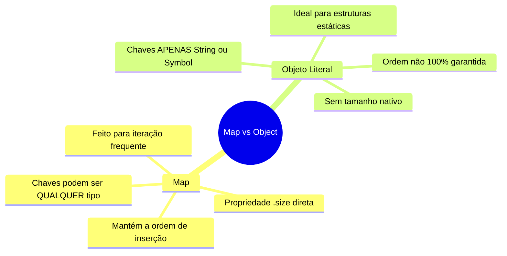

# Aula: Explorando o Objeto Map() em JavaScript

## Abertura: Qual problema o Map() resolve?

Imagine que você precisa guardar informações de usuários em um dicionário. No JavaScript, a forma mais comum de fazer isso sempre foi usando **Objetos Literais** (`{}`). O problema é que um Objeto é como um armário onde as etiquetas de cada gaveta (as chaves) **só podem ser textos (strings) ou símbolos**. Se você tentar usar um número ou outro objeto como etiqueta, o JavaScript converte tudo silenciosamente para texto, o que pode causar confusões terríveis.

Além disso, Objetos tradicionais não foram feitos para você perguntar facilmente "quantos itens tem aí dentro?" (você precisa fazer malabarismos como `Object.keys(obj).length`), e eles nem sempre lembram a ordem exata em que você guardou as coisas.

É aí que entra o **`Map()`**! Ele é um dicionário "anabolizado" e moderno. Com um `Map()`, a etiqueta da sua gaveta pode ser **literalmente qualquer coisa**: um número, uma função, um booleano ou até mesmo outro objeto inteiro!

---

## Visualização: Map() vs Objeto Literal



---

## Sintaxe, Argumentos e Anatomia

A estrutura básica para criar e interagir com um `Map` é muito elegante, feita através de métodos dedicados em vez de colchetes ou pontos.

```javascript
// 1. Criando um novo Map vazio
const meuMapa = new Map();

// 2. Adicionando valores (chave, valor)
meuMapa.set('nome', 'Leonardo');
meuMapa.set(42, 'A resposta para tudo'); // A chave é o NÚMERO 42!

// 3. Recuperando valores
const resposta = meuMapa.get(42); // Retorna 'A resposta para tudo'

// 4. Checando se uma chave existe
const temNome = meuMapa.has('nome'); // Retorna true

// 5. Deletando um item específico
meuMapa.delete('nome');

// 6. Limpando tudo de uma vez
meuMapa.clear();
```

### Tabela de Referência Rápida

| Método/Propriedade | O que faz | Retorno |
| :--- | :--- | :--- |
| `new Map()` | Cria o mapa | Objeto Map |
| `set(chave, valor)` | Adiciona ou atualiza um item | O próprio Map (permite encadeamento) |
| `get(chave)` | Busca o valor associado à chave | O valor, ou `undefined` se não achar |
| `has(chave)` | Verifica se a chave existe | `true` ou `false` |
| `delete(chave)` | Remove o par chave/valor | `true` (se removeu) ou `false` |
| `clear()` | Remove todos os itens | `undefined` |
| `.size` | Retorna a quantidade de itens | `Number` |

### ⚠️ Regras de Ouro e Pitfalls

- ⚠️ **NUNCA use notação de colchetes ou ponto para adicionar itens!** Fazer `meuMapa['idade'] = 30` não adiciona no Map, apenas cria uma propriedade solta no objeto base. Use **SEMPRE** o método `.set()`.
- ✅ **Prefira `Map` quando as chaves forem desconhecidas até o tempo de execução**, ou quando as chaves precisarem ser de tipos diferentes de string.
- 💡 **Encadeamento:** Como `.set()` retorna o próprio Map, você pode fazer: `map.set(1, 'a').set(2, 'b').set(3, 'c');`

---

## Exemplos de Código

### Camada 1: Funcionamento Isolado

Neste exemplo, vemos como o Map permite usar diferentes tipos de dados como chave sem confusão.

```javascript
const dicionario = new Map();

// Chaves de tipos diferentes
const chaveString = "mensagem";
const chaveNumero = 100;
const chaveFuncao = function() { return "Olá"; };
const chaveObjeto = { id: 1 };

dicionario.set(chaveString, "Sou um texto");
dicionario.set(chaveNumero, "Sou um número inteiro");
dicionario.set(chaveFuncao, "A chave é uma função!");
dicionario.set(chaveObjeto, "A chave é um objeto!");

console.log(dicionario.size); // Saída: 4
console.log(dicionario.get(chaveFuncao)); // Saída: "A chave é uma função!"
```

### Camada 2: Aplicação Contextualizada (Sistema Real)

Imagine que você está desenvolvendo um sistema onde você tem objetos representando "Usuários" (do banco de dados) e precisa guardar "Sessões Ativas" (carrinho de compras, token, etc) para cada um na memória, sem alterar o objeto original do usuário.

**O Problema com Objetos Literais (Antes):**
```javascript
const user1 = { id: 101, name: "Ana" };
const sessoes = {};

// O JavaScript converte user1 para a string "[object Object]"
sessoes[user1] = { token: "abc", cart: ["Livro"] }; 

const user2 = { id: 102, name: "Carlos" };
// Isso vai SOBRESCREVER a Ana, porque user2 também vira "[object Object]"!
sessoes[user2] = { token: "xyz", cart: ["Mouse"] }; 
```

**A Solução com Map (Depois):**
```javascript
const user1 = { id: 101, name: "Ana" };
const user2 = { id: 102, name: "Carlos" };

const sessoes = new Map();

// Usamos o próprio objeto user1 como chave!
sessoes.set(user1, { token: "abc", cart: ["Livro"] });
sessoes.set(user2, { token: "xyz", cart: ["Mouse"] });

console.log(sessoes.get(user1).cart); // Saída: ["Livro"]
console.log(sessoes.size); // Saída: 2
```

---

## Engajamento, Debugging e Desafio

### Resumo Executivo
- `Map()` é a estrutura ideal para **dicionários de dados** onde as chaves podem ser alteradas, adicionadas e removidas frequentemente.
- Aceita **qualquer tipo de dado** como chave (objetos, funções, booleanos, números).
- Tem métodos amigáveis e diretos: `.set()`, `.get()`, `.has()`, `.delete()` e a propriedade `.size`.

### Visão de Debug
Para ver o que tem dentro de um Map, você pode usar um simples `console.log(meuMapa)`. No Google Chrome (DevTools) ou no Node.js, ele exibirá `Map(2) { 'chave1' => 'valor1', 'chave2' => 'valor2' }`, mostrando claramente a relação entre chaves e valores.

### Conexões
Dominar o `Map` te prepara muito bem para entender outra estrutura de dados chamada **`Set`** (que guarda apenas valores únicos), além de aprimorar suas habilidades em **Estruturas de Dados e Algoritmos (DSA)** em JavaScript.

### 🎯 Desafio Prático

Crie um arquivo `pratica-map.js` na sua pasta e tente resolver este problema:

- 🟢 **Básico:** Crie um `Map` chamado `catalogoLivros`. Adicione 3 livros usando o ISBN (número) como chave e o título (string) como valor. Depois, verifique se um ISBN específico existe usando `.has()`.
- 🟡 **Intermediário:** Use um laço `for...of` para iterar sobre o seu `Map`. Dica: o for...of em um map retorna um array `[chave, valor]` a cada iteração!
- 🔴 **Avançado:** Escreva uma função que recebe uma string (ex: "o rato roeu a roupa do rei de roma") e usa um `Map()` para contar quantas vezes cada letra aparece na frase.

*(Se quiser, me mande o código que eu faço a correção e discutimos a solução!)*

---

## 🎯 Questões de Fixação

Tente responder antes de ver a resposta!

---

**Questão 1:** Uma desenvolvedora precisa guardar configurações temporárias para elementos de uma página web (DOM). Ela quer associar um objeto de configuração diretamente a uma `div` HTML específica. Qual a melhor estrutura usar?

- A) Um Array de objetos
- B) Um Objeto literal (`{}`) usando a div como chave
- C) Um `Map()` usando a referência da div como chave
- D) Uma variável global para cada div

<details>
<summary>🔍 Ver resposta</summary>

**C) Um `Map()` usando a referência da div como chave** — O `Map` permite usar objetos (incluindo elementos DOM) como chaves diretamente. Se usasse um objeto literal (B), a div seria convertida para a string genérica `"[object HTMLDivElement]"`, o que causaria conflitos se tentasse usar múltiplas divs.

</details>

---

**Questão 2:** Você criou um Map e adicionou dois itens. Como você faz para descobrir rapidamente quantos itens existem dentro dele?

- A) `meuMapa.length`
- B) `meuMapa.size`
- C) `meuMapa.size()`
- D) `Object.keys(meuMapa).length`

<details>
<summary>🔍 Ver resposta</summary>

**B) `meuMapa.size`** — O Map possui uma **propriedade** nativa chamada `.size` que retorna exatamente o número de entradas. A alternativa A está errada porque `length` é para Arrays e Strings. A C está errada pois `size` é propriedade, não função. A D é a gambiarra usada para Objetos literais.

</details>

---

**Questão 3:** Um programador júnior escreveu o seguinte código e está confuso porque não está funcionando como esperado:
```javascript
const pontuacoes = new Map();
pontuacoes["joao"] = 100;
pontuacoes["maria"] = 250;
console.log(pontuacoes.size);
```
Qual será a saída no console e por quê?

- A) `2`, porque foram adicionados dois itens.
- B) `0`, porque itens foram adicionados como propriedades do objeto e não dentro da estrutura do Map.
- C) `undefined`, pois o Map não possui tamanho nativo.
- D) Erro de sintaxe, pois não se pode usar colchetes em um Map.

<details>
<summary>🔍 Ver resposta</summary>

**B) `0`, porque itens foram adicionados como propriedades do objeto e não dentro da estrutura do Map.** — Essa é uma pegadinha muito comum (Pitfall)! O `Map` é um objeto por baixo dos panos, então você *consegue* colocar propriedades nele com colchetes, mas isso NÃO adiciona dados no dicionário interno do Map. Você DEVE usar `.set("joao", 100)` para que o `.size` e os outros métodos funcionem.

</details>

---

**Questão 4:** O que acontecerá se você executar o seguinte código?
```javascript
const map = new Map();
map.set({}, "Valor 1");
map.set({}, "Valor 2");
console.log(map.size);
```

- A) `1`, o segundo `.set` sobrescreve o primeiro porque as chaves são iguais.
- B) `2`, porque cada objeto `{}` criado na hora ocupa um espaço diferente na memória.
- C) `0`, porque objetos vazios não podem ser chaves.
- D) Erro de execução, chaves precisam ser primitivos.

<details>
<summary>🔍 Ver resposta</summary>

**B) `2`, porque cada objeto `{}` criado na hora ocupa um espaço diferente na memória.** — No JavaScript, objetos são comparados por referência, não por valor. Como passamos dois `{}` literais diferentes, eles são entidades distintas na memória, logo, são consideradas duas chaves completamente diferentes pelo Map.

</details>

---

**Questão 5:** Uma equipe precisa esvaziar completamente um dicionário `Map` para reutilizá-lo em uma nova requisição. Qual a forma mais limpa e performática fornecida pela própria API do Map para fazer isso?

- A) `meuMapa = new Map();`
- B) `meuMapa.length = 0;`
- C) `meuMapa.clear();`
- D) `meuMapa.delete();`

<details>
<summary>🔍 Ver resposta</summary>

**C) `meuMapa.clear();`** — O método `.clear()` remove todas as chaves e valores do Map instantaneamente. A opção A criaria um objeto totalmente novo (o que pode quebrar referências `const`), a B é um truque usado em Arrays, e a D exige que você passe a chave específica que quer deletar, não servindo para limpar tudo de uma vez.

</details>

---

## ⚡ Resumo Rápido para Revisão

Memorize estas associações:

| Se você precisar... | Pense em... |
| :--- | :--- |
| Criar um dicionário onde chaves não são textos | **`new Map()`** |
| Adicionar ou atualizar um item | **`map.set(chave, valor)`** |
| Pegar o valor de uma chave | **`map.get(chave)`** |
| Saber quantos itens estão armazenados | **`map.size`** |
| Remover tudo de uma vez | **`map.clear()`** |
| Iterar mantendo a ordem de inserção | **`for (const [chave, valor] of map) { ... }`** |

---

### 🔑 Fatos-Chave que Você PRECISA Saber

| Fato / Valor | O que significa |
| :---: | :--- |
| **`typeof Map`** | Retorna `'function'` (a classe/função construtora), mas uma instância (`new Map()`) retorna `'object'`. |
| **Comparação de Objetos** | Objetos usados como chave são comparados por *referência*, não pelo que têm dentro. |
| **Iteração Padrão** | Um `Map` sempre itera na **ordem exata** em que os itens foram inseridos (diferente de `{}`). |
| **`map[key] = value`** | **NÃO USE!** Isso não aciona os mecanismos internos do Map, não altera o `.size` e não aparecerá nos laços de repetição corretos. |
