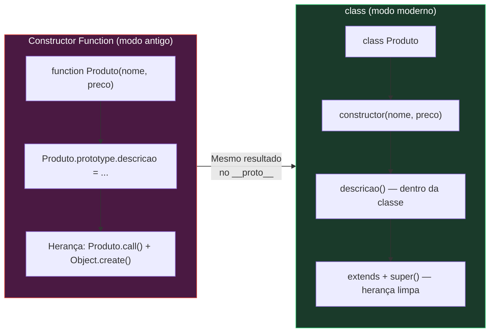
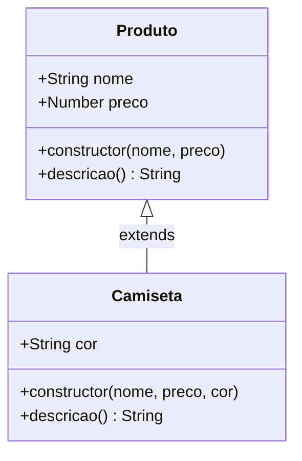

# Aula: Classes em JavaScript

## Abertura com Analogia Prática

**Qual problema as Classes resolvem?**

Lembra de como você criava Constructor Functions? Algo assim:

```js
function Produto(nome, preco) {
    this.nome = nome;
    this.preco = preco;
}
Produto.prototype.descricao = function() {
    return `${this.nome} custa R$${this.preco}`;
};
```

Funcionava — mas era **bagunçado**. O construtor ficava num lugar, os métodos em outro (`prototype`), a herança era um quebra-cabeça com `call()` e `Object.create()`. Parecia montar um móvel sem manual.

**A `class` é o manual de montagem.**

Pense numa **fábrica de carros**. Antes das classes, cada peça (construtor, métodos, herança) ficava espalhada em setores diferentes da fábrica, e você precisava saber exatamente onde cada parafuso ia. A `class` é como uma **linha de montagem moderna**: todas as peças ficam organizadas num único lugar, na ordem certa, com instruções claras. O carro final é o mesmo — mas montar ficou muito mais fácil.

💡 *Curiosidade histórica: a palavra-chave `class` foi introduzida no ES6 (2015), mas por baixo dos panos ela faz exatamente o que Constructor Functions + Prototype já faziam. O comitê TC39 do JavaScript chamou isso de "syntactic sugar" (açúcar sintático) — é a mesma comida, só que com uma apresentação mais bonita no prato.*

---

## Visualização com Diagramas

### Constructor Function vs Class — mesma mecânica, embalagem diferente


*Ambos produzem a mesma cadeia de prototypes. A classe apenas organiza tudo num único bloco.*

---

### Anatomia interna de uma Classe


*A herança com `extends` substitui toda aquela dança de `Camiseta.prototype = Object.create(Produto.prototype)` que você viu na aula de Prototypes.*

---

## Sintaxe, Argumentos e Anatomia

### Anatomia Básica

```js
class NomeDaClasse {
    // 1. CONSTRUCTOR — inicializa as propriedades
    constructor(param1, param2) {
        this.prop1 = param1;
        this.prop2 = param2;
    }

    // 2. MÉTODOS — vão direto no prototype (sem "function"!)
    meuMetodo() {
        return this.prop1;
    }

    // 3. GETTERS e SETTERS — igual ao que você já estudou!
    get resumo() {
        return `${this.prop1} - ${this.prop2}`;
    }

    set novoProp1(valor) {
        if (typeof valor !== 'string') throw new Error('Precisa ser string!');
        this.prop1 = valor;
    }

    // 4. MÉTODOS ESTÁTICOS — pertencem à CLASSE, não às instâncias
    static criarPadrao() {
        return new NomeDaClasse('padrão', 0);
    }
}
```

### Detalhamento Crítico Linha por Linha

| Elemento | O que faz | Obrigatório? | Equivalente antigo |
| :--- | :--- | :---: | :--- |
| `class NomeDaClasse` | Declara a classe (deve ser PascalCase) | ✅ | `function NomeDaClasse()` |
| `constructor()` | Função executada ao usar `new`. Inicializa `this` | Não* | O corpo da Constructor Function |
| Métodos (ex: `meuMetodo()`) | Funções no prototype — **sem** `function`, **sem** vírgula | Não | `NomeDaClasse.prototype.metodo = function() {}` |
| `get` / `set` | Getters e Setters — comportam-se como propriedades | Não | `Object.defineProperty()` com get/set |
| `static metodo()` | Método acessível via `NomeDaClasse.metodo()`, não via instância | Não | `NomeDaClasse.metodo = function() {}` |

> \* *Se omitido, o JS cria um `constructor()` vazio automaticamente.*

### Regras de Ouro e Pitfalls

⚠️ **Classes não sofrem hoisting como funções!**
```js
const p = new Produto(); // ❌ ReferenceError!
class Produto {}
```
Com Constructor Functions, `function Produto() {}` sofria hoisting e funcionava em qualquer ordem. Com `class`, **não**. Você precisa declarar a classe ANTES de usá-la.

⚠️ **Não use vírgula entre métodos!**
```js
class Errado {
    metodo1() {},  // ❌ SyntaxError!
    metodo2() {}
}
```
Diferente de objetos literais, métodos dentro de classes são separados por **nada** (apenas quebra de linha).

⚠️ **O corpo da classe roda em strict mode automaticamente!**
Variáveis não declaradas, `this` global acidental — tudo gera erro imediatamente.

✅ **Sempre use PascalCase** para nomes de classes: `Produto`, `ContaBancaria`, `UsuarioAdmin`.

✅ **Mantenha o constructor enxuto** — apenas atribua propriedades. Lógica complexa vai em métodos separados.

💡 **`typeof` de uma classe retorna `"function"`** — mais uma prova de que classes são Constructor Functions disfarçadas.

---

## Exemplos de Código em Duas Camadas

### Camada 1: Exemplo Isolado (Mecânica Pura)

```js
// Definindo uma classe simples
class Animal {
    // O constructor recebe os dados e guarda no this
    constructor(nome, tipo) {
        this.nome = nome;  // propriedade da instância
        this.tipo = tipo;
    }

    // Método — vai automaticamente para Animal.prototype
    apresentar() {
        return `Eu sou ${this.nome}, um ${this.tipo}.`;
    }

    // Getter — acesso como propriedade, não como função
    get nomeUpperCase() {
        return this.nome.toUpperCase();
    }

    // Setter — validação ao atribuir
    set novoNome(valor) {
        if (valor.length < 2) {
            console.log('⚠️ Nome muito curto!');
            return;
        }
        this.nome = valor;
    }

    // Método estático — pertence à classe, NÃO à instância
    static criarGato(nome) {
        return new Animal(nome, 'Gato');
    }
}

// Criando instâncias com new
const rex = new Animal('Rex', 'Cachorro');
console.log(rex.apresentar());   // "Eu sou Rex, um Cachorro."
console.log(rex.nomeUpperCase);  // "REX" (getter, sem parênteses!)

rex.novoNome = 'A';              // "⚠️ Nome muito curto!" (setter validou)
rex.novoNome = 'Thor';           // Agora aceita!
console.log(rex.nome);           // "Thor"

// Método estático — chamado na CLASSE, não no objeto
const mimi = Animal.criarGato('Mimi');
console.log(mimi.apresentar());  // "Eu sou Mimi, um Gato."

// Prova de que é prototype:
console.log(rex.__proto__ === Animal.prototype); // true
console.log(typeof Animal);                      // "function" ← Açúcar sintático!
```

---

### Camada 2: Exemplo Contextualizado (seu projeto!)

Lembra do seu projeto de **To Do List** (aula67)? E da forma como trabalhava com objetos na aula89? Vamos imaginar esse To Do reescrito com classes:

```js
// Antes — estilo Constructor Function (como na aula89)
function Tarefa(texto) {
    this.texto = texto;
    this.concluida = false;
    this.criadaEm = new Date();  // ← usou Date na aula46!
}
Tarefa.prototype.concluir = function() {
    this.concluida = true;
};
Tarefa.prototype.descricao = function() {
    return `[${this.concluida ? '✅' : '⬜'}] ${this.texto}`;
};

// -------------------------------------------------------

// Depois — estilo Class (limpo e organizado!)
class Tarefa {
    constructor(texto) {
        this.texto = texto;
        this.concluida = false;
        this.criadaEm = new Date();
    }

    concluir() {
        this.concluida = true;
    }

    // Getter — lembra do que viu na aula de Getters e Setters?
    // Agora fica DENTRO da classe, tudo junto!
    get descricao() {
        return `[${this.concluida ? '✅' : '⬜'}] ${this.texto}`;
    }

    // Setter com validação — igual ao padrão que estudou!
    set novoTexto(valor) {
        if (typeof valor !== 'string' || valor.trim() === '') {
            throw new Error('Texto inválido!');
        }
        this.texto = valor.trim();
    }

    // Método estático — cria tarefa urgente sem repetir código
    static criarUrgente(texto) {
        const tarefa = new Tarefa(`🔴 URGENTE: ${texto}`);
        return tarefa;
    }
}

// Usando:
const t1 = new Tarefa('Estudar Classes em JS');
console.log(t1.descricao);  // "[⬜] Estudar Classes em JS"

t1.concluir();
console.log(t1.descricao);  // "[✅] Estudar Classes em JS"

const t2 = Tarefa.criarUrgente('Entregar projeto');
console.log(t2.descricao);  // "[⬜] 🔴 URGENTE: Entregar projeto"
```

### Comparação Visual: Antes vs Depois

| Aspecto | Constructor Function | Class |
| :--- | :--- | :--- |
| Construtor | `function Tarefa(texto) { ... }` | `constructor(texto) { ... }` dentro da class |
| Métodos | `Tarefa.prototype.metodo = function() {}` | `metodo() {}` dentro da class |
| Getters/Setters | `Object.defineProperty(Tarefa.prototype, ...)` | `get prop()` / `set prop()` dentro da class |
| Herança | `Filho.call(this) + Object.create()` | `extends` + `super()` |
| Leitura | Espalhado em vários blocos | **Tudo junto, num único bloco** |

---

## Engajamento, Debugging e Desafio

### Resumo Executivo

- 🔹 `class` é **açúcar sintático** sobre Constructor Functions + Prototype — o motor do JS faz a mesma coisa por baixo.
- 🔹 Tudo fica organizado num único bloco: `constructor`, métodos, getters/setters e `static`.
- 🔹 Diferente de `function`, classes **não sofrem hoisting** — declare antes de usar.

### Visão de Debug

Para validar se sua classe está funcionando, use o console do DevTools (F12 no Chrome):

```js
const obj = new MinhaClasse('teste');

// 1. Verificar se é instância
console.log(obj instanceof MinhaClasse); // true

// 2. Ver toda a estrutura do objeto
console.dir(obj);

// 3. Verificar o prototype
console.log(Object.getPrototypeOf(obj)); // mostra os métodos herdados

// 4. Confirmar que class é function
console.log(typeof MinhaClasse); // "function"
```

💡 *O `console.dir()` é mais útil que `console.log()` para objetos — ele mostra a árvore de propriedades expandível, incluindo o `__proto__`.*

### Conexões com o Futuro

O que acabou de aprender é **fundação para tudo** que vem a seguir em POO:
- **Herança com `extends` e `super()`** — próxima aula! Substitui todo o `call()` + `Object.create()` que você estudou.
- **Polimorfismo** — que você já tem na pasta, vai ficar muito mais natural com classes.
- **Encapsulamento com `#` (campos privados)** — evolução dos níveis de proteção que estudou com `defineProperty()`.
- **Composição vs Herança** — padrões de design avançados usando classes.

### 🏋️ Desafio Prático

Crie no arquivo `script.js` desta pasta uma classe chamada `ContaBancaria` com:

1. `constructor` que recebe `titular` (string) e `saldoInicial` (number, default 0)
2. Um **getter** `saldo` que retorna o saldo formatado: `"R$ 1.500,00"`
3. Um **setter** `deposito` que só aceita números positivos (senão lança erro)
4. Um método `sacar(valor)` que verifica se tem saldo suficiente
5. Um método **static** `criarContaZerada(titular)` que cria uma conta com saldo 0

**Dificuldade:** 🟡 Intermediário — combina `class` com getters/setters que você já estudou.

*Quando terminar, me manda que eu corrijo e discuto a solução!*

---

## 🎯 Questões de Fixação

Tente responder antes de ver a resposta!

---

**Questão 1:** Um desenvolvedor junior declara uma classe `Usuario` e logo em seguida tenta criar uma instância com `new Usuario('João')`. O código funciona perfeitamente. Porém, ao reorganizar o arquivo, ele move a chamada `new Usuario('João')` para **antes** da declaração `class Usuario`. O que acontece?

- A) Funciona normalmente, pois classes sofrem hoisting igual a funções
- B) Retorna `undefined` silenciosamente
- C) Lança um `ReferenceError` porque classes não sofrem hoisting
- D) Cria um objeto vazio `{}` sem propriedades

<details>
<summary>🔍 Ver resposta</summary>

**C) Lança um `ReferenceError` porque classes não sofrem hoisting** — Diferente de `function declarations` (que você pode chamar antes de declarar), declarações `class` ficam na chamada "Temporal Dead Zone" até serem avaliadas. A alternativa A é o erro mais comum, pois o aluno assume que classes se comportam como funções tradicionais.

</details>

---

**Questão 2:** A equipe de front-end de uma startup precisa criar um método `validarEmail()` que deve funcionar **sem precisar criar uma instância** da classe `Validador`. Qual abordagem correta?

- A) Definir `validarEmail()` como método normal dentro da classe
- B) Usar `Validador.prototype.validarEmail = function() {}`
- C) Declarar `validarEmail()` como `static` dentro da classe
- D) Criar a função fora da classe e usar `this` nela

<details>
<summary>🔍 Ver resposta</summary>

**C) Declarar `validarEmail()` como `static` dentro da classe** — Métodos `static` pertencem à classe em si, não ao prototype, então são chamados via `Validador.validarEmail()` sem precisar de `new`. A alternativa A criaria um método no prototype que só funciona em instâncias, e a B é o jeito antigo (Constructor Function) de fazer o equivalente a um método de instância, não estático.

</details>

---

**Questão 3:** Observe o código abaixo. Qual será a saída no console?

```js
class Teste {
    constructor() {
        this.x = 10;
    }
    getX() {
        return this.x;
    }
}
console.log(typeof Teste);
```

- A) `"class"`
- B) `"object"`
- C) `"function"`
- D) `"undefined"`

<details>
<summary>🔍 Ver resposta</summary>

**C) `"function"`** — Essa é a pegadinha! Apesar da sintaxe `class`, internamente o JavaScript transforma a classe em uma **função construtora**. Não existe um tipo `"class"` no JS. A alternativa A é a armadilha — parece lógico que `typeof class` retorne `"class"`, mas JavaScript não tem esse tipo primitivo.

</details>

---

**Questão 4:** Um dev está refatorando código antigo para usar classes. Ele escreve:

```js
class Produto {
    constructor(nome, preco) {
        this.nome = nome;
        this.preco = preco;
    },
    descricao() {
        return `${this.nome}: R$${this.preco}`;
    }
}
```

Ao executar, recebe um erro. Por quê?

- A) O `constructor` não pode receber mais de um parâmetro
- B) Faltou a palavra `function` antes de `descricao()`
- C) Há uma vírgula `,` após o `constructor`, o que é proibido em classes
- D) O template literal não funciona dentro de métodos de classe

<details>
<summary>🔍 Ver resposta</summary>

**C) Há uma vírgula `,` após o `constructor`, o que é proibido em classes** — Em objetos literais, propriedades são separadas por vírgulas. Mas dentro de `class`, métodos são separados apenas por quebra de linha, **sem vírgulas**. A alternativa B é armadilha: dentro de classes, você NÃO usa `function` — é justamente essa a simplificação sintática.

</details>

---

**Questão 5:** Considere esta classe:

```js
class Pessoa {
    constructor(nome) {
        this.nome = nome;
    }
    get saudacao() {
        return `Olá, ${this.nome}!`;
    }
}
const p = new Pessoa('Leo');
```

Qual é a forma **correta** de acessar a saudação?

- A) `p.saudacao()`
- B) `p.saudacao`
- C) `Pessoa.saudacao`
- D) `Pessoa.prototype.saudacao()`

<details>
<summary>🔍 Ver resposta</summary>

**B) `p.saudacao`** — Um **getter** é acessado como se fosse uma propriedade, sem parênteses. Isso é exatamente o que você estudou na aula de Getters e Setters! A alternativa A parece correta mas `saudacao()` com parênteses tentaria chamar o *retorno* do getter como função, e como o retorno é uma string, daria `TypeError`. A alternativa C tentaria acessar um método estático, que não existe.

</details>

---

## ⚡ Resumo Rápido para Revisão

Memorize estas associações:

| Se você precisar... | Pense em... |
| :--- | :--- |
| Agrupar construtor + métodos num único bloco | **`class NomeDaClasse { ... }`** |
| Inicializar propriedades ao criar um objeto | **`constructor(params)`** |
| Criar métodos que vão para o prototype | **Declarar diretamente dentro da classe** (sem `function`, sem vírgula) |
| Acessar/validar propriedades como se fossem atributos | **`get` / `set`** dentro da classe |
| Criar um método utilitário sem precisar de instância | **`static metodo()`** |
| Herdar de outra classe | **`extends` + `super()`** (próxima aula!) |
| Substituir toda a confusão de `call()` + `Object.create()` | **`class Filho extends Pai`** |

---

### 🔑 Fatos-Chave que Você PRECISA Saber

| Fato / Valor | O que significa |
| :---: | :--- |
| **`typeof MinhaClasse` → `"function"`** | Classes são Constructor Functions por baixo dos panos |
| **Classes NÃO sofrem hoisting** | Declare a classe ANTES de usá-la (diferente de `function`) |
| **Sem vírgulas entre métodos** | Diferente de objetos literais — separação por quebra de linha |
| **`class` roda em strict mode** | Erros silenciosos viram erros explícitos automaticamente |
| **`constructor` é opcional** | Se omitido, o JS cria um vazio: `constructor() {}` |
| **Métodos da classe vão para `.prototype`** | `instancia.metodo()` funciona via prototype chain, igual antes |
| **`static` fica na classe, não no prototype** | `MinhaClasse.metodo()` ✅ — `instancia.metodo()` ❌ |
| **`get`/`set` dentro da classe** | Mesma coisa que `Object.defineProperty()`, mas mais legível |
