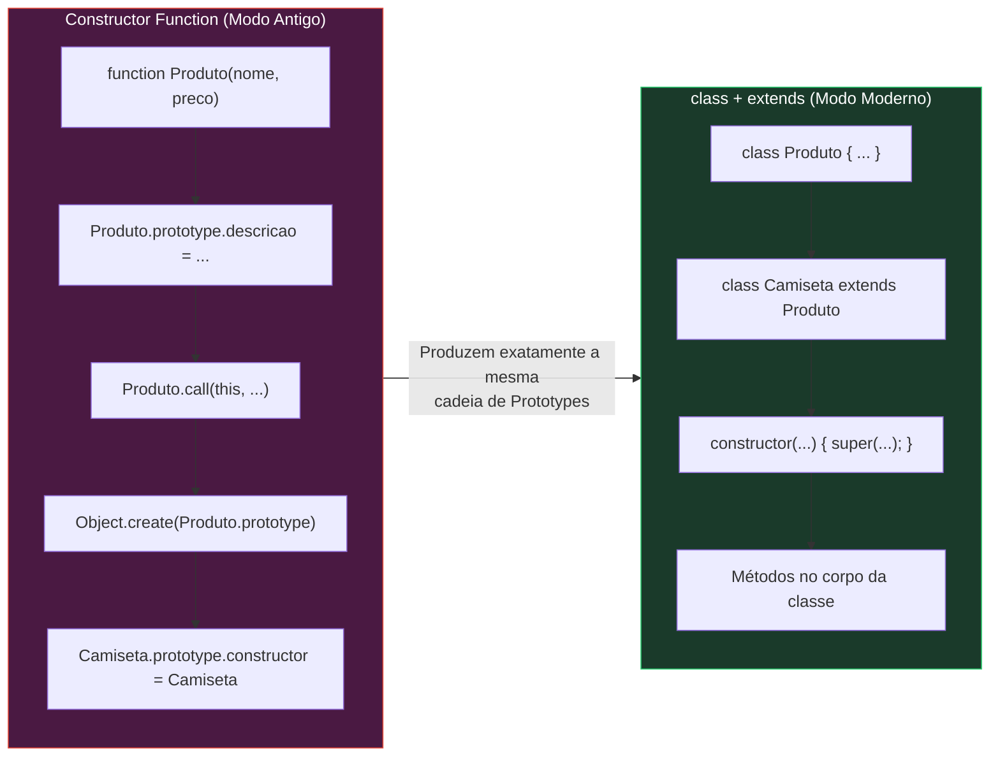
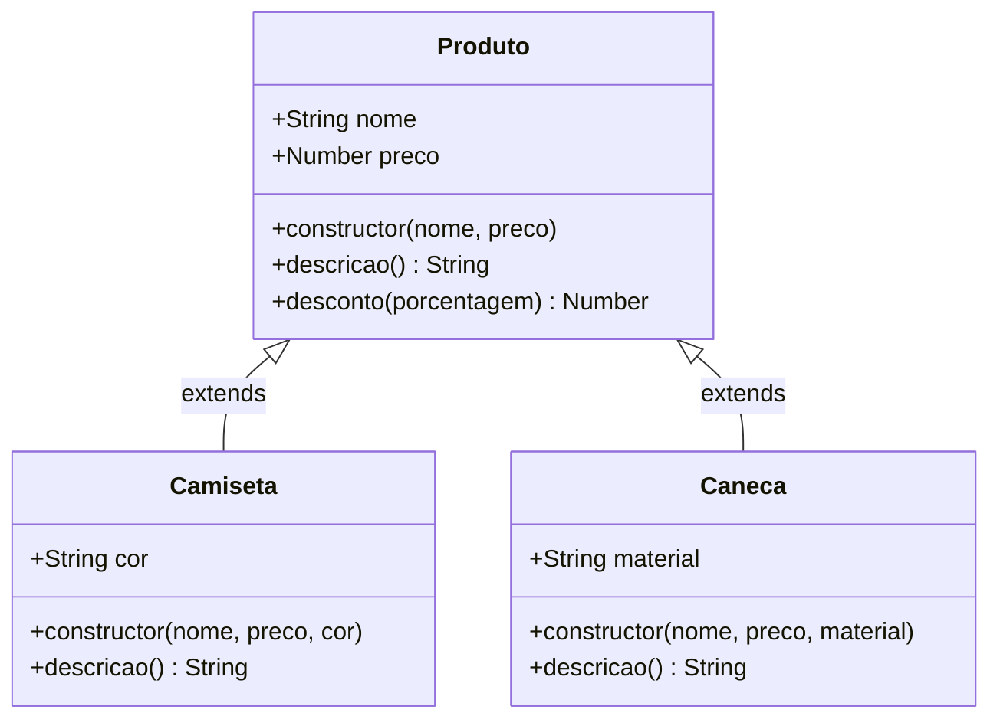
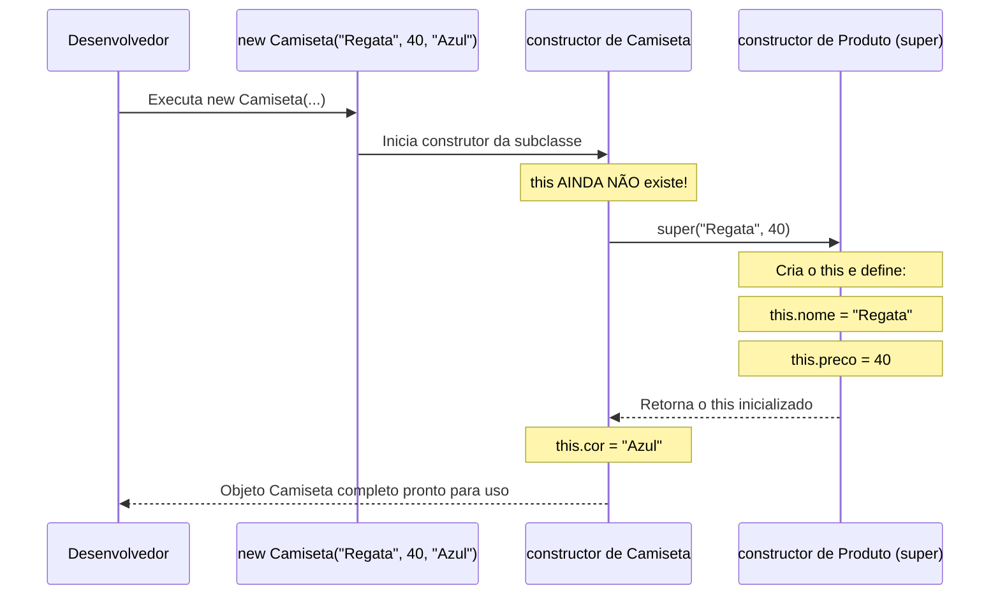

# Aula: Classes e Herança em JavaScript

## Abertura com Analogia Prática

**Qual problema as Classes e a Herança resolvem?**

Lembra de como você criava Constructor Functions e implementava herança na Aula 3 de Prototypes? Era algo assim:

```js
function Produto(nome, preco) {
    this.nome = nome;
    this.preco = preco;
}
Produto.prototype.descricao = function() {
    return `${this.nome} custa R$${this.preco}`;
};

// Herança à moda antiga:
function Camiseta(nome, preco, cor) {
    Produto.call(this, nome, preco); // 1. Empresta construtor
    this.cor = cor;
}
Camiseta.prototype = Object.create(Produto.prototype); // 2. Liga prototypes
Camiseta.prototype.constructor = Camiseta;              // 3. Corrige construtor
```

Funcionava — mas era **verboso, frágil e espalhado**. O construtor ficava num lugar, os métodos em outro (`prototype`), e a herança exigia três passos manuais complexos (`call()`, `Object.create()`, redefinir `constructor`). Parecia montar um móvel de 50 peças sem marcações de encaixe.

---

### A Analogia da Linha de Montagem e da Plataforma Modular

Pense numa **fábrica automotiva moderna**:
1. **A `class` básica** é como a **planta de um modelo de carro padrão**: motor, chassi, portas e painel descritos em um único manual integrado e organizado.
2. **A Herança (`extends` e `super`)** é o conceito de **plataforma compartilhada**: a fábrica cria uma plataforma-base (`Veiculo`) com as peças comuns (rodas, motor, acelerador). Quando decide produzir um modelo específico (`CarroEletrico` ou `Caminhao`), ela não desenha tudo do zero. Ela **estende** a plataforma-base (`extends`) e aciona a linha de montagem principal para montar a base (`super()`), adicionando apenas o que é exclusivo do novo modelo (como a bateria de alta voltagem ou a caçamba).

O resultado no objeto final é exatamente o mesmo que o sistema de prototypes gerava — mas o processo de fabricação ficou limpo, legível e à prova de falhas.

💡 *Curiosidade histórica: a palavra-chave `class` e os operadores `extends` / `super` foram introduzidos no ES6 (2015). Por baixo dos panos, o motor do JavaScript continua usando protótipos (`__proto__` e `prototype`). Por isso, dizemos que a sintaxe de classes é um **"açúcar sintático" (syntactic sugar)**: a receita interna é a mesma, mas a apresentação e a ergonomia de escrita são infinitamente melhores.*

💡 *O termo `super` vem de **superclasse** (a classe "pai" ou superior na árvore genealógica de herança).*

---

## Visualização com Diagramas

### 1. Constructor Function vs Class (com Herança)


*Ambas as abordagens criam a mesma estrutura interna na memória, mas a sintaxe moderna elimina o trabalho manual suscetível a erros.*

---

### 2. Diagrama de Classes e Hierarquia


*`Camiseta` e `Caneca` herdam `nome`, `preco` e métodos de `Produto`, acrescentando suas próprias particularidades.*

---

### 3. O Fluxo de Execução com `new` e `super()`


*O operador `super()` é o responsável por invocar o construtor pai e liberar o uso da palavra `this` no construtor filho.*

---

## Sintaxe, Argumentos e Anatomia

### Anatomia Básica de uma Classe

```js
class NomeDaClasse {
    // 1. CONSTRUCTOR — inicializa as propriedades da instância
    constructor(param1, param2) {
        this.prop1 = param1;
        this.prop2 = param2;
    }

    // 2. MÉTODOS — vão direto para o prototype (sem "function" e sem vírgula!)
    meuMetodo() {
        return this.prop1;
    }

    // 3. GETTERS e SETTERS — atuam como propriedades computadas/validadas
    get resumo() {
        return `${this.prop1} - ${this.prop2}`;
    }

    set novoProp1(valor) {
        if (typeof valor !== 'string') throw new Error('Precisa ser string!');
        this.prop1 = valor;
    }

    // 4. MÉTODOS ESTÁTICOS — pertencem à CLASSE, e não às instâncias
    static criarPadrao() {
        return new NomeDaClasse('Padrão', 0);
    }
}
```

---

### Anatomia da Herança: `extends` e `super`

```js
// CLASSE PAI (Superclasse / Classe Base)
class Dispositivo {
    constructor(nome) {
        this.nome = nome;
        this.ligado = false;
    }

    ligar() {
        if (this.ligado) {
            console.log(`${this.nome} já está ligado.`);
            return;
        }
        this.ligado = true;
    }

    desligar() {
        this.ligado = false;
    }
}

// CLASSE FILHA (Subclasse / Classe Derivada)
class Smartphone extends Dispositivo {
    constructor(nome, modelo, cor) {
        // 1. super() invoca o constructor de Dispositivo
        // OBRIGATÓRIO chamar antes de acessar 'this'
        super(nome);

        // 2. Propriedades exclusivas da subclasse
        this.modelo = modelo;
        this.cor = cor;
    }

    // 3. Sobrescrita de método (Method Overriding) com reaproveitamento do pai
    ligar() {
        console.log('Verificando bateria do smartphone...');
        super.ligar(); // Chama o método ligar() da classe pai (Dispositivo)
        console.log(`Tela do ${this.modelo} acesa.`);
    }

    // 4. Método exclusivo da subclasse
    fazerChamada(numero) {
        if (!this.ligado) {
            console.log(`Ligue o ${this.nome} primeiro!`);
            return;
        }
        console.log(`Discando para ${numero}...`);
    }
}
```

---

### Detalhamento Crítico Linha por Linha

| Elemento | O que faz | Obrigatório? | Equivalente Antigo (Prototypes) |
| :--- | :--- | :---: | :--- |
| `class Nome` | Declara uma classe (deve usar **PascalCase**) | ✅ | `function Nome() {}` |
| `constructor()` | Função executada ao usar `new`. Inicializa o `this` | Não* | O corpo da Constructor Function |
| `extends SuperClasse` | Estabelece a ligação de protótipos entre as classes | Não | `Sub.prototype = Object.create(Super.prototype)` |
| `super(...)` | Invoca o construtor da classe pai e constrói o `this` | ✅ (se houver `constructor` na subclasse) | `SuperClasse.call(this, ...)` |
| `super.metodo()` | Chama a versão do método que pertence à classe pai | Não | `SuperClasse.prototype.metodo.call(this)` |
| Métodos (ex: `ligar()`) | Funções inseridas no `.prototype` — sem palavra `function` | Não | `Classe.prototype.ligar = function() {}` |
| `get` / `set` | Getters e Setters integrados diretamente no corpo | Não | `Object.defineProperty(..., { get, set })` |
| `static metodo()` | Método da função construtora, chamado via `Classe.metodo()` | Não | `Classe.metodo = function() {}` |

> \* *Se o `constructor` for omitido em uma classe simples, o JS cria `constructor() {}` automaticamente. Se for omitido em uma subclasse com `extends`, o JS repassa os argumentos automaticamente: `constructor(...args) { super(...args); }`.*

---

### Regras de Ouro e Pitfalls

⚠️ **`super()` DEVE ser chamado ANTES de qualquer uso de `this` no construtor filho!**
```js
class Smartphone extends Dispositivo {
    constructor(nome, modelo) {
        this.modelo = modelo; // ❌ ReferenceError: Must call super constructor in derived class before accessing 'this'
        super(nome);
    }
}
```
Na especificação do JavaScript, o objeto `this` de uma subclasse só passa a existir fisicamente na memória depois que o `super()` executa o construtor pai.

⚠️ **Não esqueça de repassar os argumentos ao `super()`!**
Se a classe pai espera `nome` no `constructor(nome)` e você apenas chamar `super()`, a propriedade `this.nome` ficará com valor `undefined`.

⚠️ **Classes NÃO sofrem hoisting como funções!**
```js
const p = new Produto(); // ❌ ReferenceError: Cannot access 'Produto' before initialization
class Produto {}
```
Você deve sempre declarar as classes no início do código ou antes do ponto de instanciação.

⚠️ **Não use vírgulas entre métodos!**
Dentro do corpo da classe, os métodos são separados apenas por quebras de linha e chaves, **nunca** por vírgulas como em objetos literais.

⚠️ **O corpo da classe roda em Strict Mode por padrão!**
Atribuições acidentais a variáveis globais, duplicação incorreta de parâmetros ou acessos inválidos geram erros imediatos.

✅ **Subclasse "é um" tipo da Superclasse:** Use herança apenas quando fizer sentido conceitual (um `Smartphone` *é um* `Dispositivo`, uma `Camiseta` *é um* `Produto`).

💡 **O operador `instanceof` reconhece toda a árvore de herança:**
```js
const cel = new Smartphone('iPhone', '15 Pro', 'Titânio');
console.log(cel instanceof Smartphone); // true
console.log(cel instanceof Dispositivo); // true (pois herda de Dispositivo!)
console.log(cel instanceof Object);     // true (tudo descende de Object!)
```

---

## Exemplos de Código em Duas Camadas

### Camada 1: Exemplo Isolado (Mecânica Pura de Classes e Herança)

```js
// 1. Classe Base (Superclasse)
class Animal {
    constructor(nome, idade) {
        this.nome = nome;
        this.idade = idade;
    }

    // Método compartilhado no prototype
    falar() {
        return `${this.nome} emitiu um som.`;
    }

    // Getter
    get info() {
        return `${this.nome} (${this.idade} anos)`;
    }
}

// 2. Subclasse Cão que herda de Animal
class Cachorro extends Animal {
    constructor(nome, idade, raca) {
        super(nome, idade); // Inicializa 'nome' e 'idade' no construtor de Animal
        this.raca = raca;   // Inicializa 'raca' na subclasse
    }

    // Sobrescrita de método (Override)
    falar() {
        return `${this.nome} (${this.raca}) latiu: Au au! 🐶`;
    }

    // Método exclusivo da subclasse
    abanarRabo() {
        return `${this.nome} está feliz abanando o rabo!`;
    }
}

// 3. Subclasse Gato que reaproveita o método do pai
class Gato extends Animal {
    constructor(nome, idade, corPelagem) {
        super(nome, idade);
        this.corPelagem = corPelagem;
    }

    falar() {
        // Usa super.falar() para pegar o som genérico e adiciona o miado
        const somBase = super.falar();
        return `${somBase} Especificamente um miado: Miau! 🐱`;
    }
}

// Instanciação e testes
const rex = new Cachorro('Rex', 3, 'Pastor Alemão');
console.log(rex.info);         // "Rex (3 anos)" -> herdado de Animal
console.log(rex.falar());        // "Rex (Pastor Alemão) latiu: Au au! 🐶" -> sobrescrito
console.log(rex.abanarRabo());   // "Rex está feliz abanando o rabo!" -> exclusivo

const mimi = new Gato('Mimi', 2, 'Branco');
console.log(mimi.falar());       // "Mimi emitiu um som. Especificamente um miado: Miau! 🐱"

// Verificação de tipos e protótipos
console.log(rex instanceof Cachorro); // true
console.log(rex instanceof Animal);   // true
console.log(rex instanceof Object);   // true
```

---

### Camada 2: Exemplo Contextualizado (Seus Projetos: To Do List & Produtos)

Lembra do seu projeto de **To Do List** (aula67 e `POO em JS/1 - Classes/script.js`)? Vamos evoluir a sua classe `Task` criando subclasses especializadas para **Tarefas com Prazo** e **Tarefas Recorrentes**, conectando com o `Date` que você estudou na aula46:

```js
// CLASSE BASE: Tarefa geral
class Task {
    constructor(title, description) {
        this.title = title;
        this.description = description;
        this.complete = false;
        this.createdAt = new Date(); // Usou Date na aula46!
    }

    conclusion() {
        this.complete = true;
    }

    get descriptionTask() {
        const icon = this.complete ? '✅' : '⬜';
        return `${icon} [${this.title}] - ${this.description}`;
    }

    set newDescription(value) {
        if (typeof value !== 'string' || value.trim() === '') {
            throw new Error('Texto inválido para a descrição.');
        }
        this.description = value.trim();
    }

    static createUrgent(title, description) {
        return new Task(`⚠️ URGENTE: ${title}`, description);
    }
}

// SUBCLASSE: Tarefa com Prazo (DeadlinedTask)
class DeadlinedTask extends Task {
    constructor(title, description, deadlineDate) {
        super(title, description); // Inicializa os dados básicos via Task
        this.deadline = new Date(deadlineDate); // Propriedade exclusiva
    }

    // Sobrescrita do getter para exibir a data de entrega
    get descriptionTask() {
        const baseDescription = super.descriptionTask; // Reaproveita o texto da classe pai
        const formattedDate = this.deadline.toLocaleDateString('pt-BR');
        return `${baseDescription} ⏳ (Prazo: ${formattedDate})`;
    }

    // Método exclusivo da subclasse
    isExpired() {
        const today = new Date();
        return today > this.deadline && !this.complete;
    }
}

// -------------------------------------------------------------
// Testando no console:

const t1 = new Task('Estudar Classes', 'Compreender constructor, métodos e static');
console.log(t1.descriptionTask); // "⬜ [Estudar Classes] - Compreender constructor, métodos e static"

const t2 = new DeadlinedTask(
    'Entregar Projeto JS',
    'Submeter o código refatorado de POO',
    '2026-12-31'
);

console.log(t2.descriptionTask); 
// "⬜ [Entregar Projeto JS] - Submeter o código refatorado de POO ⏳ (Prazo: 31/12/2026)"

t2.conclusion();
console.log(t2.descriptionTask);
// "✅ [Entregar Projeto JS] - Submeter o código refatorado de POO ⏳ (Prazo: 31/12/2026)"

console.log('Está expirada?', t2.isExpired()); // false
```

---

### Comparação Visual e Técnica: Herança Antiga vs Herança Moderna

Veja como o mesmo objetivo técnico é atingido nas duas abordagens:

```js
// ==========================================
// 1. MODO ANTIGO (Constructor Functions)
// ==========================================
function Produto(nome, preco) {
    this.nome = nome;
    this.preco = preco;
}
Produto.prototype.aumento = function(quantia) {
    this.preco += quantia;
};

function Camiseta(nome, preco, cor) {
    Produto.call(this, nome, preco); // 1. Empresta lógica
    this.cor = cor;
}
Camiseta.prototype = Object.create(Produto.prototype); // 2. Encadeia prototype
Camiseta.prototype.constructor = Camiseta;              // 3. Corrige o ponteiro

// ==========================================
// 2. MODO MODERNO (Classes com extends)
// ==========================================
class Produto {
    constructor(nome, preco) {
        this.nome = nome;
        this.preco = preco;
    }
    aumento(quantia) {
        this.preco += quantia;
    }
}

class Camiseta extends Produto {
    constructor(nome, preco, cor) {
        super(nome, preco); // Faz o call() e a ligação de uma só vez!
        this.cor = cor;
    }
}
```

| Aspecto | Modo Antigo (Constructor Functions) | Modo Moderno (`class` + `extends`) |
| :--- | :--- | :--- |
| **Declaração do Pai** | `function Produto(nome, preco) { ... }` | `class Produto { constructor(nome, preco) { ... } }` |
| **Herança de Protótipo** | `Sub.prototype = Object.create(Pai.prototype)` | `class Sub extends Pai` |
| **Correção de Construtor** | `Sub.prototype.constructor = Sub` | Automático pelo motor do JavaScript |
| **Chamada ao Construtor Pai** | `Pai.call(this, arg1, arg2)` | `super(arg1, arg2)` |
| **Acesso a Métodos do Pai** | `Pai.prototype.metodo.call(this)` | `super.metodo()` |
| **Legibilidade e Manutenção** | Fragmentado em 4 a 5 trechos soltos | **Unificado, coeso e linear** |

---

## Engajamento, Debugging e Desafio

### Resumo Executivo

- 🔹 **`class` e `extends` são açúcar sintático**: simplificam drasticamente o uso de Constructor Functions e da cadeia de protótipos (`prototype chain`).
- 🔹 **`super()` é a chave da herança**: deve ser invocado no construtor da subclasse antes de qualquer acesso ao `this`.
- 🔹 **Reaproveitamento e Especialização**: subclasses herdam todos os métodos e getters da superclasse, podendo criar métodos novos ou sobrescrever (`override`) os existentes usando `super.metodo()`.

---

### Visão de Debug

Para validar a hierarquia e inspecionar objetos criados com classes e herança no Console do DevTools (F12):

```js
const item = new DeadlinedTask('Teste', 'Desc', '2026-12-31');

// 1. Validar a árvore genealógica de herança
console.log(item instanceof DeadlinedTask); // true
console.log(item instanceof Task);          // true
console.log(item instanceof Object);        // true

// 2. Inspecionar a cadeia de protótipos (Prototype Chain)
console.log(Object.getPrototypeOf(item));                       // Prototype de DeadlinedTask
console.log(Object.getPrototypeOf(Object.getPrototypeOf(item))); // Prototype de Task

// 3. Ver a árvore expandível no DevTools
console.dir(item);
```

💡 *Dica de Debug: Use `console.dir(instancia)` no DevTools do navegador. Ao expandir o objeto, você verá as propriedades próprias no topo e os métodos organizados em níveis sucessivos de `[[Prototype]]`.*

---

### Conexões com o Futuro

Dominar classes e herança básica abre portas imediatas para:
- **Polimorfismo:** Tratar objetos de subclasses diferentes através de uma interface comum (ex: iterar uma lista de `[Task, DeadlinedTask]` chamando `item.descriptionTask` e cada uma respondendo com seu próprio formato).
- **Campos Privados (`#`):** Proteger propriedades contra alterações externas sem depender de closures ou `Object.defineProperty`.
- **Composição vs Herança:** Aprender quando estender uma classe e quando compor objetos usando múltiplos comportamentos modulares.

---

### 🏋️ Desafio Prático

Abra o arquivo `script.js` desta pasta e pratique implementando o seguinte cenário:

Crie uma hierarquia bancária com **Classe Base** e **Subclasse**:

1. Crie a classe base `ContaBancaria`:
   - `constructor(titular, saldoInicial = 0)`
   - Método `depositar(valor)` que soma ao saldo se o valor for positivo.
   - Método `sacar(valor)` que desconta do saldo se houver saldo suficiente (retorna `true` se deu certo ou `false` se não houver saldo).
   - Getter `saldoFormatado` que retorna `"R$ X.XXX,XX"`.

2. Crie a subclasse `ContaCorrente` que herda de `ContaBancaria`:
   - `constructor(titular, saldoInicial, limite = 500)` -> repasse titular e saldo ao `super()`.
   - Sobrescreva o método `sacar(valor)`: a `ContaCorrente` permite sacar usando o `saldo + limite`. Ao sacar, se o saldo próprio acabar, utiliza o limite.
   - Método exclusivo `extrato()` que imprime titular, saldo e limite disponível.

**Classificação de Dificuldade:**
- 🟢 Básico: Criar a classe base `ContaBancaria` com constructor, métodos e getter.
- 🟡 Intermediário: Criar a subclasse `ContaCorrente` com `extends`, `super()` e sobrescrita de `sacar()`.
- 🔴 Avançado: Adicionar uma taxa fixa de R$ 2,00 a cada saque na `ContaCorrente` reaproveitando `super.sacar()` ou validando se o saldo + limite cobre o saque + taxa.

---

## 🎯 Questões de Fixação

Tente responder antes de ver a resposta!

---

**Questão 1:** Um desenvolvedor júnior está modelando um sistema de comércio eletrônico. Ele cria uma classe `Produto` e, em seguida, cria a subclasse `Livro` com o seguinte código:

```js
class Produto {
    constructor(nome, preco) {
        this.nome = nome;
        this.preco = preco;
    }
}

class Livro extends Produto {
    constructor(nome, preco, autor) {
        this.autor = autor;
        super(nome, preco);
    }
}

const l1 = new Livro('Clean Code', 85, 'Robert Martin');
```

Ao executar esse código no Node.js ou no navegador, o que acontece?

- A) O objeto `l1` é criado normalmente com as três propriedades.
- B) A propriedade `autor` fica como `undefined`, mas o código não quebra.
- C) Ocorre um `ReferenceError`, pois `this` foi acessado antes da invocação do `super()`.
- D) O JavaScript ignora a linha do `super()` e apenas define `this.autor`.

<details>
<summary>🔍 Ver resposta</summary>

**C) Ocorre um `ReferenceError`, pois `this` foi acessado antes da invocação do `super()`** — Em subclasses no JavaScript, o objeto `this` só é construído e disponibilizado após a execução do construtor da superclasse via `super()`. Escrever `this.autor = autor` antes de `super(nome, preco)` lança obrigatoriamente um `ReferenceError`. As alternativas A e D são incorretas porque violam essa regra fundamental da especificação ES6.

</details>

---

**Questão 2:** Analise o trecho de código abaixo que implementa classes e herança:

```js
class Veiculo {
    acelerar() {
        return 'Acelerando motor comum...';
    }
}

class CarroEletrico extends Veiculo {
    acelerar() {
        const anterior = super.acelerar();
        return `${anterior} em silêncio com propulsão elétrica!`;
    }
}

const tesla = new CarroEletrico();
console.log(tesla.acelerar());
```

Qual será a saída exata no console?

- A) `"Acelerando motor comum... em silêncio com propulsão elétrica!"`
- B) `TypeError: super.acelerar is not a function`
- C) `"em silêncio com propulsão elétrica!"`
- D) `undefined`

<details>
<summary>🔍 Ver resposta</summary>

**A) `"Acelerando motor comum... em silêncio com propulsão elétrica!"`** — A sintaxe `super.metodo()` permite que uma subclasse execute o método original definido no prototype da classe pai, possibilitando estender ou complementar o comportamento existente sem precisar reescrever toda a lógica. A alternativa C ignora a chamada a `super.acelerar()`, e a alternativa B supõe incorretamente que `super` não tem acesso a métodos normais.

</details>

---

**Questão 3:** Uma empresa de logística possui uma estrutura onde `Caminhao` herda de `Automovel`, e `Automovel` herda de `Transporte`. Após instanciar `const c = new Caminhao()`, um desenvolvedor executa três verificações com o operador `instanceof`:

```js
console.log(c instanceof Caminhao);   // (1)
console.log(c instanceof Automovel);  // (2)
console.log(c instanceof Transporte); // (3)
```

Quais serão os resultados de (1), (2) e (3), respectivamente?

- A) `true`, `false`, `false`
- B) `true`, `true`, `false`
- C) `true`, `true`, `true`
- D) `true`, `undefined`, `undefined`

<details>
<summary>🔍 Ver resposta</summary>

**C) `true`, `true`, `true`** — O operador `instanceof` percorre toda a cadeia de protótipos (`prototype chain`) do objeto até o topo (`Object.prototype`). Como `Caminhao` herda de `Automovel` e este herda de `Transporte`, o objeto `c` é simultaneamente uma instância de `Caminhao`, `Automovel`, `Transporte` e `Object`. A alternativa A é o erro de quem acredita que `instanceof` verifica apenas a classe imediata.

</details>

---

**Questão 4:** Ao inspecionar o tipo de uma classe no console com `typeof`, qual é o retorno do JavaScript?

```js
class Notificacao {
    enviar() {
        console.log('Enviado!');
    }
}

console.log(typeof Notificacao);
```

- A) `"class"`
- B) `"function"`
- C) `"object"`
- D) `"constructor"`

<details>
<summary>🔍 Ver resposta</summary>

**B) `"function"`** — Esta é uma clássica pegadinha de entrevistas e fundamentos de JavaScript: a palavra-chave `class` é apenas açúcar sintático (syntactic sugar) sobre funções construtoras e protótipos. Internamente, uma classe é registrada como uma função (`function`). Não existe o tipo primitivo `"class"` ou `"constructor"` no JavaScript.

</details>

---

**Questão 5:** Um desenvolvedor criou uma subclasse sem declarar o bloco `constructor`:

```js
class Funcionario {
    constructor(nome, salario) {
        this.nome = nome;
        this.salario = salario;
    }
}

class Gerente extends Funcionario {
    aumentarSalario(taxa) {
        this.salario *= (1 + taxa);
    }
}

const g = new Gerente('Ana', 8000);
```

O que acontece na instanciação de `new Gerente('Ana', 8000)`?

- A) Ocorre erro de sintaxe, pois toda subclasse com `extends` é obrigada a escrever um `constructor` explícito.
- B) O objeto é criado com propriedades `nome: undefined` e `salario: undefined`.
- C) O JavaScript gera automaticamente um construtor padrão que chama `super(...args)`, inicializando `nome` e `salario` perfeitamente.
- D) O objeto é criado vazio `{}` sem vínculo com `Funcionario`.

<details>
<summary>🔍 Ver resposta</summary>

**C) O JavaScript gera automaticamente um construtor padrão que chama `super(...args)`, inicializando `nome` e `salario` perfeitamente** — Quando você não escreve um `constructor` em uma classe derivada (com `extends`), a engine do JavaScript insere por padrão a linha `constructor(...args) { super(...args); }`. Portanto, todos os argumentos passados ao `new Gerente` são repassados diretamente ao construtor de `Funcionario`.

</details>

---

## ⚡ Resumo Rápido para Revisão

Memorize estas associações práticas:

| Se você precisar... | Pense em... |
| :--- | :--- |
| Criar uma classe organizada com construtor e métodos | **`class MinhaClasse { ... }`** |
| Inicializar dados no momento do `new` | **`constructor(params) { ... }`** |
| Fazer uma classe herdar propriedades e métodos de outra | **`class Subclasse extends Superclasse`** |
| Executar o construtor da classe pai dentro da filha | **`super(argumentos)`** (na 1ª linha do construtor filho) |
| Chamar um método da classe pai dentro de um método filho | **`super.nomeDoMetodo()`** |
| Criar um método utilitário que não exige `new` | **`static meuMetodo()`** |
| Criar propriedades computadas ou com validação | **`get propriedade()`** / **`set propriedade(valor)`** |
| Verificar se um objeto pertence a uma classe ou ancestral | **`objeto instanceof Classe`** |

---

### 🔑 Fatos-Chave que Você PRECISA Saber

| Fato / Valor | O que significa na prática |
| :---: | :--- |
| **`super()` antes do `this`** | Chamar `this` antes de `super()` no construtor filho lança `ReferenceError` imediato. |
| **`typeof Classe` → `"function"`** | Classes são Constructor Functions disfarçadas de sintaxe moderna. |
| **Classes NÃO sofrem Hoisting** | Devem ser declaradas antes da linha onde são instanciadas com `new`. |
| **`class` roda em Strict Mode** | Todo o código dentro do bloco `{}` de uma classe é avaliado em modo estrito automaticamente. |
| **Sem vírgulas entre métodos** | Métodos em classes são separados por quebras de linha/chaves (vírgulas geram `SyntaxError`). |
| **Construtor padrão em subclasses** | Omitir o `constructor` na subclasse faz o JS executar `super(...args)` automaticamente. |
| **Métodos vão para o `.prototype`** | Todos os métodos declarados na classe ficam no protótipo compartilhado entre instâncias. |
| **`instanceof` percorre a cadeia** | Uma subclasse é instância de si mesma, da classe pai e de `Object`. |
