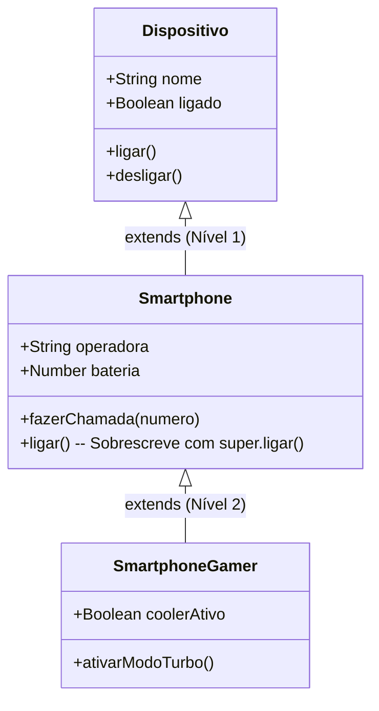
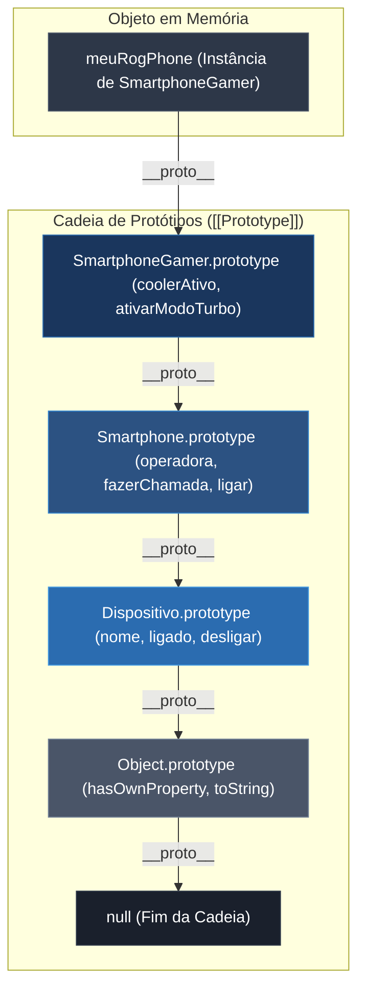
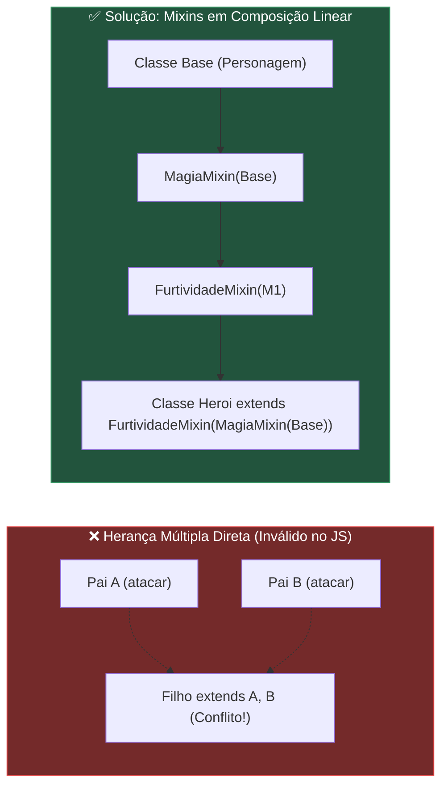

# Aula: Herança de Classes em JavaScript

## 1. Abertura com Analogia Prática

### Qual problema a Herança e as Cadeias de Herança resolvem?

Imagine que você está desenvolvendo um sistema de gerenciamento e precisa criar três tipos de entidades:
1. Um **Dispositivo Genérico** (tem nome, status de ligado/desligado, método `ligar()` e `desligar()`).
2. Um **Smartphone** (é um dispositivo, mas também tem bateria, operadora e método `fazerChamada()`).
3. Um **Smartphone Gamer** (é um smartphone, mas também tem sistema de resfriamento líquido e modo `ativarModoTurbo()`).

Sem herança, você teria que copiar e colar o código de `ligar()`, `desligar()` e controle de energia em **todas** essas classes. Se amanhã o método `ligar()` mudar para incluir uma verificação de bateria, você precisará alterar 3, 5 ou 10 classes manualmente — a receita perfeita para bugs.

A **Herança de Classes** resolve isso criando uma relação do tipo **"É UM" (is-a)**:
- Um `Smartphone` *é um* `Dispositivo`.
- Um `SmartphoneGamer` *é um* `Smartphone` (e, por consequência, também *é um* `Dispositivo`).

---

### A Analogia do DNA vs Habilidades de RPG

Para entender a diferença entre **Hierarquia Multinível (Classes que herdam de classes que herdam)** e **Herança Múltipla**, pense em duas situações:

1. **A Linhagem Genética (Herança Multinível):**
   Você herda características físicas dos seus pais, e seus pais herdaram dos seus avós. Há uma **linha genealógica única e contínua**. Seus pais refinaram certas características, e você refinou outras, mas você ainda carrega a base do seu avô. Em JavaScript, isso é a **cadeia de herança linear** (`Neto extends Filho extends Pai`).

2. **O Personagem de RPG (Herança Múltipla & Mixins):**
   Imagine um Guerreiro que também quer aprender magia de Mago e furtividade de Ladino. Se ele tentar ter 3 "pais biológicos" diretos, a biologia entra em conflito: *"Se o Guerreiro e o Mago têm um comando 'atacar()', qual versão ele herda?"* (o famoso **Problema do Diamante**).
   Por isso, o JavaScript **não permite herança biológica múltipla** (`class Heroi extends Guerreiro, Mago` é proibido!). Em vez disso, o JS usa **Equipamentos/Habilidades Adicionais (Mixins)**: o Guerreiro herda de uma base, e "acopla" módulos de magia e furtividade sob demanda.

> 💡 *Curiosidade Histórica: Por que o JavaScript não tem herança múltipla nativa? No coração da linguagem, todo objeto possui apenas **um único** slot interno de protótipo (`[[Prototype]]`). Como um objeto só pode apontar para um único protótipo-pai na memória, o motor V8 não tem como bifurcar a busca de propriedades. Para suprir a necessidade de múltiplos comportamentos, usamos o padrão **Mixins**.*

---

## 2. Visualização com Diagramas

### Hierarquia Multinível de Classes (Classes que herdam de classes que herdam)



*Legenda: `SmartphoneGamer` herda tudo de `Smartphone` e, por transitividade, tudo de `Dispositivo`.*

---

### Cadeia de Protótipos Interna (Under the Hood)



---

### Herança Múltipla: O Problema vs A Solução (Mixins)



---

## 3. Sintaxe, Argumentos e Anatomia

### Anatomia da Herança Multinível

```js
// 1. Superclasse (Nível 0 - Base)
class Dispositivo {
    constructor(nome) {
        this.nome = nome;
        this.ligado = false;
    }

    ligar() {
        if (this.ligado) return;
        this.ligado = true;
    }
}

// 2. Subclasse Intermediária (Nível 1)
class Smartphone extends Dispositivo {
    constructor(nome, operadora) {
        super(nome); // ⚠️ OBRIGATÓRIO: invoca o constructor da superclasse
        this.operadora = operadora;
    }

    ligar() {
        super.ligar(); // Chama o ligar() de Dispositivo
        console.log(`${this.nome} exibindo logo na tela...`);
    }
}

// 3. Subclasse Especializada (Nível 2 - Herda de quem já herdou)
class SmartphoneGamer extends Smartphone {
    constructor(nome, operadora, temCooler) {
        super(nome, operadora); // Passa os dados para Smartphone (que passa nome para Dispositivo)
        this.temCooler = temCooler;
        this.modoTurbo = false;
    }

    ativarModoTurbo() {
        this.modoTurbo = true;
    }
}
```

---

### Desmontando a Sintaxe Linha por Linha

| Elemento / Palavra-Chave | O que faz | Regras Críticas |
| :--- | :--- | :--- |
| `extends SuperClasse` | Estabelece a ligação prototípica entre as classes. | Aceita apenas **uma** superclasse. Não é possível fazer `extends A, B`. |
| `super(...args)` *(como função)* | Executa o construtor da classe pai imediatamente acima. | **Deve ser chamado antes** de qualquer acesso a `this` dentro do `constructor`. |
| `super.metodo()` *(como objeto)* | Invoca um método da superclasse para reaproveitar sua lógica antes/depois de estendê-la. | Permite **estender** um comportamento em vez de apenas substituí-lo por completo. |
| `instanceof` | Verifica se o protótipo da classe está presente na cadeia do objeto. | Retorna `true` para a classe direta e para **todos** os ancestrais na cadeia. |

---

### O Mecanismo de Mixins (Como simular Herança Múltipla)

Como o JavaScript não suporta herança múltipla com `class C extends A, B`, a forma canônica e idiomática de compor múltiplos comportamentos é através de **Factory Functions de Classes (Mixins)**:

```js
// Mixin 1: Habilidade de Log / Auditoria
const AuditavelMixin = (SuperClasse) => class extends SuperClasse {
    log(mensagem) {
        console.log(`[LOG ${new Date().toISOString()}] ${this.nome || 'Entidade'}: ${mensagem}`);
    }
};

// Mixin 2: Habilidade de Validação
const ValidavelMixin = (SuperClasse) => class extends SuperClasse {
    validar() {
        if (!this.nome || this.nome.trim() === '') {
            throw new Error('Nome inválido.');
        }
        return true;
    }
};

// Aplicação dos Mixins em uma Classe Base:
class EntidadeBase {
    constructor(nome) {
        this.nome = nome;
    }
}

// Compondo múltiplos comportamentos linearmente:
class ProdutoFinal extends ValidavelMixin(AuditavelMixin(EntidadeBase)) {
    salvar() {
        this.validar();
        this.log('Salvo com sucesso!');
    }
}
```

---

### ⚠️ Regras de Ouro e Pitfalls

- ⚠️ **`ReferenceError: Must call super constructor before accessing 'this'`**:
  Se você tentar ler ou gravar `this.propriedade` antes da linha do `super()`, o JavaScript lançará um erro fatal. O objeto `this` só é inicializado pela classe base.
- ⚠️ **Herança Múltipla Inválida**:
  `class A extends B, C {}` resulta em `SyntaxError: Unexpected token ','`. O JS exige um único pai por `extends`.
- ⚠️ **O Problema da Herança Profunda (Fragile Base Class)**:
  Criar cadeias de herança com 5 ou mais níveis (`A extends B extends C extends D extends E`) torna o código rígido e difícil de manter. Mudanças na base afetam todos os filhos imprevisivelmente. *Mantenha a hierarquia rasa (2 a 3 níveis no máximo) ou prefira composição com Mixins.*
- ✅ **Chamar `super.metodo()` para não reinventar a roda**:
  Ao sobrescrever um método na classe filha, avalie se a classe pai já faz parte do trabalho. Reaproveite usando `super.metodo()` e adicione apenas o diferencial.
- 💡 **`instanceof` com Hierarquia Multinível**:
  Se `Gamer extends Smart extends Disp`, então `gamer instanceof Gamer`, `gamer instanceof Smart`, `gamer instanceof Disp` e `gamer instanceof Object` são **todos `true`**.

---

## 4. Exemplos de Código em Duas Camadas

### Camada 1: Isolada e Didática (Dispositivos Eletrônicos Multinível)

```js
// ==========================================
// CAMADA 1: Hierarquia Multinível Limpa
// ==========================================

// Superclasse Base
class DispositivoEletronico {
    constructor(nome) {
        this.nome = nome;
        this.ligado = false;
    }

    ligar() {
        if (this.ligado) {
            console.log(`${this.nome} já está ligado.`);
            return;
        }
        this.ligado = true;
        console.log(`${this.nome} foi ligado.`);
    }

    desligar() {
        if (!this.ligado) {
            console.log(`${this.nome} já está desligado.`);
            return;
        }
        this.ligado = false;
        console.log(`${this.nome} foi desligado.`);
    }
}

// Nível 1: Smartphone herda de DispositivoEletronico
class Smartphone extends DispositivoEletronico {
    constructor(nome, operadora, modelo) {
        super(nome); // Envia 'nome' para a classe DispositivoEletronico
        this.operadora = operadora;
        this.modelo = modelo;
    }

    // Sobrescrita (Override) com extensão de comportamento
    ligar() {
        super.ligar(); // Executa a lógica de ligar da classe base
        console.log(`📱 [Smartphone] Conectando à rede ${this.operadora}...`);
    }

    fazerLigacao(numero) {
        if (!this.ligado) {
            console.log(`❌ Não é possível ligar: ${this.nome} está desligado.`);
            return;
        }
        console.log(`📞 Ligando para ${numero} via ${this.operadora}...`);
    }
}

// Nível 2: SmartphoneGamer herda de Smartphone (que herda de DispositivoEletronico)
class SmartphoneGamer extends Smartphone {
    constructor(nome, operadora, modelo, taxaAtualizacaoHz) {
        super(nome, operadora, modelo); // Repassa para Smartphone
        this.taxaAtualizacaoHz = taxaAtualizacaoHz;
        this.coolerAtivo = false;
    }

    // Método exclusivo da classe neta
    ativarCooler() {
        this.coolerAtivo = true;
        console.log(`❄️ Cooler ativado a ${this.taxaAtualizacaoHz}Hz para alto desempenho!`);
    }

    // Sobrescrita do ligar no nível 2
    ligar() {
        super.ligar(); // Chama o ligar do Smartphone (que chama o do Dispositivo)
        console.log(`🎮 [Gamer] Perfil de alta performance carregado.`);
    }
}

// --- Testando a Hierarquia ---
const rogPhone = new SmartphoneGamer('Asus ROG Phone', 'Vivo', 'ROG 7', 165);

rogPhone.ligar();
// Saída:
// Asus ROG Phone foi ligado.
// 📱 [Smartphone] Conectando à rede Vivo...
// 🎮 [Gamer] Perfil de alta performance carregado.

rogPhone.ativarCooler(); // ❄️ Cooler ativado a 165Hz para alto desempenho!
rogPhone.fazerLigacao('11999998888'); // 📞 Ligando para 11999998888 via Vivo...

// Verificando a cadeia com instanceof
console.log(rogPhone instanceof SmartphoneGamer);      // true
console.log(rogPhone instanceof Smartphone);           // true
console.log(rogPhone instanceof DispositivoEletronico);// true
console.log(rogPhone instanceof Object);               // true
```

---

### Camada 2: Contextualizada (Sistema de Tarefas com Hierarquia + Herança Múltipla via Mixins)

Conectando diretamente com a classe `Task` que você já conhece:

```js
// ==========================================
// CAMADA 2: Contextualizada no Sistema de Tarefas
// ==========================================

// --- PARTE A: MIXINS (Para compor múltiplos comportamentos) ---

// Mixin 1: Notificações
const NotificavelMixin = (BaseClass) => class extends BaseClass {
    notificar(canal = 'Email') {
        console.log(`🔔 [Notificação por ${canal}]: A tarefa "${this.title}" precisa de atenção!`);
    }
};

// Mixin 2: Sincronização em Nuvem
const SincronizavelNuvemMixin = (BaseClass) => class extends BaseClass {
    sincronizarComServidor() {
        console.log(`☁️ [Cloud Sync]: Sincronizando dados de "${this.title}" com o banco remoto...`);
    }
};

// --- PARTE B: CLASSE BASE ---
class Task {
    constructor(title, description) {
        this.title = title;
        this.description = description;
        this.complete = false;
        this.createdAt = new Date();
    }

    concluir() {
        this.complete = true;
        console.log(`✅ Tarefa "${this.title}" marcada como concluída.`);
    }

    get status() {
        return `${this.complete ? '✅ Concluída' : '⏳ Pendente'} - ${this.title}`;
    }
}

// --- PARTE C: HIERARQUIA MULTINÍVEL (Classes que herdam) ---

// Nível 1: TaskComPrazo herda de Task
class TaskComPrazo extends Task {
    constructor(title, description, prazoData) {
        super(title, description);
        this.prazoData = new Date(prazoData);
    }

    estaAtrasada() {
        return !this.complete && new Date() > this.prazoData;
    }

    // Sobrescrita de método
    get status() {
        const infoBase = super.status;
        const prazoFormatado = this.prazoData.toLocaleDateString('pt-BR');
        const atraso = this.estaAtrasada() ? ' ⚠️ [ATRASADA]' : '';
        return `${infoBase} (Prazo: ${prazoFormatado})${atraso}`;
    }
}

// Nível 2 + Mixins (Herança Multinível combinada com Herança Múltipla via Mixins):
// TaskProjeto herda de TaskComPrazo E recebe Notificavel + Sincronizavel
class TaskProjeto extends SincronizavelNuvemMixin(NotificavelMixin(TaskComPrazo)) {
    constructor(title, description, prazoData, projetoNome, responsavel) {
        super(title, description, prazoData);
        this.projetoNome = projetoNome;
        this.responsavel = responsavel;
    }

    delegarPara(novoResponsavel) {
        this.responsavel = novoResponsavel;
        console.log(`👤 Tarefa transferida para: ${this.responsavel}`);
        this.notificar('Slack'); // Método vindo do NotificavelMixin
        this.sincronizarComServidor(); // Método vindo do SincronizavelNuvemMixin
    }
}

// --- Demonstração ---
const taskSprint = new TaskProjeto(
    'Refatorar Módulo de Autenticação',
    'Migrar para JWT com classes modularizadas',
    '2026-12-31',
    'Plataforma Core',
    'Leonardo'
);

console.log(taskSprint.status);
// Saída: ⏳ Pendente - Refatorar Módulo de Autenticação (Prazo: 31/12/2026)

taskSprint.delegarPara('Equipe Backend');
// Saída:
// 👤 Tarefa transferida para: Equipe Backend
// 🔔 [Notificação por Slack]: A tarefa "Refatorar Módulo de Autenticação" precisa de atenção!
// ☁️ [Cloud Sync]: Sincronizando dados de "Refatorar Módulo de Autenticação" com o banco remoto...

taskSprint.concluir();
// Saída: ✅ Tarefa "Refatorar Módulo de Autenticação" marcada como concluída.

// Verificando toda a hierarquia genealógica:
console.log(taskSprint instanceof TaskProjeto);      // true
console.log(taskSprint instanceof TaskComPrazo);      // true
console.log(taskSprint instanceof Task);              // true
console.log(taskSprint instanceof Object);            // true
```

---

## 5. Engajamento, Debugging e Desafio

### Resumo Executivo
- **Hierarquia Multinível (`A extends B extends C`):** Cria especializações em cascata. O `super()` deve repassar os parâmetros necessários em cada degrau da escada.
- **Herança Múltipla no JS:** Não existe nativamente via `extends A, B` porque cada objeto tem apenas um `[[Prototype]]`.
- **Mixins como Solução:** Usamos funções `(Base) => class extends Base { ... }` para compor múltiplas habilidades de forma linear, limpa e flexível.

---

### Visão de Debugging (Como inspecionar a cadeia no console)

Para inspecionar a hierarquia completa de qualquer objeto no Node.js ou DevTools:

```js
const inspecionarCadeia = (obj) => {
    let atual = Object.getPrototypeOf(obj);
    let nivel = 1;
    console.log(`🔍 [Inspeção de Protótipos]`);
    while (atual !== null) {
        console.log(`  Nível ${nivel}: ${atual.constructor.name}`);
        atual = Object.getPrototypeOf(atual);
        nivel++;
    }
};

inspecionarCadeia(taskSprint);
// Saída:
// 🔍 [Inspeção de Protótipos]
//   Nível 1: TaskProjeto
//   Nível 2: _class (SincronizavelNuvemMixin)
//   Nível 3: _class (NotificavelMixin)
//   Nível 4: TaskComPrazo
//   Nível 5: Task
//   Nível 6: Object
```

---

### Próximas Conexões
- **Polimorfismo:** Como diferentes subclasses na mesma hierarquia respondem à mesma mensagem de formas diferentes.
- **Composição vs Herança ("Composition over Inheritance"):** Quando parar de estender classes e passar a injetar dependências/objetos.

---

### 🎯 Desafios Práticos

- 🟢 **Básico:** Crie uma classe `TaskUrgente` que herda diretamente de `Task` (`extends Task`). No construtor, use `super(title, description)` e adicione uma propriedade `nivelUrgencia` (1 a 5). Sobrescreva o getter `status` para adicionar o ícone `🚨 [URGÊNCIA NÍVEL X]`.
- 🟡 **Intermediário:** Crie uma classe `TaskRecorrente` que herda de `TaskComPrazo` (formando 3 níveis: `Task` -> `TaskComPrazo` -> `TaskRecorrente`). Adicione o método `renovarPrazo(dias)` que atualiza a data de prazo somando os dias e reabre a tarefa (`this.complete = false`).
- 🔴 **Avançado:** Crie dois Mixins independentes: `AuditavelMixin` (registra histórico de alterações num array `this.historico = []`) e `CriptografavelMixin` (método `encriptarDescricao()` e `decriptarDescricao()`). Crie uma classe `TaskSegura` aplicando ambos os mixins sobre a classe `Task`.

---

## 🎯 Questões de Fixação

Tente responder antes de ver a resposta!

---

**Questão 1:** Um desenvolvedor júnior está estruturando um sistema de e-commerce e deseja criar uma classe `NotebookGamer` que precisa herdar simultaneamente os métodos de `Computador` e de `AparelhoPortatil`. Ele escreve: `class NotebookGamer extends Computador, AparelhoPortatil { ... }`. O que acontecerá ao executar este código?

- A) O código funcionará normalmente, herdando os métodos de `Computador` com prioridade sobre `AparelhoPortatil`.
- B) O motor JavaScript lançará um **`SyntaxError`**, pois a sintaxe de classes do JavaScript não permite herança múltipla direta com múltiplos identificadores após `extends`.
- C) O motor JavaScript criará dois protótipos separados na propriedade `__proto__`, mesclando as duas classes automaticamente.
- D) O código executará, mas apenas a primeira classe (`Computador`) será herdada, ignorando silenciosamente `AparelhoPortatil`.

<details>
<summary>🔍 Ver resposta</summary>

**B) O motor JavaScript lançará um `SyntaxError`** — A especificação do ECMAScript define que a cláusula `extends` aceita apenas uma única expressão de classe base. Como cada objeto no JS possui apenas um ponteiro interno `[[Prototype]]`, herança múltipla nativa não existe na sintaxe de classes; para alcançar esse comportamento, devem ser utilizados Mixins ou Composição.

</details>

---

**Questão 2:** Analise o trecho de código abaixo onde uma subclasse tenta inicializar suas propriedades no construtor:

```js
class Veiculo {
    constructor(marca) {
        this.marca = marca;
    }
}

class CarroEletrico extends Veiculo {
    constructor(marca, capacidadeBateria) {
        this.capacidadeBateria = capacidadeBateria;
        super(marca);
    }
}

const tesla = new CarroEletrico('Tesla', 100);
```

Qual será o resultado da execução?

- A) A instância `tesla` será criada normalmente com as propriedades `marca: 'Tesla'` e `capacidadeBateria: 100`.
- B) O código lançará um erro do tipo **`ReferenceError`**, porque em classes derivadas é obrigatório invocar `super()` antes de acessar ou atribuir qualquer valor a `this`.
- C) A propriedade `marca` será atribuída como `undefined` porque `super(marca)` foi chamado depois.
- D) O código lançará um `TypeError: super is not a constructor`.

<details>
<summary>🔍 Ver resposta</summary>

**B) O código lançará um `ReferenceError`** — Em construtores derivados (classes com `extends`), o ponteiro `this` não é alocado até que o construtor da superclasse (`super()`) seja invocado. Tentar acessar `this.capacidadeBateria` antes de `super(marca)` lança imediatamente um `ReferenceError`.

</details>

---

**Questão 3:** Considere uma cadeia de herança em três níveis: `class ContaPJ extends ContaBancaria` e `class ContaPJExportadora extends ContaPJ`. Criamos uma instância: `const minhaConta = new ContaPJExportadora(...)`. Ao avaliarmos as expressões com o operador `instanceof`, qual das alternativas apresenta o resultado correto?

- A) `minhaConta instanceof ContaPJExportadora` é `true`, mas `minhaConta instanceof ContaBancaria` é `false`, pois o `instanceof` avalia apenas o pai imediato.
- B) Todas as expressões: `minhaConta instanceof ContaPJExportadora`, `minhaConta instanceof ContaPJ`, `minhaConta instanceof ContaBancaria` e `minhaConta instanceof Object` retornam **`true`**.
- C) Retorna `true` apenas para `ContaPJExportadora` e `Object`, pois as classes intermediárias são descartadas da memória após a instanciação.
- D) Retorna `true` para `ContaPJExportadora`, mas lançará um `TypeError` ao testar com classes ancestrais se o método `super()` não tiver sido explicitamente nomeado.

<details>
<summary>🔍 Ver resposta</summary>

**B) Todas as expressões retornam `true`** — O operador `instanceof` percorre recursivamente toda a cadeia de protótipos (`__proto__`) do objeto até encontrar o `prototype` da função/classe testada ou atingir `null`. Como a herança é multinível, a instância contém toda a linhagem em sua cadeia prototípica.

</details>

---

**Questão 4:** *(Pegadinha)* Um desenvolvedor deseja sobrescrever um método na classe filha, mas ainda precisa que o comportamento original da classe pai seja executado antes da nova lógica. Qual é a forma correta e recomendada de fazer isso?

- A) Invocar `this.super.metodo()` no início da função filha.
- B) Invocar `super.metodo()` dentro da definição do método na classe filha.
- C) Recriar a função pai com `Pai.prototype.metodo.apply(this)` manualmente.
- D) Não é possível executar ambos; ao definir um método com o mesmo nome na classe filha, o método pai é permanentemente deletado da cadeia.

<details>
<summary>🔍 Ver resposta</summary>

**B) Invocar `super.metodo()` dentro da definição do método na classe filha** — A palavra-chave `super` usada como objeto (`super.nomeDoMetodo()`) referencia o protótipo da superclasse, permitindo invocar e reaproveitar a implementação original com o contexto do `this` atual antes ou depois do código customizado da subclasse.

</details>

---

**Questão 5:** Em relação ao padrão **Mixins** para simulação de múltiplos comportamentos em JavaScript, qual das afirmações abaixo descreve com precisão como ele opera internamente?

- A) Ele altera a especificação do JavaScript em tempo de execução para permitir múltiplos ponteiros `[[Prototype]]` no mesmo objeto.
- B) Ele utiliza Factory Functions que recebem uma classe base como parâmetro e retornam uma nova classe intermediária anônima estendendo essa base, transformando a composição de múltiplos comportamentos em uma **cadeia linear de herança simples**.
- C) Ele clona os métodos via `JSON.parse(JSON.stringify())`, evitando a criação de protótipos.
- D) Ele funciona apenas com funções construtoras do ES5, sendo incompatível com a sintaxe `class` do ES6.

<details>
<summary>🔍 Ver resposta</summary>

**B) Ele utiliza Factory Functions que retornam classes estendendo a base recebida, gerando uma cadeia linear** — Como o motor JS suporta apenas herança simples, o padrão Mixin resolve o compartilhamento de múltiplos comportamentos encadeando classes derivadas de forma linear (`ClasseFinal extends MixinB(MixinA(Base))`), preservando a integridade da cadeia de protótipos.

</details>

---

## ⚡ Resumo Rápido para Revisão

Memorize estas associações:

| Se você precisar... | Pense em... |
| :--- | :--- |
| Criar uma relação de especialização ("É UM") | **`class Filho extends Pai`** |
| Inicializar os atributos da superclasse no construtor | **`super(...args)`** *(na 1ª linha do constructor)* |
| Aproveitar a lógica do método da classe pai ao sobrescrever | **`super.nomeDoMetodo()`** |
| Testar se um objeto pertence a qualquer nível da hierarquia | **`objeto instanceof ClassePai`** |
| Adicionar múltiplos comportamentos independentes sem herança múltipla nativa | **Padrão Mixin (`(Base) => class extends Base`)** |
| Inspecionar o protótipo pai de um objeto em tempo de execução | **`Object.getPrototypeOf(objeto)`** |

---

### 🔑 Fatos-Chave que Você PRECISA Saber

| Fato / Comportamento | O que significa |
| :---: | :--- |
| **`class C extends A, B`** | **Erro de Sintaxe imediato.** JS suporta apenas herança simples. |
| **`this` antes do `super()`** | **`ReferenceError`**. O `this` só passa a existir após a chamada de `super()`. |
| **Ponteiro `[[Prototype]]`** | Todo objeto tem **exatamente um** protótipo pai (ou `null`). |
| **Cadeia de `instanceof`** | Retorna `true` para a classe instanciada e para **todos** os ancestrais até `Object`. |
| **Mixins no JS** | Empilham classes anônimas intermediárias para criar uma cadeia linear de herança. |
