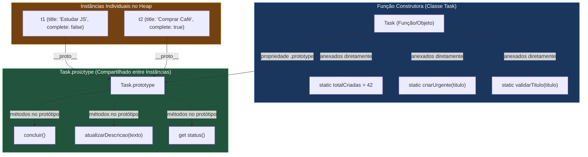
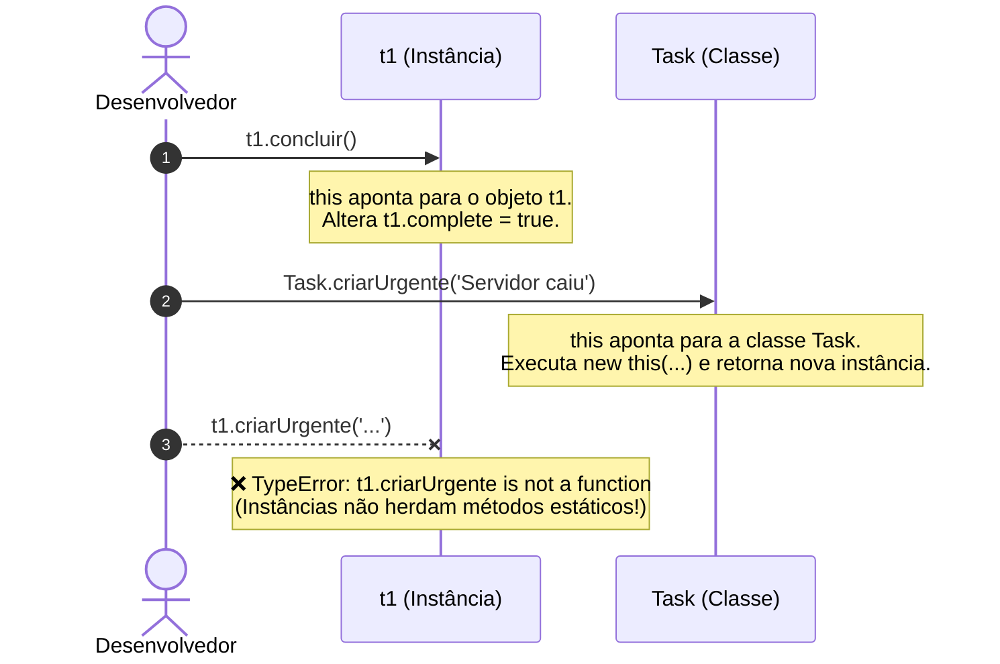
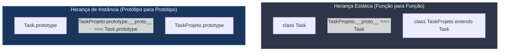

# Aula: Métodos de Instância e Métodos de Classe (Estáticos) em JavaScript

## 1. Abertura com Analogia Prática

### Qual problema a separação entre Métodos de Instância e de Classe resolve?

Ao programar orientado a objetos, você inevitavelmente se depara com dois tipos bem diferentes de necessidades:
1. **Comportamentos Individuais:** Ações que afetam os dados específicos de **um único objeto** (ex: marcar *esta* tarefa específica como concluída, alterar o saldo *desta* conta bancária, acelerar *este* carro).
2. **Operações Globais e Utilitárias:** Ações que dizem respeito ao **conceito da classe como um todo**, e não a um objeto em particular (ex: validar se um formato de e-mail é válido antes de criar o usuário, contar quantas tarefas já foram criadas no sistema, ou criar uma tarefa pré-configurada a partir de um JSON).

Sem métodos de classe (estáticos), você teria dois caminhos ruins:
- Ou você criava funções soltas e espalhadas pelo código sem nenhuma organização modular.
- Ou você era obrigado a instanciar um objeto com `new Usuario()` só para poder chamar uma função de validação matemática ou de formatação.

A divisão entre **Métodos de Instância** e **Métodos de Classe (`static`)** resolve isso organizando o código exatamente onde ele pertence.

---

### A Analogia da Montadora de Carros vs O Carro na Garagem

Pense na relação entre a **Montadora Fiat** e o **carro Fiat Uno na sua garagem**:

1. **Método de Instância (`meuUno.acelerar()`):**
   É o pedal do acelerador do *seu* carro. Ele depende do estado daquele veículo específico: quanto combustível há no tanque, se o motor está ligado e qual é a velocidade atual. Cada carro tem o seu próprio pedal e seu próprio motor.
2. **Método de Classe / Estático (`Montadora.calcularIPVA(valor, ano)` ou `Montadora.criarModeloPopular()`):**
   É a tabela de especificações ou a linha de montagem da fábrica. Você **não precisa ligar nem comprar um carro específico** para consultar uma fórmula de cálculo de imposto ou para pedir à fábrica que monte um modelo pré-configurado. A própria montadora (`Fiat`) executa essa operação no nível global da marca.

> 💡 *Curiosidade Histórica: Por que a palavra-chave `static`? O termo foi herdado de linguagens como C++ e Java. Nessas linguagens, "estático" significava que a função ou variável tinha uma posição de memória fixa alocada na inicialização do programa, em vez de ser alocada dinamicamente a cada `new`. Em JavaScript, métodos de instância residem no `Classe.prototype`, enquanto métodos estáticos são anexados diretamente à função construtora `Classe`.*

---

## 2. Visualização com Diagramas

### Onde Cada Método Vive na Memória



*Legenda: As instâncias `t1` e `t2` têm acesso aos métodos em `Task.prototype`, mas **não** possuem os métodos estáticos em sua cadeia de protótipos.*

---

### Resolução do `this` em Tempo de Execução



---

### Herança de Métodos Estáticos vs Métodos de Instância



*Diferencial do JavaScript: Subclasses herdam tanto os métodos de instância quanto os métodos estáticos da superclasse!*

---

## 3. Sintaxe, Argumentos e Anatomia

### Anatomia Completa de uma Classe Moderna

```js
class GerenciadorDeTarefas {
    // 1. Campo Estático Público (Compartilhado globalmente pela classe)
    static VERSAO_API = '2.4.0';
    static totalInstancias = 0;

    // 2. Campo Estático Privado (Apenas a classe acessa internamente)
    static #prefixoPadrao = 'TASK';

    // 3. Bloco de Inicialização Estática (Executado 1 única vez ao carregar a classe)
    static {
        console.log(`[INIT] GerenciadorDeTarefas carregado na versão ${this.VERSAO_API}`);
    }

    // 4. Construtor de Instância
    constructor(titulo, prioridade = 'Baixa') {
        this.id = `${GerenciadorDeTarefas.#prefixoPadrao}-${++GerenciadorDeTarefas.totalInstancias}`;
        this.titulo = titulo;
        this.prioridade = prioridade;
        this.concluida = false;
    }

    // 5. Método de Instância (Opera no objeto individual 'this')
    marcarConcluida() {
        this.concluida = true;
        return this;
    }

    // 6. Getter de Instância
    get resumo() {
        return `[${this.id}] ${this.titulo} (${this.prioridade}) - ${this.concluida ? 'Concluída' : 'Pendente'}`;
    }

    // 7. Método Estático (Factory Method / Construtor Alternativo)
    static criarUrgente(titulo) {
        // 'this' aqui dentro aponta para a classe GerenciadorDeTarefas!
        return new this(titulo, 'Alta');
    }

    // 8. Método Estático Utilitário / Helper
    static ehPrioridadeValida(prioridade) {
        const validas = ['Baixa', 'Média', 'Alta', 'Crítica'];
        return validas.includes(prioridade);
    }
}
```

---

### Tabela de Comparação Direta

| Característica | Método de Instância | Método de Classe (`static`) |
| :--- | :--- | :--- |
| **Declaração** | `nomeMetodo(args) { ... }` | `static nomeMetodo(args) { ... }` |
| **Onde reside na memória** | `Classe.prototype.nomeMetodo` | `Classe.nomeMetodo` |
| **Como é chamado** | `minhaInstancia.nomeMetodo()` | `NomeDaClasse.nomeMetodo()` |
| **Para quem o `this` aponta** | Para o **objeto individual** instanciado | Para a **própria função/classe** |
| **Acesso a dados individuais** | ✅ Acessa `this.propriedades` do objeto | ❌ Não tem acesso ao estado da instância |
| **Chamada a partir da instância** | ✅ `instancia.metodo()` funciona | ❌ `instancia.metodo()` lança `TypeError` |
| **Herança via `extends`** | ✅ Herdado pelo prototype filho | ✅ Herdado pela subclasse (`Filho.metodo()`) |
| **Casos de Uso Ideais** | Lógica de negócio do objeto, alteração de estado individual, getters/setters. | **Factory Methods**, Validações puras, Helpers/Utilitários, Agregações em arrays. |

---

### Exemplos de Métodos Estáticos Nativos do JavaScript

Você já usa métodos estáticos todos os dias sem perceber:

- `Math.max(10, 20)` *(você não faz `new Math()`)*
- `Array.from('123')` ou `Array.isArray([])` *(você não faz `[].isArray()`)*
- `Object.keys(objeto)` ou `Object.assign({}, fonte)`
- `Number.parseInt('42')` ou `Number.isNaN(NaN)`
- `Promise.all([p1, p2])` ou `Promise.resolve('ok')`
- `JSON.parse(string)` ou `JSON.stringify(dados)`

Todos eles são **Métodos Estáticos** agrupados dentro do "namespace" de suas respectivas classes/objetos globais.

---

### ⚠️ Regras de Ouro e Pitfalls

- ⚠️ **`TypeError: instancia.metodoEstatico is not a function`**:
  Métodos estáticos **não** estão no prototype da instância. Tentar chamar `const t = new Task(); t.criarUrgente()` causará um erro imediato. Chame sempre `Task.criarUrgente()`.
- ⚠️ **`this` dentro de Método Estático NÃO é a instância**:
  Dentro de um método `static`, `this.titulo` retornará `undefined` (ou o nome da classe `Task.name` se você ler `this.name`), porque `this` aponta para a classe `Task`, não para um objeto criado com `new`.
- ⚠️ **Perda de Contexto ao Desestruturar**:
  Se você fizer `const { criarUrgente } = Task; criarUrgente('Bug');`, o `this` interno deixará de ser `Task` e a chamada `new this(...)` falhará. Chame sempre com a classe à esquerda do ponto (`Task.criarUrgente()`) ou use referências explícitas.
- ✅ **Factory Methods para Construtores Expressivos**:
  Em vez de sobrecarregar um único `constructor` com dezenas de `if/else`, crie métodos estáticos como `Task.criarAPartirDeJSON()`, `Task.criarComPrazoEmDias()`, etc.
- ✅ **Métodos Utilitários Devem ser Funções Puras**:
  Métodos estáticos de cálculo ou validação devem, preferencialmente, receber todos os dados por parâmetros e não depender de variáveis globais mutáveis.

---

## 4. Exemplos de Código em Duas Camadas

### Camada 1: Isolada e Didática (Classe Calculadora & Conversor)

```js
// ==========================================
// CAMADA 1: Métodos de Instância vs Estáticos Isolados
// ==========================================

class Calculadora {
    // 1. Estado de Instância (Memória da Calculadora)
    constructor(valorInicial = 0) {
        this.resultado = valorInicial;
    }

    // Método de Instância: Modifica o estado desta calculadora específica
    somar(numero) {
        this.resultado += numero;
        return this; // Permite encadeamento de métodos (Method Chaining)
    }

    subtrair(numero) {
        this.resultado -= numero;
        return this;
    }

    obterResultado() {
        return this.resultado;
    }

    // --- MÉTODOS ESTÁTICOS (Utilitários que não precisam de estado) ---

    // Método de Classe 1: Operação pura e instantânea
    static somarEstatico(a, b) {
        return a + b;
    }

    // Método de Classe 2: Validação
    static ehNumeroValido(valor) {
        return typeof valor === 'number' && !Number.isNaN(valor) && Number.isFinite(valor);
    }

    // Método de Classe 3: Conversor / Helper
    static formatarMoeda(valor, moeda = 'BRL') {
        if (!Calculadora.ehNumeroValido(valor)) {
            throw new TypeError('Valor numérico inválido para formatação.');
        }
        return new Intl.NumberFormat('pt-BR', { style: 'currency', currency: moeda }).format(valor);
    }
}

// --- USO NA PRÁTICA ---

// A) Usando Métodos de Instância (Precisamos de um objeto para manter histórico/estado)
const minhaCalc = new Calculadora(10);
minhaCalc.somar(5).subtrair(3);
console.log('Resultado da instância:', minhaCalc.obterResultado()); // 12

// B) Usando Métodos Estáticos (Não precisamos criar um objeto com 'new')
const somaRapida = Calculadora.somarEstatico(50, 30);
console.log('Soma estática:', somaRapida); // 80

const formatado = Calculadora.formatarMoeda(1250.50);
console.log('Moeda formatada:', formatado); // R$ 1.250,50

// C) Testando a barreira de acesso:
// console.log(minhaCalc.somarEstatico(1, 2)); // ❌ TypeError: minhaCalc.somarEstatico is not a function
// console.log(Calculadora.somar(5));          // ❌ TypeError: Calculadora.somar is not a function
```

---

### Camada 2: Contextualizada (Evolução da Classe `Task` do Projeto)

Vamos expandir a classe `Task` que você já implementou no seu projeto, adicionando contadores globais, validações, fábrica de instâncias (Factory Methods) e operações de agregação em lote:

```js
// ==========================================
// CAMADA 2: Contextualizada no Sistema de Tarefas
// ==========================================

class Task {
    // Propriedade Estática (Contador compartilhado globalmente)
    static totalTarefasCriadas = 0;
    static #contadorId = 0;

    constructor(title, description, priority = 'NORMAL') {
        // Validação usando o método estático da própria classe
        if (!Task.validarTexto(title)) {
            throw new Error('Título da tarefa é obrigatório e não pode ser vazio.');
        }

        this.id = ++Task.#contadorId;
        this.title = title.trim();
        this.description = description;
        this.priority = priority;
        this.complete = false;
        this.createdAt = new Date();

        // Incrementa o contador global de instâncias
        Task.totalTarefasCriadas++;
    }

    // --- MÉTODOS DE INSTÂNCIA ---

    concluir() {
        this.complete = true;
        console.log(`✅ [Tarefa #${this.id}] "${this.title}" marcada como concluída.`);
    }

    get status() {
        const icone = this.complete ? '✅' : '⏳';
        return `${icone} [#${this.id}] [${this.priority}] ${this.title}`;
    }

    toJSON() {
        return {
            id: this.id,
            title: this.title,
            description: this.description,
            priority: this.priority,
            complete: this.complete,
            createdAt: this.createdAt.toISOString()
        };
    }

    // --- MÉTODOS DE CLASSE (ESTÁTICOS) ---

    // 1. Helper de Validação
    static validarTexto(valor) {
        return typeof valor === 'string' && valor.trim().length > 0;
    }

    // 2. Factory Method: Criação Especializada de Tarefa Urgente
    static createUrgent(title, description = 'Ação imediata necessária!') {
        // 'this' refere-se à classe Task (ou a qualquer subclasse que herdar)
        return new this(`⚠️ ${title}`, description, 'URGENTE');
    }

    // 3. Factory Method: Reconstrução a partir de JSON ou API
    static fromJSON(jsonString) {
        const dados = typeof jsonString === 'string' ? JSON.parse(jsonString) : jsonString;
        const task = new this(dados.title, dados.description, dados.priority);
        task.complete = Boolean(dados.complete);
        return task;
    }

    // 4. Método Utilitário de Lote (Batch): Filtra arrays de tarefas
    static filtrarPendentes(listaDeTasks) {
        if (!Array.isArray(listaDeTasks)) return [];
        return listaDeTasks.filter(task => !task.complete);
    }

    // 5. Método Utilitário de Lote: Relatório Resumido
    static gerarRelatorio(listaDeTasks) {
        const total = listaDeTasks.length;
        const concluidas = listaDeTasks.filter(t => t.complete).length;
        const pendentes = total - concluidas;

        return {
            totalRegistradas: total,
            concluidas,
            pendentes,
            taxaConclusao: total === 0 ? '0%' : `${Math.round((concluidas / total) * 100)}%`
        };
    }
}

// --- DEMONSTRAÇÃO COMPLETA ---

// 1. Criando instâncias normais:
const t1 = new Task('Estudar JavaScript', 'Assistir aula sobre métodos estáticos');
const t2 = new Task('Praticar Exercícios', 'Fazer os desafios da aula 1');

// 2. Criando instância via Factory Method (Método Estático):
const t3 = Task.createUrgent('Bug em Produção', 'API de pagamentos fora do ar');

// 3. Criando instância reconstruída de um JSON (padrão de consumo de APIs):
const jsonMock = '{"title":"Atualizar Documentação","description":"Criar README","priority":"BAIXA","complete":true}';
const t4 = Task.fromJSON(jsonMock);

// 4. Executando métodos de instância:
t1.concluir();

console.log(t1.status); // ✅ [#1] [NORMAL] Estudar JavaScript
console.log(t2.status); // ⏳ [#2] [NORMAL] Praticar Exercícios
console.log(t3.status); // ⏳ [#3] [URGENTE] ⚠️ Bug em Produção
console.log(t4.status); // ✅ [#4] [BAIXA] Atualizar Documentação

// 5. Executando operações de lote estáticas:
const todasAsTasks = [t1, t2, t3, t4];

const pendentes = Task.filtrarPendentes(todasAsTasks);
console.log('\n--- Tarefas Pendentes ---');
pendentes.forEach(t => console.log(t.status));

const relatorio = Task.gerarRelatorio(todasAsTasks);
console.log('\n--- Relatório Executivo ---', relatorio);
// Saída: { totalRegistradas: 4, concluidas: 2, pendentes: 2, taxaConclusao: '50%' }

console.log('\nTotal de instâncias instanciadas no sistema:', Task.totalTarefasCriadas); // 4
```

---

## 5. Engajamento, Debugging e Desafio

### Resumo Executivo
- **Método de Instância (`this` = objeto):** Vive em `Classe.prototype`. Modifica ou lê dados específicos de uma instância criada com `new`.
- **Método de Classe (`static`, `this` = Classe):** Vive na função construtora `Classe`. Não requer instância; ideal para **Factory Methods**, **Validações Puras** e **Processamento de Lotes (Arrays)**.
- **Herança:** Subclasses herdam tanto métodos normais quanto métodos estáticos da superclasse.

---

### Visão de Debugging (Como inspecionar onde o método está alocado)

Abra o Node.js ou o Console do DevTools para inspecionar onde cada propriedade reside:

```js
const t = new Task('Teste', 'Desc');

// 1. O método de instância está no prototype:
console.log(Task.prototype.hasOwnProperty('concluir')); // true
console.log(t.hasOwnProperty('concluir'));               // false (vem via __proto__)

// 2. O método estático está na função construtora:
console.log(Task.hasOwnProperty('createUrgent'));        // true
console.log(Task.prototype.hasOwnProperty('createUrgent')); // false
console.log(t.hasOwnProperty('createUrgent'));          // false

// 3. Inspecionando propriedades estáticas:
console.log(Object.getOwnPropertyNames(Task));
// ['length', 'name', 'prototype', 'totalTarefasCriadas', 'validarTexto', 'createUrgent', 'fromJSON', ...]
```

---

### Próximas Conexões
- **Padrão Singleton:** Garantir que uma classe tenha apenas uma única instância controlada por um método estático `Classe.getInstance()`.
- **Design Pattern Factory:** Encapsular a lógica de criação de múltiplos tipos de objetos derivados sem expor a lógica de instanciação direta.

---

### 🎯 Desafios Práticos

- 🟢 **Básico:** Adicione um método estático `Task.compararPorPrioridade(taskA, taskB)` que recebe duas instâncias de `Task` e retorna um valor numérico para ser usado diretamente dentro de `array.sort(Task.compararPorPrioridade)`.
- 🟡 **Intermediário:** Crie um método de instância `clonar(novosAtributos)` que retorna uma nova instância idêntica à atual, permitindo sobrescrever propriedades específicas sem alterar a original (imutabilidade).
- 🔴 **Avançado:** Implemente uma classe `RepositorioTarefas` com métodos estáticos privados `#bancoLocal = new Map()` e crie métodos estáticos públicos `salvar(task)`, `buscarPorId(id)` e `listarTodas()`, simulando um banco de dados em memória centralizado na classe.

---

## 🎯 Questões de Fixação

Tente responder antes de ver a resposta!

---

**Questão 1:** Uma equipe de desenvolvedores precisa criar uma função para converter temperaturas de Celsius para Fahrenheit. Essa operação não depende do estado de nenhum usuário, sensor ou objeto individual. Qual é a melhor abordagem segundo as boas práticas de Orientação a Objetos em JavaScript?

- A) Criar a função como um método de instância dentro da classe `Termometro`, forçando o desenvolvedor a instanciar `new Termometro().celsiusParaFahrenheit(30)`.
- B) Criar a função como um **método estático** (`static converterCelsiusParaFahrenheit(graus)`) na classe `ConversorTemperatura`, permitindo chamá-la diretamente via `ConversorTemperatura.converterCelsiusParaFahrenheit(30)`.
- C) Métodos estáticos não aceitam parâmetros numéricos em JavaScript, logo a conversão deve ser feita obrigatoriamente através de getters.
- D) Declarar a função no `Object.prototype` global para que qualquer número do JavaScript receba o método automaticamente.

<details>
<summary>🔍 Ver resposta</summary>

**B) Criar a função como um método estático (`static ...`)** — Funções utilitárias, puras e de conversão matemática que não necessitam armazenar ou alterar o estado interno de um objeto individual devem ser implementadas como métodos estáticos. Isso evita o overhead e a redundância de instanciar objetos desnecessários com `new`.

</details>

---

**Questão 2:** Analise o código abaixo e identifique o que será impresso no console:

```js
class Usuario {
    static categoriaPadrao = 'Visitante';

    constructor(nome) {
        this.nome = nome;
    }

    static obterCategoria() {
        return this.categoriaPadrao;
    }
}

const u1 = new Usuario('Carlos');
console.log(u1.obterCategoria());
```

- A) `'Visitante'`
- B) `undefined`
- C) O motor JavaScript lançará um **`TypeError: u1.obterCategoria is not a function`**.
- D) `null`

<details>
<summary>🔍 Ver resposta</summary>

**C) TypeError: u1.obterCategoria is not a function** — Métodos estáticos são definidos na própria função construtora `Usuario`, e **não** no objeto `Usuario.prototype`. Por isso, instâncias criadas com `new` (como `u1`) não herdam nem encontram métodos estáticos em sua cadeia de protótipos.

</details>

---

**Questão 3:** *(Pegadinha)* Analise o comportamento do `this` dentro do método estático no código a seguir:

```js
class Produto {
    constructor(nome, preco) {
        this.nome = nome;
        this.preco = preco;
    }

    static criarComDesconto(nome, preco, porcentagem) {
        const precoFinal = preco * (1 - porcentagem / 100);
        return new this(nome, precoFinal);
    }
}

class ServicoDigital extends Produto {}

const assinatura = ServicoDigital.criarComDesconto('Streaming', 100, 20);
console.log(assinatura instanceof ServicoDigital);
```

Qual será o valor impresso no console?

- A) `false`, pois `this` dentro de `criarComDesconto` sempre apontará exclusivamente para `Produto`.
- B) **`true`**, pois métodos estáticos são herdados por subclasses e o `this` em tempo de execução aponta para a classe que fez a chamada (`ServicoDigital`).
- C) O código lançará um erro de sintaxe, pois a palavra-chave `new` não pode ser usada com `this`.
- D) Retornará `undefined`, pois classes derivadas não herdam propriedades ou métodos estáticos.

<details>
<summary>🔍 Ver resposta</summary>

**B) true** — Em JavaScript, o operador `extends` estabelece a herança tanto entre protótipos quanto entre as próprias funções construtoras (`ServicoDigital.__proto__ === Produto`). Quando chamamos `ServicoDigital.criarComDesconto()`, o valor de `this` dentro do método estático é a classe `ServicoDigital`. Logo, `new this(...)` instancia com sucesso um objeto do tipo `ServicoDigital`.

</details>

---

**Questão 4:** O que acontece quando um desenvolvedor tenta acessar uma propriedade de instância (`this.nome`) dentro de um método declarado como `static`?

```js
class Cliente {
    constructor(nome) {
        this.nome = nome;
    }

    static saudar() {
        return `Olá, ${this.nome}!`;
    }
}

const c1 = new Cliente('Mariana');
console.log(Cliente.saudar());
```

- A) Imprime `'Olá, Mariana!'`, pois o método estático busca a última instância criada.
- B) Imprime **`'Olá, Cliente!'`**, porque dentro de um método estático `this` aponta para a classe `Cliente`, e `Cliente.nome` é o nome da função/classe (`'Cliente'`).
- C) Lança um erro fatal `ReferenceError: this is not defined`.
- D) Imprime `'Olá, undefined!'` obrigatoriamente em todos os ambientes.

<details>
<summary>🔍 Ver resposta</summary>

**B) Imprime `'Olá, Cliente!'`** — Dentro de um método estático, `this` aponta para o construtor/classe `Cliente`. Como toda função em JavaScript possui uma propriedade nativa `name` contendo o nome da função (`'Cliente'`), `this.nome` acessa essa propriedade da classe, e **não** a propriedade da instância `'Mariana'`.

</details>

---

**Questão 5:** Sobre a memória e o desempenho na declaração de métodos de instância vs métodos estáticos, qual das seguintes afirmativas está tecnicamente correta?

- A) Métodos de instância são duplicados na memória para cada novo objeto criado com `new`, enquanto métodos estáticos existem em uma única via.
- B) **Métodos de instância residem em uma única cópia no `prototype` compartilhado**, enquanto métodos estáticos residem em uma única cópia diretamente no construtor da classe; nenhum dos dois duplica suas funções a cada instância.
- C) Métodos estáticos consomem mais memória porque são clonados para todas as variáveis do escopo global.
- D) Apenas métodos estáticos podem ser otimizados pelo compilador JIT do V8.

<details>
<summary>🔍 Ver resposta</summary>

**B) Métodos de instância residem no prototype e métodos estáticos residem no construtor; nenhum dos dois se duplica por instância** — Graças ao modelo de protótipos do JavaScript, métodos de instância são definidos no `Classe.prototype` (compartilhado por referência por todas as instâncias via `__proto__`), enquanto métodos estáticos pertencem à própria função `Classe`. Ambos são alocados uma única vez na memória.

</details>

---

## ⚡ Resumo Rápido para Revisão

Memorize estas associações:

| Se você precisar... | Pense em... |
| :--- | :--- |
| Operar sobre o estado ou propriedades de um objeto específico | **Método de Instância (`this.propriedade`)** |
| Criar funções utilitárias ou cálculos que independem de instâncias | **Método Estático (`static calcular(...)`)** |
| Criar instâncias pré-configuradas (Factory Methods) | **Método Estático (`static criarUrgente(...)`)** |
| Reconstruir instâncias a partir de JSON ou DTOs de APIs | **Método Estático (`static fromJSON(...)`)** |
| Manter um contador global de quantos objetos foram criados | **Campo Estático (`static total = 0`)** |
| Executar lógica de configuração única ao carregar a classe | **Bloco Estático (`static { ... }`)** |

---

### 🔑 Fatos-Chave que Você PRECISA Saber

| Fato / Comportamento | O que significa |
| :---: | :--- |
| **`t1.metodoEstatico()`** | **`TypeError`**. Instâncias não têm acesso a métodos estáticos. |
| **`this` em Método Estático** | Aponta para a **Classe** (ex: `Task`), **nunca** para uma instância individual. |
| **Herança de `static`** | **Sim!** Subclasses herdam métodos estáticos do pai (`Filho.metodoEstatico()`). |
| **`Math`, `Number`, `Array`** | São repletos de métodos estáticos nativos (`Math.max`, `Array.isArray`). |
| **Alocação de Memória** | Métodos normais vivem no `prototype`; métodos estáticos vivem na `Classe`. |
