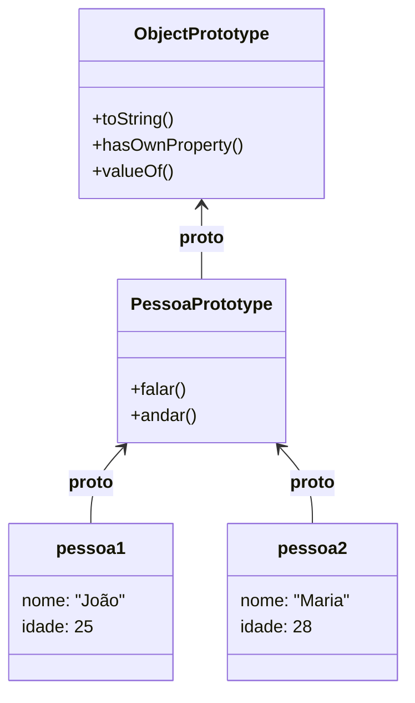

# Aula Básica sobre Prototypes em JS

## Abertura com Analogia Prática

Imagine que você está abrindo uma franquia de hamburgueria. Cada nova lanchonete (objeto) que você cria precisa saber como fazer o "Hambúrguer Clássico da Casa". 

Se você entregar um manual de instruções (métodos/funções) impresso para cada lanchonete nova, vai gastar muito papel (memória do computador) e, se um dia decidir mudar a receita, terá que ir de lanchonete em lanchonete para trocar a página. 

**Qual problema o Prototype resolve?**
O Prototype funciona como um "Manual Central na Nuvem". Cada lanchonete não tem a receita inteira guardada nela mesma; ela apenas tem um "link" (o Prototype) que aponta para a sede. Quando a lanchonete precisa fazer o hambúrguer, ela consulta a sede. Se você mudar a receita na sede, todas as lanchonetes aprendem na hora, e você economiza muita memória! Em JavaScript, essa sede é o **Prototype**.

---

## Visualização com Diagramas

Sempre que criamos um objeto no JavaScript, ele herda propriedades e métodos de um "Objeto Pai". Essa é a famosa **Prototype Chain** (Cadeia de Protótipos).


*Tudo em JavaScript eventualmente aponta para o `Object.prototype`, que é o topo da cadeia (o manual universal).*

---

## Sintaxe, Argumentos e Anatomia

A grande confusão ao aprender Prototypes está em diferenciar a propriedade `.prototype` (da função) e a referência `.__proto__` (do objeto criado).

```javascript
// Função Construtora
function Pessoa(nome) {
  this.nome = nome;
}

// O ".prototype" é onde guardamos o "Manual Central"
Pessoa.prototype.falar = function() {
  console.log(`Olá, meu nome é ${this.nome}`);
};

const p1 = new Pessoa('Leo');

// O ".__proto__" é o link secreto dentro de p1 que aponta para Pessoa.prototype
console.log(p1.__proto__ === Pessoa.prototype); // true
```

### Regras de Ouro e Pitfalls

- ⚠️ **NUNCA modifique o `Object.prototype` diretamente.** Isso pode quebrar bibliotecas e outras partes do seu código, pois todos os objetos herdarão essa modificação.
- ⚠️ **Evite usar `.__proto__` diretamente no código de produção.** Hoje em dia, o ideal é usar `Object.getPrototypeOf(obj)` para ler e `Object.setPrototypeOf(obj, proto)` para definir (veremos isso na próxima aula!).
- ✅ **Prefira colocar métodos no Prototype.** Se colocar dentro da função construtora (`this.falar = function()...`), cada objeto criado terá uma cópia do método, desperdiçando memória.

---

## Exemplos de Código em Duas Camadas

### Camada 1: Exemplo Isolado
Aqui vemos como o prototype economiza recursos.

```javascript
function Animal(nome) {
  this.nome = nome;
  // Se eu colocasse this.comer = function()... aqui,
  // cada animal teria sua própria cópia da função.
}

// Colocando no Prototype, a função "comer" existe em apenas UM lugar na memória!
Animal.prototype.comer = function() {
  console.log(`${this.nome} está comendo.`);
};

const cachorro = new Animal('Rex');
const gato = new Animal('Mingau');

cachorro.comer(); // Rex está comendo.
gato.comer();     // Mingau está comendo.

// Ambos apontam para a MESMA função na memória
console.log(cachorro.comer === gato.comer); // true
```

### Camada 2: Exemplo Contextualizado
Vamos aplicar a um cenário de e-commerce que você pode usar no seu portfólio.

```javascript
function CarrinhoDeCompras(cliente) {
  this.cliente = cliente;
  this.itens = [];
}

// Em vez de recriar o método "adicionarItem" e "calcularTotal"
// para os milhares de carrinhos abertos no site, usamos o Prototype:
CarrinhoDeCompras.prototype.adicionarItem = function(produto, preco) {
  this.itens.push({ produto, preco });
  console.log(`${produto} adicionado ao carrinho de ${this.cliente}.`);
};

CarrinhoDeCompras.prototype.calcularTotal = function() {
  const total = this.itens.reduce((acc, item) => acc + item.preco, 0);
  return `Total a pagar: R$ ${total.toFixed(2)}`;
};

const carrinhoLeo = new CarrinhoDeCompras('Leonardo');
carrinhoLeo.adicionarItem('Notebook', 4500);
carrinhoLeo.adicionarItem('Mouse', 150);

console.log(carrinhoLeo.calcularTotal()); // Total a pagar: R$ 4650.00
```

---

## Engajamento, Debugging e Desafio

- **Resumo Executivo:**
  - O Prototype é a base da herança no JavaScript.
  - Ele permite compartilhar propriedades e métodos entre instâncias de objetos.
  - Isso economiza memória absurdamente, pois os métodos não são duplicados.

- **Visão de Debug:**
  Para ver a "cadeia" de herança, simplesmente dê um `console.dir(p1)` no navegador ou `console.log(p1.__proto__)`. O DevTools do navegador mostrará um objeto expansível chamado `[[Prototype]]`, que é exatamente essa referência!

- **Call to Action (Desafio):**
  🟢 **Básico:** Crie uma função construtora chamada `ContaBancaria` que receba titular e saldo. Em seguida, adicione os métodos `sacar(valor)` e `depositar(valor)` no `.prototype` dessa conta. Crie uma conta para você, teste os métodos e verifique no console se eles estão dentro de `[[Prototype]]`.

---

## 🎯 Quiz de Fixação

Tente responder antes de ver a resposta!

---

**Questão 1:** Um desenvolvedor júnior está criando um sistema de RPG e tem a seguinte função construtora: `function Guerreiro(nome) { this.nome = nome; this.atacar = function() { console.log("Ataque forte!"); } }`. Se ele criar 1.000 instâncias de `Guerreiro`, o que acontece com a memória referente à função `atacar`?

- A) O JavaScript otimiza automaticamente e guarda apenas uma função.
- B) Serão criadas 1.000 cópias da função `atacar` na memória do computador.
- C) A função `atacar` será armazenada no `Guerreiro.prototype` por padrão.
- D) Ocorre um erro de estouro de pilha (Stack Overflow).

<details>
<summary>🔍 Ver resposta</summary>

**B) Serão criadas 1.000 cópias da função `atacar` na memória do computador.** — Ao declarar `this.atacar` diretamente dentro do corpo da função construtora, cada novo objeto instanciado carrega sua própria via física da função. Para otimizar, o método deveria estar em `Guerreiro.prototype`.
</details>

---

**Questão 2:** Quando você cria um array simples no JavaScript (`const nomes = ['Leo', 'Maria']`) e digita `nomes.push('João')`, de onde vem a função `push`?

- A) Ela é criada magicamente pelo motor v8 no momento da execução.
- B) Ela vem do `Object.prototype`.
- C) Ela é herdada do `Array.prototype`, que está na cadeia de protótipos de `nomes`.
- D) Ela é importada globalmente pelo objeto `Window`.

<details>
<summary>🔍 Ver resposta</summary>

**C) Ela é herdada do `Array.prototype`, que está na cadeia de protótipos de `nomes`.** — Todo array criado herda métodos como push, map e filter do "Manual Central" de Arrays (`Array.prototype`).
</details>

---

**Questão 3:** Qual a principal diferença entre `.prototype` e `.__proto__`?

- A) Não há diferença, são sinônimos e funcionam da mesma forma.
- B) `.prototype` só existe em strings, enquanto `.__proto__` é para objetos.
- C) `.prototype` é um objeto que acompanha as funções construtoras, e `.__proto__` é a ligação/link presente nas instâncias que aponta para o construtor.
- D) `.prototype` é privado e `.__proto__` é público.

<details>
<summary>🔍 Ver resposta</summary>

**C) `.prototype` é um objeto que acompanha as funções construtoras, e `.__proto__` é a ligação/link presente nas instâncias.** — A função construtora segura o "molde" no seu `.prototype`. Já os objetos criados (`new Função`) usam o `.__proto__` para se ligar e ler esse molde.
</details>

---

**Questão 4:** Você executa `const obj = {}; console.log(obj.toString());` e obtém `"[object Object]"`. O objeto estava vazio, como ele tem o método `toString()`?

- A) Ele procurou em `obj`, não encontrou, e seguiu a referência `__proto__` até achar em `Object.prototype`.
- B) As chaves `{}` declaram automaticamente os métodos essenciais dentro do objeto.
- C) `toString()` é uma variável global embutida no node/navegador.
- D) Retornou porque o JavaScript realiza uma coerção de tipos para evitar erros de compilação.

<details>
<summary>🔍 Ver resposta</summary>

**A) Ele procurou em `obj`, não encontrou, e seguiu a referência `__proto__` até achar em `Object.prototype`.** — Essa é a essência do "Prototype Chain" (delegações de busca). Se o objeto não tem a propriedade, ele delega a busca para o pai (protótipo), até chegar ao topo da cadeia (`Object.prototype`).
</details>

---

**Questão 5:** O que o JavaScript faz se ele procurar por uma propriedade em um objeto, não achar nela, nem no seu protótipo, nem no protótipo do protótipo, até o topo da cadeia?

- A) Lança o erro `ReferenceError`.
- B) Retorna `null`.
- C) Retorna `undefined`.
- D) Volta ao início da busca e tenta novamente.

<details>
<summary>🔍 Ver resposta</summary>

**C) Retorna `undefined`.** — Ao atingir o final da Prototype Chain (quando `__proto__` vira `null` no topo acima de `Object.prototype`), a linguagem desiste de procurar e simplesmente avalia a expressão como `undefined`.
</details>

---

## ⚡ Resumo Rápido para Revisão

Memorize estas associações:

| Se você precisar... | Pense em... |
| :--- | :--- |
| Compartilhar métodos entre milhares de objetos | **Prototype (`Funcao.prototype`)** |
| Ver de quem um objeto está herdando | **`obj.__proto__` (ou `Object.getPrototypeOf(obj)`)** |
| Evitar gasto desnecessário de RAM na instanciação | **Declarar métodos no `.prototype` ao invés de dentro da construtora** |

---

### 🔑 Fatos-Chave que Você PRECISA Saber

| Fato / Valor | O que significa |
| :---: | :--- |
| **`__proto__` é obsoleto (deprecated)** | Na vida real, use `Object.getPrototypeOf()` para visualizar de forma segura, embora os motores ainda suportem `__proto__`. |
| **A Busca é Ascendente (Bottom-Up)** | O JavaScript busca propriedades primeiro no próprio objeto. Só delega para o Prototype se não achar. |
| **O Fim da Linha é `null`** | Acima do `Object.prototype`, a referência aponta para `null`, finalizando a cadeia. |
