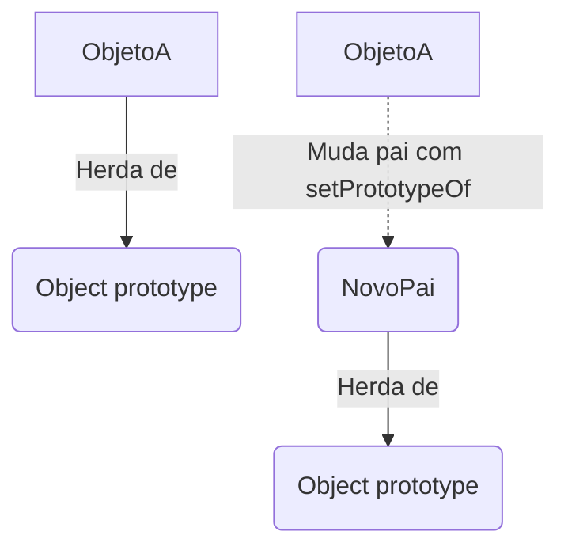

# Aula: Manipulando Prototypes

## Abertura com Analogia Prática

Lembra da nossa "franquia de lanchonetes" que herda receitas da sede? E se uma lanchonete específica decidisse que não quer mais seguir as receitas clássicas e agora prefere herdar o cardápio de uma pizzaria famosa? 

No mundo real, você não pode simplesmente "trocar de pais" e herdar a herança de outra família. Mas, em JavaScript, os objetos são extremamente flexíveis! Nós podemos dinamicamente mudar o "molde pai" (Prototype) de um objeto em tempo de execução. 

**Qual problema isso resolve?** 
Em vez de ficarmos amarrados à estrutura que foi definida na criação do objeto, podemos compor comportamentos e reaproveitar lógicas de outros objetos quando necessário, construindo estruturas poderosas usando Objetos Literais, Constructor Functions e Factory Functions.

---

## Visualização com Diagramas

Veja o que acontece quando usamos os métodos nativos para alterar a cadeia de protótipos de um objeto existente:


*A ligação do `__proto__` é rompida com o antigo pai e reatada com o novo.*

---

## Sintaxe, Argumentos e Anatomia

Esqueça o uso direto de `__proto__`. A maneira moderna e correta de manipular protótipos em JavaScript é através do objeto global `Object`.

### 1. `Object.setPrototypeOf(obj, prototype)`
Troca o prototype de um objeto **já existente**.
- **obj:** O objeto que vai receber o novo pai.
- **prototype:** O objeto pai (ou `null`).

### 2. `Object.create(prototype, [propertiesObject])`
Cria um **novo objeto** e já define o prototype dele logo no nascimento.
- **prototype:** O objeto que será o protótipo do novo objeto.
- **propertiesObject** (opcional): Propriedades extras (com descriptors).

### Regras de Ouro e Pitfalls

- ⚠️ **`Object.setPrototypeOf()` é LENTO.** Alterar o prototype de um objeto que já foi criado é uma das operações mais custosas em JavaScript porque desorganiza as otimizações do motor (V8). Evite rodar isso milhares de vezes em um loop.
- ✅ **Prefira `Object.create()`.** Se você já sabe qual será o prototype do objeto, é muito mais performático criá-lo já herdando do lugar certo usando `Object.create()`.
- 💡 **Relembrando:** `Object.getPrototypeOf(obj)` é usado para **ler** quem é o prototype atual.

---

## Exemplos de Código em Duas Camadas

### Camada 1: Exemplo Isolado (Objetos Literais)
Vamos fazer o objeto `produto` herdar os métodos de `produtoGeral`.

```javascript
// O "Pai"
const produtoGeral = {
  desconto: 10,
  precoComDesconto() {
    return this.preco - (this.preco * (this.desconto / 100));
  }
};

// O "Filho" (Objeto Literal)
const camiseta = {
  nome: 'Camiseta Preta',
  preco: 50
};

// Definindo o produtoGeral como pai da camiseta
Object.setPrototypeOf(camiseta, produtoGeral);

console.log(camiseta.precoComDesconto()); // 45
```

### Camada 2: Exemplo Contextualizado
Vamos aplicar a herança em diferentes padrões de criação: **Constructor Functions** e **Factory Functions**.

```javascript
// ============================================
// 1. Usando Constructor Functions
// ============================================
function Produto(nome, preco) {
  this.nome = nome;
  this.preco = preco;
}

Produto.prototype.desconto = function(percentual) {
  this.preco = this.preco - (this.preco * (percentual / 100));
};

function Camiseta(nome, preco, cor) {
  // Chama o construtor pai para herdar os atributos
  Produto.call(this, nome, preco); 
  this.cor = cor;
}
// Ligando os protótipos: Camiseta herda os métodos de Produto
Camiseta.prototype = Object.create(Produto.prototype);
// Consertando o ponteiro do construtor
Camiseta.prototype.constructor = Camiseta;

const minhaCamiseta = new Camiseta('Regata', 40, 'Azul');
minhaCamiseta.desconto(10);
console.log(minhaCamiseta.preco); // 36


// ============================================
// 2. Usando Factory Functions (Mais limpo)
// ============================================
const acoesDeUsuario = {
  fazerLogin() { console.log(`${this.nome} logou!`); },
  fazerLogout() { console.log(`${this.nome} deslogou!`); }
};

function criaUsuario(nome) {
  // Cria um objeto VAZIO que já herda de acoesDeUsuario
  const novoUsuario = Object.create(acoesDeUsuario);
  
  // Popula o objeto
  novoUsuario.nome = nome;
  return novoUsuario;
}

const user1 = criaUsuario('Leo');
user1.fazerLogin(); // Leo logou!
```

---

## Engajamento, Debugging e Desafio

- **Resumo Executivo:**
  - Evite `__proto__`, use os métodos estáticos do `Object`.
  - `Object.setPrototypeOf` altera a herança de objetos vivos (cuidado com performance).
  - `Object.create` já inicializa o objeto com a herança correta.
  - Para Factory Functions, `Object.create` é perfeito. Para Constructor Functions, ligamos o `.prototype` de uma classe ao `.prototype` da outra.

- **Visão de Debug:**
  Para ter certeza de que um objeto herda de outro, use o método `isPrototypeOf()`! 
  Exemplo: `Produto.prototype.isPrototypeOf(minhaCamiseta)` retornará `true`.

- **Call to Action (Desafio):**
  🟡 **Intermediário:** Crie um objeto pai chamado `Veiculo` com o método `acelerar()`. Depois, crie uma Factory Function `criaCarro(modelo)` que retorna objetos que herdam de `Veiculo` utilizando `Object.create()`. Teste o método `acelerar()` no carro criado!

---

## 🎯 Quiz de Fixação

Tente responder antes de ver a resposta!

---

**Questão 1:** Qual a desvantagem crítica de usar `Object.setPrototypeOf()` em objetos que já foram criados, em comparação a usar `Object.create()`?

- A) Ele não suporta objetos literais, apenas instâncias de classes.
- B) Ele afeta severamente a performance do código, pois o motor JavaScript precisa desotimizar os acessos às propriedades do objeto.
- C) Ele cria um vazamento de memória irreversível no navegador.
- D) Ele só permite mudar o protótipo uma única vez por objeto.

<details>
<summary>🔍 Ver resposta</summary>

**B) Ele afeta severamente a performance do código.** — Os motores JS (como V8) otimizam o acesso a propriedades prevendo o formato (shape) do objeto. Mudar o protótipo dinamicamente com `setPrototypeOf` quebra essa previsão. Por isso, prefira `Object.create()`.
</details>

---

**Questão 2:** Você tem o código `const obj = Object.create(null);`. O que isso faz?

- A) Gera um erro de sintaxe.
- B) Cria um objeto vazio, mas que herda normalmente de `Object.prototype`.
- C) Cria um objeto totalmente "limpo", sem herdar métodos como `toString()` ou `hasOwnProperty()`.
- D) Cria uma cópia do valor primitivo `null`.

<details>
<summary>🔍 Ver resposta</summary>

**C) Cria um objeto totalmente "limpo".** — Ao passar `null` como protótipo, você corta completamente a herança do topo. O objeto não terá `toString` nem nada, sendo ideal para criar mapas de dicionário puro.
</details>

---

**Questão 3:** Ao fazer a herança entre duas Constructor Functions (`Camiseta` herdando de `Produto`), por que é recomendável adicionar a linha `Camiseta.prototype.constructor = Camiseta` após usar `Object.create(Produto.prototype)`?

- A) Sem isso, o código não compila.
- B) Porque o `Object.create` sobrescreve o `.prototype` inteiro, fazendo com que a propriedade `constructor` passe a apontar incorretamente para `Produto`.
- C) Para permitir que o método `super()` funcione dentro de `Camiseta`.
- D) Para evitar que outras funções construtoras sobrescrevam `Camiseta`.

<details>
<summary>🔍 Ver resposta</summary>

**B) Porque o `Object.create` sobrescreve o `.prototype` inteiro, fazendo o `constructor` apontar incorretamente para `Produto`.** — Essa é uma pegadinha clássica do JS. Ao reatribuir o prototype, perdemos o ponteiro original de qual construtor fabricou aquele objeto, então precisamos consertá-lo manualmente.
</details>

---

**Questão 4:** Um desenvolvedor escreve: `const pai = { a: 1 }; const filho = Object.create(pai); filho.a = 2; console.log(pai.a);`. Qual será o resultado impresso?

- A) `2`, porque `filho` e `pai` compartilham a mesma referência.
- B) `undefined`, pois a herança só funciona para funções, não para propriedades.
- C) `1`, porque modificar `filho.a` cria uma nova propriedade no objeto `filho` (shadowing), protegendo a propriedade `a` original do `pai`.
- D) Erro de atribuição.

<details>
<summary>🔍 Ver resposta</summary>

**C) `1`, porque modificar `filho.a` cria uma propriedade local em `filho`.** — Isso é chamado de _shadowing_ (sombreamento). O JS não altera o protótipo pai. Ele simplesmente cria a chave no filho, que a partir de agora vai "esconder" a chave do pai na busca.
</details>

---

**Questão 5:** Em uma Factory Function, qual é a principal vantagem de usar `Object.create(comportamentosPai)` na hora de retornar o objeto?

- A) Obriga o uso da palavra-chave `new` ao chamar a Factory Function.
- B) Impede que o objeto criado seja modificado no futuro (congela o objeto).
- C) Economiza memória, pois todos os objetos retornados compartilharão os métodos de `comportamentosPai` em vez de criar novas cópias de funções a cada invocação.
- D) Transforma automaticamente o objeto retornado em um array.

<details>
<summary>🔍 Ver resposta</summary>

**C) Economiza memória, pois os métodos são compartilhados.** — Esse é o padrão clássico de _Prototypal Inheritance_ em Factory Functions. Evitamos recriar métodos pesados a cada objeto novo, pendurando-os no prototype.
</details>

---

## ⚡ Resumo Rápido para Revisão

Memorize estas associações:

| Se você precisar... | Pense em... |
| :--- | :--- |
| Criar um objeto já herdando de um pai | **`Object.create(pai)`** |
| Trocar o protótipo de um objeto vivo | **`Object.setPrototypeOf(obj, novoPai)`** |
| Herdar numa Constructor Function | **`Filho.prototype = Object.create(Pai.prototype)`** |
| Criar um objeto sem NENHUM método padrão | **`Object.create(null)`** |

---

### 🔑 Fatos-Chave que Você PRECISA Saber

| Fato / Valor | O que significa |
| :---: | :--- |
| **`setPrototypeOf` custa caro** | Mudar prototypes em tempo de execução destrói otimizações do motor V8. Evite em gargalos de performance. |
| **Shadowing** | Definir uma propriedade diretamente num objeto não afeta seu pai. A nova propriedade no filho "ofusca" a do pai. |
| **`constructor` perdido** | Ao sobrescrever um prototype (`.prototype = Object.create(...)`), não esqueça de reatribuir o `.constructor`. |
