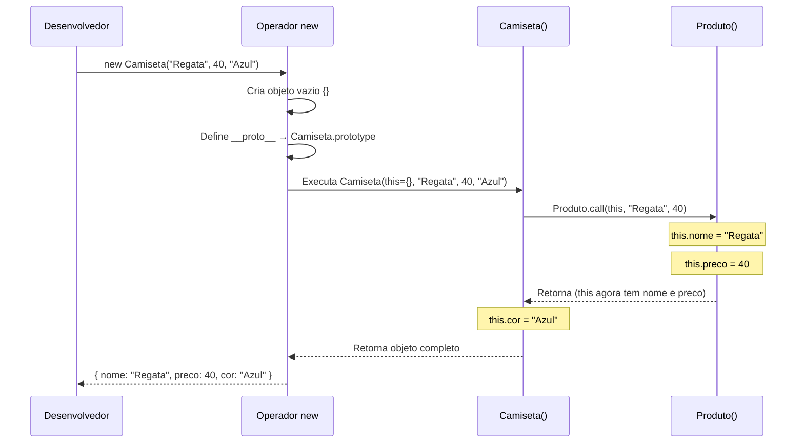
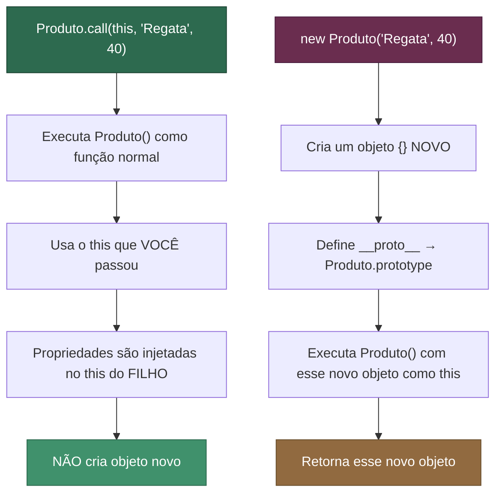

# Aula: Herança e o Método `call()`

## Abertura com Analogia Prática

Lembra da Aula 2, quando fizemos `Produto.call(this, nome, preco)` dentro da Constructor Function `Camiseta`? Aquele trecho ficou meio misterioso, não é? Agora vamos destrinchar exatamente o que o `call()` faz e por que ele é **essencial** para a herança entre Constructor Functions.

**Qual problema o `call()` resolve?**

Imagine que você é um estagiário numa empresa e precisa preencher um formulário de cadastro. Só que esse formulário é gigante — nome, CPF, endereço, telefone... E o pior: esse mesmo formulário também é usado pelo setor de RH para cadastrar funcionários efetivos.

Agora, seria muito mais inteligente se o estagiário pudesse dizer: *"RH, preenche a parte básica do formulário para mim, mas coloca os MEUS dados, não os seus!"*

Isso é exatamente o que o `call()` faz. Ele permite que uma função seja **executada no contexto de outro objeto**, ou seja, ela roda normalmente, mas o `this` dentro dela aponta para quem você quiser. Na herança, usamos isso para "emprestar" a lógica de inicialização de um construtor pai para o construtor filho — sem precisar reescrever tudo.

💡 *Curiosidade: o nome `call` vem do conceito de "chamar" (invocar) uma função manualmente, especificando explicitamente quem será o `this`. É como fazer uma ligação telefônica para a função e dizer: "Olha, faz o seu trabalho, mas em nome DESTA pessoa aqui."*

---

## Visualização com Diagramas

### O que acontece quando usamos `new Camiseta("Regata", 40, "Azul")`?


*O `call()` faz o construtor `Produto` rodar, mas usando o `this` de `Camiseta`. Assim, as propriedades `nome` e `preco` são injetadas diretamente no objeto que `Camiseta` está construindo.*

---

### `call()` vs `new`: dois caminhos diferentes


*🟢 Verde: caminho do `call()` — "empresta" a execução. 🟣 Roxo: caminho do `new` — cria uma instância independente.*

---

## Sintaxe, Argumentos e Anatomia

### Anatomia do `call()`

```javascript
funcao.call(thisArg, arg1, arg2, ...argN)
```

| Argumento | Tipo | Obrigatório? | Descrição |
| :--- | :--- | :---: | :--- |
| `thisArg` | Qualquer valor | ✅ Sim | O valor que será usado como `this` dentro da função. Se `null` ou `undefined`, o `this` será o objeto global (`window`/`globalThis`). |
| `arg1, arg2, ...` | Qualquer valor | ❌ Não | Os argumentos que serão passados para a função, **um por um**, separados por vírgula. |

### Comparação rápida: `call()` vs `apply()` vs `bind()`

| Método | Executa na hora? | Como passa argumentos? | Retorna o quê? |
| :---: | :---: | :--- | :--- |
| **`call()`** | ✅ Sim | Um por um: `func.call(this, a, b)` | O retorno da função |
| **`apply()`** | ✅ Sim | Em array: `func.apply(this, [a, b])` | O retorno da função |
| **`bind()`** | ❌ Não | Um por um: `func.bind(this, a, b)` | Uma **nova função** com o `this` fixado |

### Regras de Ouro e Pitfalls

- ⚠️ **`call()` NÃO cria um novo objeto.** Esse é o erro mais comum. Se você fizer `Produto.call(this, nome, preco)` dentro de `Camiseta`, ele apenas EXECUTA a função `Produto` usando o `this` de `Camiseta`. Nenhum objeto novo nasce aqui.
- ⚠️ **`new Produto()` dentro de `Camiseta` seria um ERRO lógico.** Isso criaria um objeto `Produto` completamente separado, com seu próprio `this`, e as propriedades não cairiam no objeto da `Camiseta`. É como pedir pro RH preencher o formulário dele em vez de preencher o SEU.
- ✅ **O `call()` herda PROPRIEDADES, não métodos do prototype.** Para herdar os métodos, você ainda precisa ligar os prototypes com `Object.create()` (como aprendemos na Aula 2).
- 💡 **Arrow functions ignoram o `call()`.** Uma arrow function não tem seu próprio `this`, então chamar `.call()` nela não muda nada — o `this` continua sendo o do escopo onde ela foi definida.

---

## Exemplos de Código em Duas Camadas

### Camada 1: Exemplo Isolado — Entendendo o `call()` puro

```javascript
// Uma função simples que usa "this"
function apresentar(saudacao) {
  console.log(`${saudacao}, eu sou ${this.nome} e tenho ${this.idade} anos.`);
}

const pessoa1 = { nome: 'Leonardo', idade: 23 };
const pessoa2 = { nome: 'Maria', idade: 30 };

// Chamada NORMAL não funciona — this seria undefined (strict) ou window
// apresentar('Olá'); // ❌ Erro ou "undefined"

// Com call(), dizemos QUEM é o "this":
apresentar.call(pessoa1, 'Olá');   // Olá, eu sou Leonardo e tenho 23 anos.
apresentar.call(pessoa2, 'Eae');   // Eae, eu sou Maria e tenho 30 anos.

// A mesma função, rodando no contexto de objetos diferentes!
```

### Camada 2: Exemplo Contextualizado — Herança entre Constructor Functions

Vamos evoluir o exemplo de e-commerce da Aula 1. Agora temos um `Produto` genérico e um `ProdutoDigital` que herda dele.

```javascript
// ============================================
// Construtor Pai
// ============================================
function Produto(nome, preco) {
  this.nome = nome;
  this.preco = preco;
  this.criadoEm = new Date().toLocaleDateString('pt-BR');
}

Produto.prototype.desconto = function(percentual) {
  this.preco -= this.preco * (percentual / 100);
  console.log(`Novo preço de "${this.nome}": R$ ${this.preco.toFixed(2)}`);
};

// ============================================
// Construtor Filho
// ============================================
function ProdutoDigital(nome, preco, formato) {
  // ⬇️ AQUI ESTÁ O call()! 
  // Executa Produto() usando o "this" de ProdutoDigital.
  // As propriedades nome, preco e criadoEm são injetadas no objeto filho.
  Produto.call(this, nome, preco);
  
  // Propriedade exclusiva do filho
  this.formato = formato;
}

// Herança de MÉTODOS (Aula 2): liga os prototypes
ProdutoDigital.prototype = Object.create(Produto.prototype);
ProdutoDigital.prototype.constructor = ProdutoDigital;

// Método exclusivo do filho
ProdutoDigital.prototype.download = function() {
  console.log(`Baixando "${this.nome}" em formato ${this.formato}...`);
};

// ============================================
// Testando
// ============================================
const ebook = new ProdutoDigital('JS Avançado', 89.90, 'PDF');

console.log(ebook.nome);      // JS Avançado      ← veio do Produto.call()
console.log(ebook.preco);     // 89.9             ← veio do Produto.call()
console.log(ebook.criadoEm);  // 24/07/2026       ← veio do Produto.call()
console.log(ebook.formato);   // PDF              ← exclusivo de ProdutoDigital

ebook.desconto(20);           // Novo preço de "JS Avançado": R$ 71.92 ← herdado via prototype
ebook.download();             // Baixando "JS Avançado" em formato PDF... ← método próprio

// Verificações
console.log(ebook instanceof ProdutoDigital); // true
console.log(ebook instanceof Produto);        // true
```

### Comparação: O que aconteceria SEM o `call()`?

```javascript
// ❌ ERRADO — sem call()
function ProdutoDigitalErrado(nome, preco, formato) {
  // Sem Produto.call(this, ...), as propriedades nome e preco
  // simplesmente NÃO EXISTEM no objeto criado!
  this.formato = formato;
}

ProdutoDigitalErrado.prototype = Object.create(Produto.prototype);
ProdutoDigitalErrado.prototype.constructor = ProdutoDigitalErrado;

const ebookErrado = new ProdutoDigitalErrado('JS Básico', 29.90, 'EPUB');

console.log(ebookErrado.nome);   // undefined  ← NÃO FOI HERDADO!
console.log(ebookErrado.preco);  // undefined  ← NÃO FOI HERDADO!
console.log(ebookErrado.formato); // EPUB      ← só isso foi definido
```

```diff
  function ProdutoDigital(nome, preco, formato) {
-   // nada aqui...
+   Produto.call(this, nome, preco); // herda as propriedades do pai
    this.formato = formato;
  }
```

### Comparação: E se usasse `new Produto()` em vez de `call()`?

```javascript
// ❌ ERRADO — usando new dentro do construtor filho
function ProdutoDigitalNew(nome, preco, formato) {
  // Isso cria um objeto SEPARADO! Não injeta no "this" atual.
  const produtoSeparado = new Produto(nome, preco);
  // produtoSeparado.nome existe, mas this.nome NÃO!
  
  this.formato = formato;
}

const ebookNew = new ProdutoDigitalNew('JS Pro', 120, 'PDF');
console.log(ebookNew.nome);   // undefined ← o nome foi pro objeto separado!
console.log(ebookNew.formato); // PDF
```

---

## Engajamento, Debugging e Desafio

- **Resumo Executivo:**
  - `call()` executa uma função trocando o `this` por outro objeto que você escolhe.
  - Na herança, usamos `Pai.call(this, args)` dentro do construtor filho para **herdar as propriedades** do pai.
  - `call()` cuida das **propriedades**. `Object.create()` cuida dos **métodos do prototype**. Os dois juntos formam a herança completa.

- **Visão de Debug:**
  Para verificar se as propriedades foram herdadas corretamente, use `console.log(Object.keys(ebook))` — isso mostra APENAS as propriedades próprias do objeto (as que foram injetadas pelo `call()` e as definidas no próprio construtor). Se `nome` e `preco` aparecerem na lista, o `call()` funcionou!

- **Conexões:**
  - Esse padrão de herança com `call()` + `Object.create()` é exatamente o que a sintaxe `class ... extends` + `super()` faz por baixo dos panos. Quando você estudar classes ES6, vai perceber que `super(nome, preco)` é basicamente um `Pai.call(this, nome, preco)` mais elegante.
  - O `bind()` que mencionamos na tabela será útil quando estudarmos event handlers e callbacks que perdem o `this`.

- **Call to Action (Desafio):**
  🟡 **Intermediário:** Crie um construtor `ContaBancaria(titular, saldo)` com o método `extrato()` no prototype. Depois, crie um construtor `ContaPoupanca(titular, saldo, taxaRendimento)` que herde de `ContaBancaria` usando `call()` e `Object.create()`. Adicione um método exclusivo `renderJuros()` que aplique a taxa de rendimento ao saldo. Teste tudo e verifique com `instanceof` se a herança está funcionando!

---

## 🎯 Quiz de Fixação

Tente responder antes de ver a resposta!

---

**Questão 1:** Um desenvolvedor está construindo um sistema de gerenciamento escolar. Ele tem `function Pessoa(nome, idade) { this.nome = nome; this.idade = idade; }` e quer que `function Aluno(nome, idade, matricula)` herde as propriedades de `Pessoa`. Qual é a forma correta de fazer isso dentro do corpo de `Aluno`?

- A) `this = new Pessoa(nome, idade);`
- B) `Pessoa(nome, idade);`
- C) `Pessoa.call(this, nome, idade);`
- D) `Object.create(Pessoa, nome, idade);`

<details>
<summary>🔍 Ver resposta</summary>

**C) `Pessoa.call(this, nome, idade);`** — O `call()` executa `Pessoa` usando o `this` de `Aluno`, injetando `nome` e `idade` no objeto que `Aluno` está construindo. A opção A dá erro porque não se pode reatribuir `this`. A opção B chama `Pessoa` sem contexto, então `this` seria `undefined` (strict mode) ou `window`.
</details>

---

**Questão 2:** Qual a diferença PRÁTICA entre `Produto.call(this, nome, preco)` e `new Produto(nome, preco)` quando escritos dentro do corpo de um construtor filho?

- A) Não há diferença; ambos fazem a mesma coisa.
- B) `call()` injeta as propriedades no `this` do filho, enquanto `new` cria um objeto **separado** de `Produto` que não se conecta ao filho.
- C) `new` é mais rápido porque o motor otimiza construtores encadeados.
- D) `call()` também herda os métodos do prototype, dispensando o `Object.create()`.

<details>
<summary>🔍 Ver resposta</summary>

**B) `call()` injeta as propriedades no `this` do filho, enquanto `new` cria um objeto separado.** — Essa é a diferença crucial. Com `call()`, quem define as propriedades é o `this` do filho. Com `new`, um objeto completamente novo e desconectado é criado. A opção D está errada: `call()` NÃO herda métodos do prototype — para isso, usamos `Object.create()`.
</details>

---

**Questão 3:** Observe o código: `function Veiculo(marca) { this.marca = marca; } function Carro(marca, modelo) { Veiculo.call(this, marca); this.modelo = modelo; }`. Se criarmos `const c = new Carro('Toyota', 'Corolla')`, qual será o valor de `c.marca`?

- A) `undefined`, porque `call()` não funciona com o operador `new`.
- B) `"Toyota"`, porque `Veiculo.call(this, marca)` executa `Veiculo` usando o `this` de `Carro`, definindo `this.marca = "Toyota"`.
- C) `"Toyota"`, mas apenas se `Carro.prototype = Object.create(Veiculo.prototype)` for definido antes.
- D) Lança um `TypeError` porque `Veiculo` não foi instanciado com `new`.

<details>
<summary>🔍 Ver resposta</summary>

**B) `"Toyota"`.** — O `call()` não precisa que os prototypes estejam conectados para injetar propriedades. Ele simplesmente executa a função com o `this` fornecido. A ligação de prototypes (opção C) é necessária apenas para herdar **métodos** do `.prototype`, não para propriedades definidas no corpo do construtor.
</details>

---

**Questão 4:** Um dev escreve o seguinte código com uma **arrow function**:

```javascript
const saudar = (msg) => { console.log(`${msg}, ${this.nome}`); };
const obj = { nome: 'Leo' };
saudar.call(obj, 'Olá');
```

O que será impresso no console?

- A) `"Olá, Leo"`
- B) `"Olá, undefined"` (ou erro), porque arrow functions **ignoram** o `this` passado pelo `call()`.
- C) `TypeError: saudar.call is not a function`
- D) `"Olá, "` — uma string vazia.

<details>
<summary>🔍 Ver resposta</summary>

**B) `"Olá, undefined"`.** — Arrow functions **não possuem seu próprio `this`**. Elas capturam o `this` do escopo onde foram definidas (neste caso, o escopo global/módulo, onde `this.nome` é `undefined`). Usar `call()`, `apply()` ou `bind()` em arrow functions NÃO altera o `this` delas. Essa é uma pegadinha clássica!
</details>

---

**Questão 5:** Em uma herança completa entre Constructor Functions, qual das combinações abaixo garante que o filho herda tanto as **propriedades** (definidas no corpo do construtor pai) quanto os **métodos** (definidos no `.prototype` do pai)?

- A) Apenas `Pai.call(this, args)` dentro do filho.
- B) Apenas `Filho.prototype = Object.create(Pai.prototype)`.
- C) `Pai.call(this, args)` para propriedades + `Filho.prototype = Object.create(Pai.prototype)` para métodos.
- D) `new Pai(args)` dentro do filho + `Filho.__proto__ = Pai`.

<details>
<summary>🔍 Ver resposta</summary>

**C) `Pai.call(this, args)` para propriedades + `Filho.prototype = Object.create(Pai.prototype)` para métodos.** — Essa é a receita completa da herança prototipal em JavaScript. O `call()` cuida de injetar as propriedades do corpo do construtor pai no filho. O `Object.create()` conecta a cadeia de prototypes para que o filho também tenha acesso aos métodos. A opção A herda só propriedades. A opção B herda só métodos. A opção D está errada em ambas as partes.
</details>

---

## ⚡ Resumo Rápido para Revisão

Memorize estas associações:

| Se você precisar... | Pense em... |
| :--- | :--- |
| Executar uma função com um `this` diferente | **`funcao.call(novoThis, arg1, arg2)`** |
| Herdar PROPRIEDADES do construtor pai | **`Pai.call(this, args)` dentro do filho** |
| Herdar MÉTODOS do prototype do pai | **`Filho.prototype = Object.create(Pai.prototype)`** |
| Herança COMPLETA (propriedades + métodos) | **`call()` + `Object.create()` juntos** |
| Passar argumentos como array em vez de um por um | **`apply()` em vez de `call()`** |
| Fixar o `this` permanentemente sem executar | **`bind()`** |

---

### 🔑 Fatos-Chave que Você PRECISA Saber

| Fato / Valor | O que significa |
| :---: | :--- |
| **`call()` NÃO cria objeto** | Ele apenas executa a função com outro `this`. Quem cria o objeto é o `new`. |
| **`new` dentro do filho = ERRO lógico** | Cria um objeto separado; as propriedades não vão parar no filho. |
| **Arrow functions ignoram `call()`** | Elas herdam o `this` do escopo léxico. `call()`, `apply()` e `bind()` não têm efeito sobre elas. |
| **`super()` em classes = `Pai.call(this)`** | A sintaxe moderna `class extends` + `super()` faz o mesmo que `call()` por baixo dos panos. |
| **`call` vs `apply`: apenas a forma dos args** | `call(this, a, b)` vs `apply(this, [a, b])`. Resultado idêntico. |
