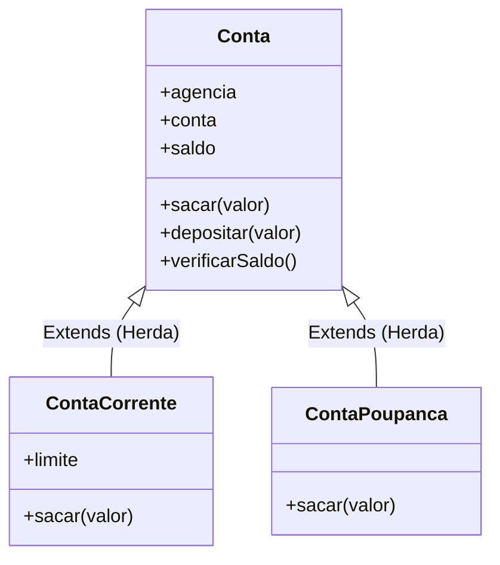

## A aula foi usando as Constructor Functions. Aqui está usando class.

## Abertura: O que é Polimorfismo e qual problema ele resolve?

Imagine que você é o gerente de um restaurante e dá a mesma ordem para todos os funcionários: **"Trabalhar!"**
- O **Cozinheiro** vai para a cozinha preparar os pratos.
- O **Garçom** vai para o salão atender os clientes.
- O **Caixa** vai para o balcão cobrar as contas.

A ordem foi exatamente a mesma ("Trabalhar"), mas cada funcionário executou a tarefa de uma **forma diferente**, baseada na sua especialidade. 

Na programação Orientada a Objetos, isso é o **Polimorfismo** (do grego *poli* = muitas, *morfos* = formas). Ele permite que objetos diferentes respondam à mesma chamada de método, mas cada um executando a sua própria versão daquele comportamento. 

O problema que ele resolve é a **repetição de código e a complexidade de tomar decisões**. Sem ele, você teria que fazer vários `if`s (ex: `se conta for corrente faz isso, se for poupança faz aquilo`). Com ele, você apenas chama o método e o objeto sabe exatamente o que fazer.

---

## 🗺️ Visão do Sistema: A Hierarquia Bancária

Aqui está como nossas classes vão se organizar. Repare que a ação `sacar()` existe na classe pai (Conta), mas é reescrita nas classes filhas de forma especializada.



---

## 🧬 Sintaxe e Anatomia

Para aplicar o polimorfismo em JavaScript, geralmente usamos herança (`extends`). Nós criamos a classe base e, nas classes filhas, **sobrescrevemos** (override) o método que precisa se comportar diferente.

```javascript
class ClassePai {
    metodo() {
        // Comportamento padrão
    }
}

class ClasseFilha extends ClassePai {
    // Mesma assinatura (nome do método)
    metodo() { 
        // Comportamento específico sobrescrevendo o padrão
    }
}
```

### 💡 Regras de Ouro e Pitfalls

- ✅ **Mantenha a Assinatura:** O método reescrito na classe filha deve idealmente receber os mesmos parâmetros (e na mesma ordem) que o método original da classe pai, para não causar confusão no uso.
- ⚠️ **`super` não é obrigatório para métodos:** Ao sobrescrever um método, você não precisa chamar o `super.metodo()` a menos que queira *adicionar* algo ao comportamento pai em vez de substituí-lo por completo. 
- ⚠️ **Lembre-se do `super()` no construtor:** Se a classe filha tiver seu próprio `constructor`, é obrigatório chamar o `super()` antes de usar o `this`.

---

## 💻 Exemplos de Código

### Camada 1: Isolada (Mecânica Pura)

Aqui vemos o conceito funcionando sem ruído. Um exemplo clássico e direto.

```javascript
class Animal {
    emitirSom() {
        console.log("Som genérico de animal...");
    }
}

class Cachorro extends Animal {
    // Sobrescrevendo o método da classe pai
    emitirSom() {
        console.log("Au au!");
    }
}

class Gato extends Animal {
    // Sobrescrevendo o método da classe pai
    emitirSom() {
        console.log("Miau!");
    }
}

const pets = [new Cachorro(), new Gato(), new Animal()];

// O mesmo método emitirSom() gera 3 comportamentos diferentes!
for(let pet of pets) {
    pet.emitirSom(); 
}
```

### Camada 2: Contextualizada (Sistema Bancário)

Agora vamos ao que vimos na aula: a aplicação real do polimorfismo nas regras de saque de diferentes tipos de conta bancária.

```javascript
// 1. Superclasse (Classe Base)
class Conta {
    constructor(agencia, conta, saldo) {
        this.agencia = agencia;
        this.conta = conta;
        this.saldo = saldo;
    }

    depositar(valor) {
        this.saldo += valor;
        console.log(`Depósito de R$${valor}. Saldo atual: R$${this.saldo}`);
    }

    verificarSaldo() {
        console.log(`Ag/Cc: ${this.agencia}/${this.conta} | Saldo: R$${this.saldo}`);
    }

    // Método genérico de saque que será sobrescrito
    sacar(valor) {
        if (this.saldo >= valor) {
            this.saldo -= valor;
            console.log(`Saque de R$${valor} realizado com sucesso.`);
        } else {
            console.log(`Saldo insuficiente. Seu saldo é R$${this.saldo}`);
        }
    }
}

// 2. Subclasse Conta Poupança
class ContaPoupanca extends Conta {
    // A Conta Poupança não permite saldo negativo.
    // Ela vai simplesmente reutilizar a lógica da Conta genérica.
    // Portanto, nem precisamos reescrever o método sacar() aqui! 
    // Ela herda o comportamento restrito.
}

// 3. Subclasse Conta Corrente (Com Polimorfismo aplicado)
class ContaCorrente extends Conta {
    constructor(agencia, conta, saldo, limite) {
        super(agencia, conta, saldo); // Chama o construtor da classe pai
        this.limite = limite;
    }

    // Sobrescrevendo (Override) o método sacar para permitir limite extra
    sacar(valor) {
        if (valor > (this.saldo + this.limite)) {
            console.log(`Saque de R$${valor} negado. Valor ultrapassa o limite.`);
            return; // Sai do método se estourar o limite
        }
        
        this.saldo -= valor;
        console.log(`Saque de R$${valor} realizado na CC. Saldo atual: R$${this.saldo}`);
    }
}

// --- Testando o Polimorfismo ---

console.log("--- CONTA POUPANÇA ---");
const cp = new ContaPoupanca(11, 22, 100);
cp.verificarSaldo();
cp.sacar(150); // Falha: saldo insuficiente
cp.sacar(50);  // Sucesso

console.log("\n--- CONTA CORRENTE ---");
const cc = new ContaCorrente(11, 22, 100, 100); // Saldo 100, Limite 100
cc.verificarSaldo();
cc.sacar(150); // Sucesso: usa o limite (saldo fica -50)
cc.sacar(60);  // Falha: ultrapassa o que sobrou do limite
```

**Repare no diferencial:** O método `sacar()` foi chamado em `cp` e em `cc`. Mas a regra de *como* o dinheiro sai mudou drasticamente graças ao Polimorfismo!

---

## 🚀 Engajamento, Debugging e Desafio

- **Resumo Executivo:**
  - Polimorfismo permite que classes diferentes derivadas de uma mesma raiz tenham comportamentos diferentes para um método com o mesmo nome.
  - Ele evita a criação de códigos complexos cheios de condicionais (se é CC faça X, se é CP faça Y).
  - É feito reescrevendo (fazendo override) os métodos da Superclasse dentro das Subclasses.

- **Visão de Debug:**
  Sempre faça `console.log()` do objeto instanciado (ex: `console.log(cc)`) antes e depois das operações para verificar se a propriedade `this.saldo` está realmente sendo alterada conforme a regra matemática de cada classe. 

- **Conexões:**
  Este conceito fecha a tríade principal da Orientação a Objetos que você está estudando (Encapsulamento, Herança e Polimorfismo). Mais para frente, ao estudar TypeScript, isso fará ainda mais sentido com a implementação de *Interfaces*.

### 🎯 Call to Action (Desafio)

🟡 **Intermediário:** Pegue o código do sistema bancário acima e crie uma nova classe chamada `ContaUniversitaria` que herda de `Conta`. A regra dela é: o saque funciona normalmente como na `Conta` genérica, **porém**, ela tem uma regra onde o valor máximo de qualquer saque não pode ultrapassar `R$ 500`, independente do saldo do aluno! Aplique o polimorfismo no método `sacar()`. Mande aqui quando conseguir!

---

## 🎯 Questões de Fixação

Tente responder antes de ver a resposta!

---

**Questão 1:** O que acontece quando você chama um método em um objeto de uma classe filha, mas esse método não foi sobrescrito (não teve override) dentro dela?

- A) O JavaScript lança um erro de referência.
- B) O método original definido na classe pai é executado.
- C) O método é executado, mas retorna sempre `undefined`.
- D) O interpretador ignora a chamada e o código continua rodando silenciosamente.

<details>
<summary>🔍 Ver resposta</summary>

**B) O método original definido na classe pai é executado.** — Exatamente o que aconteceu com a nossa `ContaPoupanca`. Como ela não reescreveu o `sacar`, ela buscou a implementação que já existia na `Conta` através da cadeia de protótipos (herança).
</details>

---

**Questão 2:** A equipe de desenvolvimento quer que, toda vez que um boleto seja pago, a lógica seja diferente caso ele seja do tipo `BoletoVip` ou `BoletoComum`. Sem usar polimorfismo, como esse código provavelmente estaria estruturado?

- A) Em funções separadas para cada tipo de boleto em arquivos diferentes.
- B) Com uma estrutura gigante de `if/else` ou `switch` dentro de um único método genérico.
- C) Usando a palavra chave `super` repetidas vezes.
- D) Apenas através da alteração direta do prototype do objeto global.

<details>
<summary>🔍 Ver resposta</summary>

**B) Com uma estrutura gigante de `if/else` ou `switch` dentro de um único método genérico.** — Sem polimorfismo, você é forçado a checar manualmente qual é o "tipo" do objeto antes de executar a ação. O polimorfismo elimina a necessidade de `if (tipo === 'Vip') { ... } else { ... }`, delegando a responsabilidade para a própria classe instanciada.
</details>

---

**Questão 3:** Qual é a função da palavra-chave `super()` no construtor de uma classe que herda de outra?

- A) Proibir que os métodos da classe pai sejam reescritos.
- B) Instanciar um objeto vazio para receber novos métodos.
- C) Executar o construtor da classe pai para inicializar as propriedades herdadas antes de usar o `this`.
- D) Definir qual será o limite da conta corrente antes do saque.

<details>
<summary>🔍 Ver resposta</summary>

**C) Executar o construtor da classe pai para inicializar as propriedades herdadas antes de usar o `this`.** — Em JS, classes derivadas devem chamar `super()` se quiserem usar a palavra `this` no seu `constructor`, caso contrário recebem um erro, pois é o pai quem constrói a fundação do objeto.
</details>

---

**Questão 4:** O dev júnior João criou a classe `Animal` com um método `andar()`. Depois ele criou `Cachorro extends Animal` e escreveu `Andar() { console.log('Corre!') }`. Ao chamar `cachorro.andar()`, o que acontecerá?

- A) O código imprimirá 'Corre!', pois o polimorfismo é insensível a maiúsculas/minúsculas.
- B) Executará o comportamento padrão do pai, pois `Andar` não sobrescreveu o `andar`.
- C) Causará um erro de sintaxe por ter dois métodos parecidos.
- D) O método original do pai será permanentemente apagado da memória.

<details>
<summary>🔍 Ver resposta</summary>

**B) Executará o comportamento padrão do pai, pois `Andar` não sobrescreveu o `andar`.** — Javascript é *case-sensitive*. Para que o polimorfismo funcione, a assinatura (nome do método) deve ser exatamente idêntica. Ele apenas criou um método novo chamado `Andar` (com A maiúsculo).
</details>

---

**Questão 5:** Sobre a anatomia do Polimorfismo, qual das alternativas abaixo é uma afirmação correta?

- A) Uma classe filha que faz o override (reescrita) de um método é obrigada a chamar o `super.metodo()` dentro dele.
- B) Classes diferentes podem ter métodos com o mesmo nome, e quem decide qual versão rodar é o objeto no momento da execução.
- C) Não é possível usar polimorfismo em Javascript, apenas herança simples.
- D) Se você reescrever um método na classe filha, os outros métodos da classe pai deixam de ser acessíveis.

<details>
<summary>🔍 Ver resposta</summary>

**B) Classes diferentes podem ter métodos com o mesmo nome, e quem decide qual versão rodar é o objeto no momento da execução.** — Esse é o núcleo do polimorfismo. Não é obrigatório chamar o `super.metodo()` (A está errada) e você não perde acesso a outros métodos (D está errada).
</details>

---

## ⚡ Resumo Rápido para Revisão

Memorize estas associações:

| Se você precisar... | Pense em... |
| :--- | :--- |
| **Aproveitar atributos/métodos de outra classe** | **`extends` (Herança)** |
| **Alterar como uma classe filha executa um método herdado** | **Fazer Override (Sobrescrever o método)** |
| **Inicializar propriedades da classe Pai dentro da classe Filha** | **Chamar o `super()` dentro do `constructor`** |
| **Evitar usar vários `if/else` para tratar objetos diferentes** | **Polimorfismo (cada classe sabe como cuidar de si mesma)** |
| **Usar um comportamento antigo do pai antes de aplicar o novo** | **`super.nomeDoMetodo()`** |

---

### 🔑 Fatos-Chave que Você PRECISA Saber

| Fato / Valor | O que significa |
| :---: | :--- |
| **`this` no construtor filho** | Vai dar erro (ReferenceError) se você tentar usá-lo *antes* de chamar `super()`. |
| **Nomes exatos (Case-sensitive)** | Para sobrescrever um método, o nome precisa ser **exatamente** igual ao do Pai. Um erro de digitação cria um método novo. |
| **Herdar não obriga sobrescrever** | Se a filha não reescrever o método (como nossa `ContaPoupanca`), ela usa o comportamento exato da classe Base sem problemas. |
