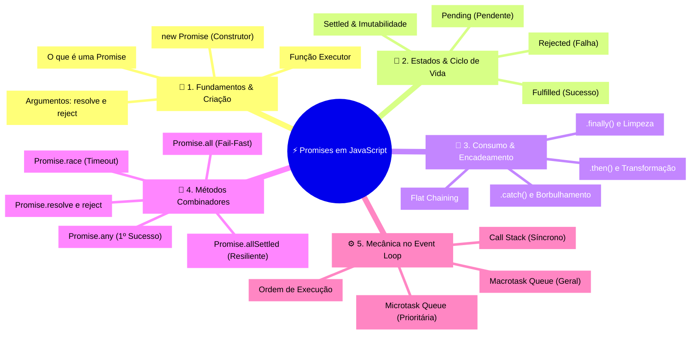
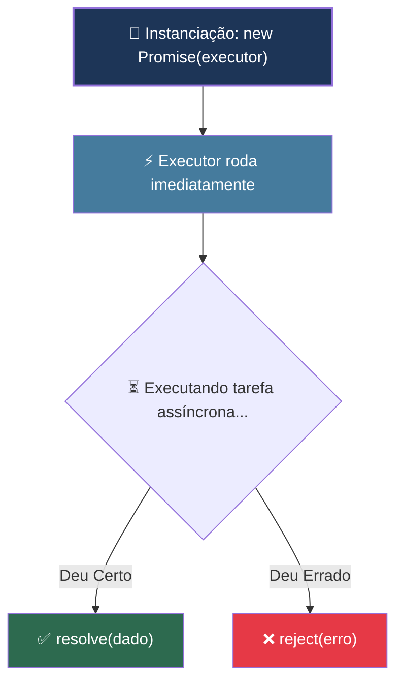
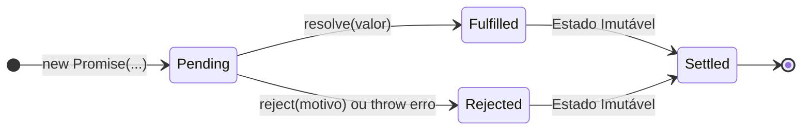
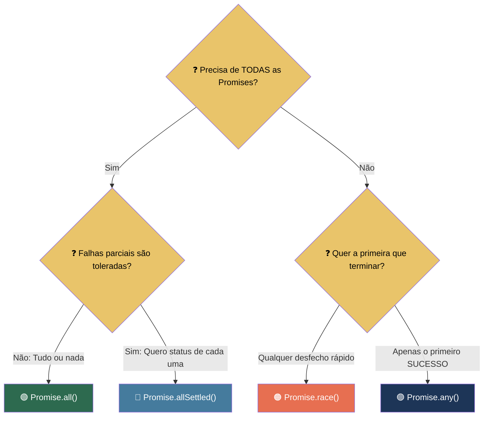
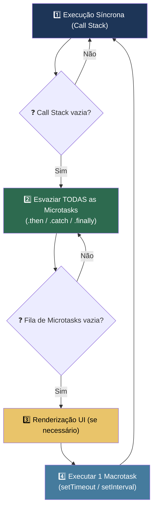
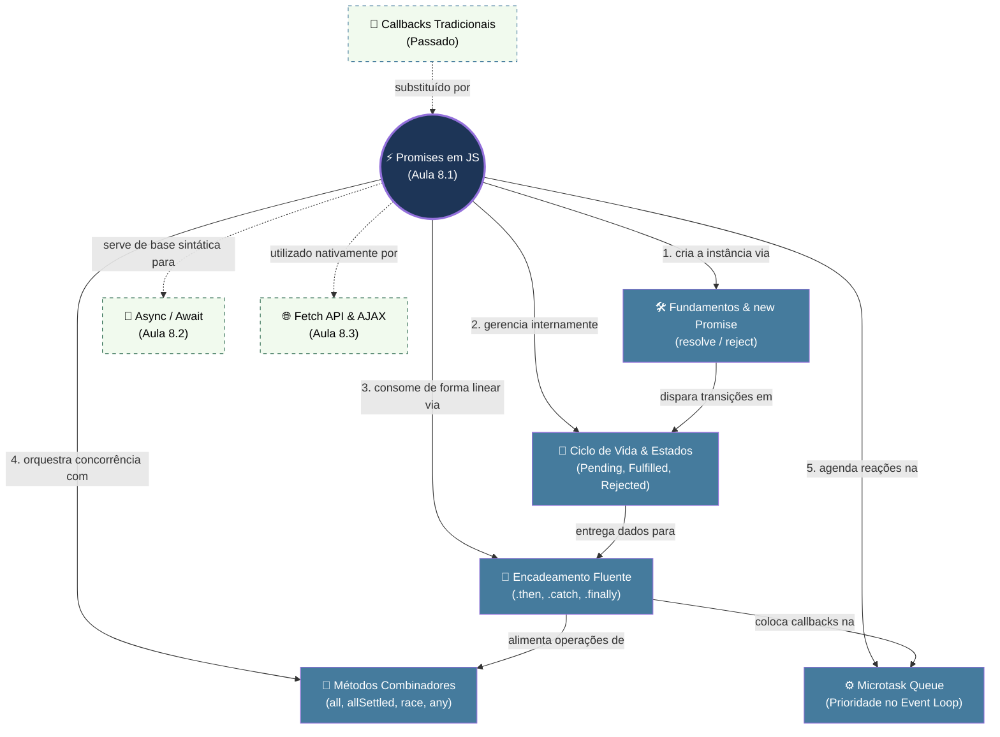

# 📘 Aula 8.1: Promises em JavaScript

> **Módulo:** Seção 8 — JS Assíncrono | **Nível:** 🟢 Fundamento & 🟡 Intermediário > **Tempo estimado:** ~35min de estudo focado | **Pré-requisitos:** Funções JavaScript, Callbacks, Noções de Sincronismo vs Assincronismo

---

## 📑 Índice

1. [🎯 Objetivos de Aprendizado](#-objetivos-de-aprendizado)
2. [🗺️ Mapa da Aula](#️-mapa-da-aula)
3. [📖 Conceito 1: Fundamentos e Sintaxe Básica de Criação (`new Promise`)](#-conceito-1-fundamentos-e-sintaxe-básica-de-criação-new-promise)
4. [📖 Conceito 2: Ciclo de Vida, Estados e Imutabilidade](#-conceito-2-ciclo-de-vida-estados-e-imutabilidade)
5. [📖 Conceito 3: Consumo e Encadeamento Fluente (`.then()`, `.catch()`, `.finally()`)](#-conceito-3-consumo-e-encadeamento-fluente-then-catch-finally)
6. [📖 Conceito 4: Combinadores Concorrentes (Métodos Estáticos de `Promise`)](#-conceito-4-combinadores-concorrentes-métodos-estáticos-de-promise)
7. [📖 Conceito 5: Microtasks e a Prioridade no Event Loop](#-conceito-5-microtasks-e-a-prioridade-no-event-loop)
8. [🔗 Mapa de Conexões](#-mapa-de-conexões)
9. [📊 Resumo Visual](#-resumo-visual)
10. [🧪 Teste seu Conhecimento](#-teste-seu-conhecimento)

---

## 🎯 Objetivos de Aprendizado

Ao concluir esta aula, você será capaz de:

- **Compreender** o conceito essencial de uma Promise e por que ela foi introduzida no JavaScript para substituir os callbacks tradicionais.
- **Implementar** Promises do zero utilizando a sintaxe básica do construtor `new Promise` com as funções `resolve` e `reject`.
- **Explicar** os 3 estados internos (`pending`, `fulfilled`, `rejected`) e a garantia de imutabilidade após a liquidação (*settlement*).
- **Construir** pipelines assíncronos encadeados e legíveis com `.then()`, tratamento resiliente de erros com `.catch()` e rotinas de finalização com `.finally()`.
- **Orquestrar** concorrência de múltiplas operações assíncronas utilizando os métodos estáticos (`Promise.all`, `Promise.allSettled`, `Promise.race`, `Promise.any`).
- **Analisar** a ordem de execução no Event Loop diferenciando a fila prioritária de **Microtasks** da fila de **Macrotasks**.

---

## 🗺️ Mapa da Aula



---

## 📖 Conceito 1: Fundamentos e Sintaxe Básica de Criação (`new Promise`)

### 💡 O que é

> 💬 **Analogia:** Imagine que você vai a uma lavanderia deixar um terno para lavar. O atendente não entrega a roupa limpa na hora; ele te entrega um **comprovante de retirada com um número de protocolo**. Esse comprovante é a **Promise**: um objeto físico que representa o compromisso de que, no futuro, ou você receberá seu terno limpo, ou receberá uma justificativa se houve algum problema com a lavagem. Você guarda o comprovante e continua fazendo suas tarefas do dia sem precisar ficar parado esperando na lavanderia.

Uma **Promise** (Promessa) é um **objeto nativo do JavaScript** que representa a eventual conclusão (ou falha) de uma operação assíncrona e seu valor resultante. 

Antes das Promises, o JavaScript dependia exclusivamente de **funções de callback**, o que frequentemente gerava o chamado **Callback Hell** (funções aninhadas dentro de funções em formato de pirâmide, difíceis de ler, manter e tratar erros). A Promise foi introduzida no padrão ECMAScript 6 (ES2015) para devolver o controle do fluxo assíncrono ao desenvolvedor, fornecendo uma estrutura padronizada e limpa.

### 📝 Sintaxe Básica e Anatomia

Para criar uma Promise, utilizamos a palavra-chave `new` chamando o construtor `Promise`. Ele recebe **uma função obrigatória** (chamada de **função executora** ou *executor*), que por sua vez recebe dois parâmetros fornecidos automaticamente pela engine do JavaScript: **`resolve`** e **`reject`**.

```javascript
// Sintaxe Canônica Básica
const minhaPromise = new Promise((resolve, reject) => {
  // 1. Aqui dentro colocamos a operação (síncrona ou assíncrona)
  const operacaoBemSucedida = true;

  if (operacaoBemSucedida) {
    // 2. Se deu tudo certo, chamamos resolve(valor)
    resolve("Dados entregues com sucesso!");
  } else {
    // 3. Se deu errado, chamamos reject(erro)
    reject(new Error("Houve uma falha na operação."));
  }
});
```

**Dissecando as Partes e Argumentos:**
- **`new Promise(...)`**: Cria uma nova instância de promessa.
- **Função Executor `(resolve, reject) => { ... }`**: Código que inicia o trabalho assíncrono. O JavaScript executa essa função **imediatamente e de forma síncrona** no momento em que a Promise é instanciada.
- **`resolve(valor)`**: Função gatilho. Ao ser chamada, avisa à Promise que a tarefa terminou com sucesso e entrega o `valor` resultante.
- **`reject(motivo)`**: Função gatilho. Ao ser chamada, avisa à Promise que a tarefa falhou e repassa o `motivo` do erro (recomenda-se passar sempre um objeto `new Error(...)`).

### ⚙️ Como funciona

| Elemento | O que é | Para que serve |
|:---|:---:|:---|
| **`new Promise`** | Construtor nativo | Cria e encapsula uma tarefa que produzirá um valor futuro. |
| **`executor`** | Função Callback `(resolve, reject)` | Executada **na hora** para disparar o processo (timer, leitura de arquivo, requisição). |
| **`resolve`** | Função interna da Engine | Conclui a promessa positivamente e despacha o resultado. |
| **`reject`** | Função interna da Engine | Conclui a promessa negativamente e despacha a falha. |

### 📊 Diagrama



### 💻 Na Prática

Criando nossa primeira função utilitária assíncrona para simular uma consulta simples de banco de dados com temporizador:

```javascript
// Exemplo: Função que retorna uma Promise de busca de produto
function buscarProdutoNoEstoque(idProduto) {
  return new Promise((resolve, reject) => {
    console.log(`[LOG] Iniciando busca do produto #${idProduto}...`);

    // Validação básica síncrona
    if (!idProduto || idProduto <= 0) {
      reject(new Error("ID de produto inválido. Deve ser maior que zero."));
      return; // Interrompe o executor
    }

    // Simulação de operação I/O assíncrona (1.5 segundos)
    setTimeout(() => {
      const estoque = { id: idProduto, nome: "Notebook Gamer", quantidade: 8 };
      resolve(estoque); // Entrega o resultado no sucesso!
    }, 1500);
  });
}
```

### ⚠️ Armadilhas Comuns

- ❌ **Achar que o corpo do executor roda em segundo plano:** A função `(resolve, reject) => { ... }` roda **sincronamente** no exato instante do `new Promise`. Operações de processamento pesado (loops síncronos) dentro dela travarão a thread principal antes mesmo da Promise ser devolvida.
- ❌ **Passar texto simples no `reject`:** Evite `reject("falhou")`. Sempre prefira instanciar um erro real `reject(new Error("falhou"))` para capturar a pilha de rastreamento (*stack trace*) e facilitar o diagnóstico de bugs.
- ❌ **Esquecer o `return` após o `reject`:** Invocar `reject(erro)` não encerra a execução das linhas seguintes dentro da função executora. Use `reject(erro); return;` se desejar interromper a função imediatamente.

---

*Agora que já sabemos o que é uma Promise e como escrevemos sua sintaxe básica de criação com `resolve` e `reject`, é o momento perfeito para entender o que acontece por dentro dela: sua máquina de estados e o ciclo de vida.*

---

## 📖 Conceito 2: Ciclo de Vida, Estados e Imutabilidade

### 💡 O que é

> 💬 **Analogia:** Pense no **pager eletrônico (bip)** da praça de alimentação de um restaurante. Enquanto a cozinha prepara seu prato, o aparelho está em **espera** (*Pending*). Quando o lanche fica pronto, o aparelho apita e acende a luz verde (*Fulfilled*). Se acabar o gás ou o ingrediente, o garçom te chama e cancela o pedido (*Rejected*). Note o ponto fundamental: uma vez que o prato foi entregue ou cancelado (*Settled*), o status do pedido fica gravado para sempre e não muda mais (imutabilidade).

Internamente, toda Promise em JavaScript opera como uma **máquina de estados finita** com regras rígidas e unidirecionais. Ela sempre nasce em um estado inicial de espera e só pode transicionar **uma única vez** para um estado final.

### ⚙️ Como funciona

Toda Promise possui internamente dois slots de controle gerenciados pela engine do JavaScript:
1. `[[PromiseState]]`: O status atual da promessa.
2. `[[PromiseResult]]`: O valor gerado pela operação (ou o erro).

| Estado | Significado Técnico | Transição Possível | Dispara manipulador |
|:---|:---|:---:|:---|
| **`pending` (Pendente)** | Estado inicial; a operação assíncrona ainda está sendo executada. | Para `fulfilled` ou `rejected` | Nenhum (aguarda término) |
| **`fulfilled` (Realizada)** | Operação concluída com sucesso; valor resultante disponível. | Nenhuma (**Imutável**) | `.then(onFulfilled)` |
| **`rejected` (Rejeitada)** | Operação falhou; motivo/erro da recusa disponível. | Nenhuma (**Imutável**) | `.catch(onRejected)` |
| **`settled` (Liquidada)** | Termo formal para indicar que ela **não é mais `pending`** (já foi realizada ou rejeitada). | Nenhuma | `.finally(onFinally)` |

**O Princípio da Imutabilidade:** Uma vez que uma Promise atinge o estado `fulfilled` ou `rejected`, ela está "liquidada" (*settled*). A partir desse momento, **seu estado e seu valor são totalmente imutáveis**. Qualquer chamada adicional a `resolve()` ou `reject()` dentro do executor será sumariamente ignorada pelo motor JavaScript.

### 📊 Diagrama



### 💻 Na Prática

Podemos inspecionar os estados de uma Promise diretamente no console do Node.js ou DevTools:

```javascript
// 1. Promise Pendente
const promessaPendente = new Promise(() => {});
console.log("Pendente:", promessaPendente);
// Saída: Promise { <pending> }

// 2. Promise já resolvida (Criada com o atalho estático Promise.resolve)
const promessaResolvida = Promise.resolve("Relatório financeiro gerado");
console.log("Resolvida:", promessaResolvida);
// Saída: Promise { <fulfilled>: "Relatório financeiro gerado" }

// 3. Provando a Imutabilidade:
const testeImutabilidade = new Promise((resolve, reject) => {
  resolve("Primeiro valor"); // Transiciona para fulfilled com 'Primeiro valor'
  resolve("Segundo valor");  // IGNORADO
  reject(new Error("Erro")); // IGNORADO
});

testeImutabilidade.then((val) => console.log("Resultado garantido:", val));
// Saída: Resultado garantido: Primeiro valor
```

### ⚠️ Armadilhas Comuns

- ❌ **Tentar "alterar" o valor de uma Promise já liquidada:** Chamar `resolve()` novamente em um momento posterior não altera o valor interno da Promise.
- ❌ **Tentar "cancelar" uma Promise nativa:** Promises em JS não possuem método `.cancel()`. Para implementar cancelamento de operações em andamento (como requisições HTTP), utiliza-se a API moderna `AbortController` em conjunto com a Promise.

---

> [!TIP]
> 🧠 **Pare e Pense:** Por que a especificação do ECMAScript definiu que o estado de uma Promise deve ser estritamente **imutável** após a primeira resolução? Imagine se uma biblioteca de terceiros pudesse alterar o resultado de uma Promise após ela já ter sido entregue ao seu código. Que tipo de bugs e inconsistências isso causaria no sistema?

---

*Agora que dominamos a criação básica e o ciclo de vida dos estados, como fazemos para "abrir o pacote" e consumir os valores de sucesso ou capturar os erros? É hora de conhecer o encadeamento fluente.*

---

## 📖 Conceito 3: Consumo e Encadeamento Fluente (`.then()`, `.catch()`, `.finally()`)

### 💡 O que é

> 💬 **Analogia:** Uma esteira de produção industrial automatizada em linha reta. A peça bruta entra na esteira: a estação 1 molda o metal (`.then`), a estação 2 aplica a pintura (`.then`), e a estação 3 embala (`.then`). Se qualquer peça quebrar em qualquer uma das etapas, um braço mecânico desvia a peça defeituosa imediatamente para o cesto de reparo e descarte no final da fábrica (`.catch`). Ao término do turno, as luzes da linha são desligadas para limpeza geral, quer tenham saído peças boas ou com defeito (`.finally`).

O consumo de uma Promise é realizado através de três métodos de instância encadeáveis: **`.then()`**, **`.catch()`** e **`.finally()`**. A característica revolucionária dessa arquitetura é o **Encadeamento Plano (*Flat Chaining*)**: cada método sempre retorna **uma nova Promise**, permitindo encadear transformações sequenciais em linha reta sem aninhar blocos de código.

### 📝 Sintaxe e Assinatura

```javascript
minhaPromise
  // 1. .then() — Manipula o sucesso (e transforma o valor)
  .then((valorResolvido) => {
    console.log("Recebido:", valorResolvido);
    // Pode retornar um valor síncrono OU outra Promise
    return valorResolvido.toUpperCase();
  })
  // 2. .then() encadeado — Recebe o retorno do .then() anterior
  .then((valorTransformado) => {
    console.log("Transformado:", valorTransformado);
  })
  // 3. .catch() — Captura qualquer erro de QUALQUER etapa anterior (Borbulhamento)
  .catch((erro) => {
    console.error("Tratamento centralizado de falha:", erro.message);
    // Opcional: pode retornar um valor de recuperação (fallback)
    return "Valor padrão de contingência";
  })
  // 4. .finally() — Executa sempre ao terminar (sucesso ou falha)
  .finally(() => {
    console.log("Operação encerrada: liberando recursos.");
  });
```

**Dissecando as Assinaturas:**
- **`promise.then(onFulfilled, [onRejected])`**: Registra o callback executado no sucesso. Retorna uma nova `Promise`. Se você retornar um valor primitivo ou objeto, o próximo `.then()` recebe esse valor. Se retornar outra Promise, o encadeamento aguarda essa nova Promise resolver (*auto-unwrapping*).
- **`promise.catch(onRejected)`**: É um atalho semântico para `.then(null, onRejected)`. Captura qualquer exceção lançada (`throw`) ou rejeição (`reject`) que borbulhou na cadeia.
- **`promise.finally(onFinally)`**: Executa uma rotina de finalização independentemente de sucesso ou erro. **Não recebe parâmetros** e repassa o estado original da Promise adiante.

### ⚙️ Como funciona

| Método | Quando Executa? | Argumentos Recebidos | Retorno |
|:---|:---|:---:|:---:|
| **`.then(onFulfilled)`** | Quando o elo anterior resolve com sucesso (`fulfilled`). | O valor de sucesso do elo anterior | Uma **nova Promise** contendo o que for retornado pela função. |
| **`.catch(onRejected)`** | Quando qualquer elo anterior rejeita (`rejected`) ou lança exceção. | O objeto de erro (`reason`) | Uma **nova Promise** (que pode recuperar o fluxo com um retorno simples). |
| **`.finally(onFinally)`** | Sempre que a Promise for liquidada (`settled`). | Nenhum argumento | Preserva a Promise original (não altera o valor). |

### 📊 Diagrama


### 💻 Na Prática

Pipeline linear de autenticação, busca de permissões e renderização sem Callback Hell:

```javascript
// Funções simuladas assíncronas
function autenticarUsuario(email, senha) {
  return new Promise((resolve, reject) => {
    setTimeout(() => {
      email === "leo@dev.com" && senha === "123"
        ? resolve({ id: 10, nome: "Leonardo", role: "admin" })
        : reject(new Error("Credenciais inválidas."));
    }, 400);
  });
}

function carregarPermissoes(usuario) {
  return new Promise((resolve) => {
    setTimeout(() => {
      resolve({ ...usuario, permissoes: ["LER", "CRIAR", "DELETAR"] });
    }, 300);
  });
}

// Pipeline Linear Limpo
console.log("Iniciando login...");

autenticarUsuario("leo@dev.com", "123")
  .then((usuario) => {
    console.log(`1. Autenticado: ${usuario.nome}. Buscando permissões...`);
    return carregarPermissoes(usuario); // Retorna NOVA Promise
  })
  .then((usuarioCompleto) => {
    console.log(`2. Permissões carregadas: ${usuarioCompleto.permissoes.join(", ")}`);
    return `Bem-vindo ao painel, ${usuarioCompleto.nome}!`; // Retorna string síncrona
  })
  .then((mensagemBoasVindas) => {
    console.log(`3. Mensagem final: ${mensagemBoasVindas}`);
  })
  .catch((erro) => {
    // Intercepta qualquer erro ocorrido em qualquer etapa anterior
    console.error(`❌ Falha no login: ${erro.message}`);
  })
  .finally(() => {
    console.log("🔒 Auditoria: Fluxo de autenticação finalizado.");
  });
```

### ⚠️ Armadilhas Comuns

- ❌ **"Promise Hell" (Aninhamento Desnecessário):** Colocar um `.then()` dentro do corpo de outro `.then()`. Retorne a chamada da função para manter a cadeia no mesmo nível de indentação horizontal.
- ❌ **Esquecer o `return` dentro do `.then()`:** Se você executar uma função assíncrona ou transformação dentro de um `.then()` sem colocar a palavra `return`, o próximo `.then()` receberá `undefined` imediatamente (*Floating Promise Bug*).
- ❌ **Achar que `.finally()` recebe o valor de resolução:** O callback de `.finally()` roda sem parâmetros porque sua única responsabilidade é executar efeitos colaterais de limpeza (como fechar conexões ou ocultar spinners de carregamento).

---

*E quando precisamos executar várias Promises ao mesmo tempo em paralelo e coordenar seus múltiplos resultados? Para isso, utilizamos os Métodos Combinadores Estáticos.*

---

## 📖 Conceito 4: Combinadores Concorrentes (Métodos Estáticos de `Promise`)

### 💡 O que é

> 💬 **Analogias do Mundo Real:**
> - **`Promise.all` (A Equipe de Escalada):** Quatro montanhistas amarrados pela mesma corda. Todos precisam chegar ao topo juntos para a expedição vencer. Se um único montanhista cair na fenda, a escalada é cancelada na hora (**Fail-Fast**).
> - **`Promise.allSettled` (O Censo Demográfico):** O IBGE visita 100 casas. Ao final do dia, o coordenador quer ver o relatório de todas as 100 casas: quais responderam com sucesso e quais estavam vazias. Nenhuma falha cancela as outras.
> - **`Promise.race` (A Corrida dos 100m Rasos):** Três velocistas disparam. O primeiro que cruzar a fita de chegada encerra a prova (seja ele o campeão ou alguém que tropeçou e caiu cruzando a linha).
> - **`Promise.any` (A Busca por um Fósforo para a Fogueira):** Três amigos tentam acender uma fogueira, cada um com um graveto diferente. Basta o primeiro conseguir criar fogo para todos comemorarem. Falhas individuais são ignoradas a menos que todos falhem.

Os métodos estáticos combinadores permitem orquestrar a execução de **múltiplas operações assíncronas concorrentes**, unificando múltiplos fluxos em uma única Promise consolidada.

### 📝 Sintaxe e Assinaturas dos Métodos Estáticos

```javascript
// 1. Promise.all — Todos com sucesso OU primeiro erro (Fail-Fast)
Promise.all([promessa1, promessa2, promessa3])
  .then(([res1, res2, res3]) => {
    // Array com resultados na MESMA ordem do array de entrada
  })
  .catch((primeiroErro) => {
    // Disparado imediatamente no 1º erro que ocorrer
  });

// 2. Promise.allSettled — Espera TODAS terminarem (Tolerância a Falhas)
Promise.allSettled([promessa1, promessa2, promessa3])
  .then((resultados) => {
    // resultados: Array<{ status: "fulfilled", value } | { status: "rejected", reason }>
  });

// 3. Promise.race — Primeira a liquidar (seja Sucesso ou Erro)
Promise.race([promessa1, promessa2])
  .then((primeiroResultado) => { /* valor da mais rápida */ })
  .catch((primeiroErro) => { /* erro da mais rápida */ });

// 4. Promise.any — Primeiro SUCESSO (ignora erros intermediários)
Promise.any([promessa1, promessa2])
  .then((primeiroSucesso) => { /* primeiro valor resolvido com sucesso */ })
  .catch((aggregateError) => {
    console.error("Todas falharam:", aggregateError.errors);
  });

// 5. Métodos Utilitários de Resolução Imediata
const resolvida = Promise.resolve("Já pronto!"); // Cria Promise cumprida
const rejeitada = Promise.reject(new Error("Erro!")); // Cria Promise rejeitada
```

### ⚙️ Como funciona

| Método Estático | Critério de Resolução | Critério de Rejeição | Comportamento de Erro | Caso de Uso Típico |
|:---|:---|:---|:---:|:---|
| **`Promise.all(iterable)`** | Quando **todas** cumprirem com sucesso. | Quando a **primeira** falhar. | **Fail-Fast**: Rejeita imediatamente no 1º erro. | Operações 100% interdependentes (ex: carregar Perfil + Saldo + Permissões). |
| **`Promise.allSettled(iterable)`** | Quando **todas** finalizarem (`settled`). | **Nunca rejeita**. Retorna array de status. | Tolera falhas parciais. | Painéis/Dashboards onde um gráfico com erro não pode quebrar a tela inteira. |
| **`Promise.race(iterable)`** | Quando a **primeira** concluir (com sucesso). | Quando a **primeira** concluir (com rejeição). | Segue o 1º desfecho a ocorrer. | Implementação de **Timeouts** de requisições de rede. |
| **`Promise.any(iterable)`** | Quando a **primeira com sucesso** concluir. | Apenas se **todas** falharem. | Lança `AggregateError`. | Buscar recurso no servidor espelho/CDN mais rápido com redundância. |

### 📊 Diagrama



### 💻 Na Prática

Implementando tolerância a falhas com `allSettled` e padrão de Timeout com `race`:

```javascript
const servicoUsuario = () => new Promise(res => setTimeout(() => res({ nome: "Ana" }), 300));
const servicoNoticias = () => new Promise((_, rej) => setTimeout(() => rej(new Error("API de Notícias offline")), 200));
const servicoClima = () => new Promise(res => setTimeout(() => res({ temp: "24°C" }), 400));

// 1. Dashboard tolerante a falhas parciais com Promise.allSettled
console.log("Carregando Dashboard...");
Promise.allSettled([servicoUsuario(), servicoNoticias(), servicoClima()])
  .then((resultados) => {
    resultados.forEach((res, index) => {
      if (res.status === "fulfilled") {
        console.log(`✅ Componente ${index + 1} Carregado:`, res.value);
      } else {
        console.warn(`⚠️ Componente ${index + 1} Falhou:`, res.reason.message);
      }
    });
  });

// 2. Utilitário de Timeout com Promise.race
function requisicaoComTimeout(promessaOriginal, limiteMs) {
  const timeout = new Promise((_, reject) => {
    setTimeout(() => reject(new Error(`Timeout: Limite de ${limiteMs}ms excedido!`)), limiteMs);
  });
  return Promise.race([promessaOriginal, timeout]);
}

// Teste de timeout: servicoClima leva 400ms, limite de 250ms
requisicaoComTimeout(servicoClima(), 250)
  .then(dados => console.log("Resposta rápida:", dados))
  .catch(err => console.error("⏱️ Falha de Timeout:", err.message));
```

### ⚠️ Armadilhas Comuns

- ❌ **Usar `Promise.all` em telas de Dashboard independentes:** Se uma requisição de tempo secundária falhar, o `Promise.all` descarta silenciosamente o perfil do usuário e o extrato financeiro. Use `Promise.allSettled`.
- ❌ **Achar que `Promise.race` aborta a requisição perdedora:** A Promise perdedora continua executando em segundo plano no servidor; apenas a entrega do valor para o seu código é ignorada.

---

> [!TIP]
> 🧠 **Pare e Pense:** Se você executar `Promise.all([p1, p2, p3])` e `p2` for rejeitada quase que instantaneamente (10ms), as operações `p1` e `p3` são interrompidas na rede pelo JavaScript automaticamente? Como o `AbortController` ajuda a resolver o desperdício de banda nesse cenário?

---

*Para entender por que as Promises se comportam de forma assíncrona mesmo quando já foram previamente resolvidas, precisamos olhar a mecânica do Event Loop e a Fila de Microtasks.*

---

## 📖 Conceito 5: Microtasks e a Prioridade no Event Loop

### 💡 O que é

> 💬 **Analogia:** Pense na fila de um banco. As pessoas na fila normal do caixa são as **Macrotasks** (como `setTimeout`). Quando o caixa termina de atender uma pessoa, antes de chamar a próxima da fila geral, ele atende prioritariamente quem está no guichê expresso de retorno de documentos — as **Microtasks** (callbacks de Promises). O caixa só volta a chamar a fila geral quando o guichê expresso estiver 100% vazio.

No motor JavaScript, o **Event Loop** organiza a execução assíncrona através de filas com diferentes prioridades. Os callbacks de Promises (`.then()`, `.catch()`, `.finally()`) são enfileirados na **Fila de Microtasks** (*Microtask Queue*), que possui **prioridade absoluta** sobre a fila comum de Macrotasks (`setTimeout`, `setInterval`, I/O).

### ⚙️ Como funciona

O ciclo de processamento do JavaScript segue uma ordem rigorosa:
1. Executa todo o código síncrono da **Call Stack** até esvaziar.
2. Executa **todas as Microtasks** da fila até ela ficar completamente vazia.
3. Executa a renderização visual da tela (se estiver no navegador).
4. Pega a **próxima Macrotask** da fila (ex: callback do `setTimeout`) e a envia para a Call Stack.
5. Repete o ciclo.

| Categoria | Exemplos Típicos | Prioridade | Regra de Esvaziamento |
|:---|:---|:---:|:---|
| **Síncrono (Call Stack)** | Funções normais, corpo do executor `new Promise` | 🥇 1ª (Imediata) | Executa até o fim da pilha de chamadas |
| **Microtasks** | `.then()`, `.catch()`, `.finally()`, `queueMicrotask()` | 🥈 2ª (Alta Prioridade) | **Esvazia a fila inteira** antes de avançar |
| **Macrotasks (Tasks)** | `setTimeout`, `setInterval`, `setImmediate`, eventos I/O | 🥉 3ª (Geral) | Processa **uma por vez** por volta do loop |

### 📊 Diagrama



### 💻 Na Prática

Analise a ordem exata de saída do código abaixo:

```javascript
// Exemplo clássico da mecânica do Event Loop
console.log("1. Síncrono: Início");

setTimeout(() => {
  console.log("4. Macrotask: setTimeout 0ms");
}, 0);

Promise.resolve().then(() => {
  console.log("3. Microtask: Promise.then");
});

console.log("2. Síncrono: Fim");

// Saída no Console:
// 1. Síncrono: Início
// 2. Síncrono: Fim
// 3. Microtask: Promise.then
// 4. Macrotask: setTimeout 0ms
```

### ⚠️ Armadilhas Comuns

- ❌ **Achar que `setTimeout(..., 0)` roda antes de uma Promise resolvida:** Mesmo com timer zerado (`0ms`), o `setTimeout` é uma Macrotask e sempre perderá a execução para qualquer Microtask de Promise.
- ❌ **Microtask Starvation (Inanição do Loop):** Agendar Microtasks recursivamente sem parar impede o Event Loop de processar cliques do usuário, renderizações ou timers, travando a aba do navegador.

---

## 🔗 Mapa de Conexões

Veja como os conceitos abordados nesta aula se integram pedagogicamente e preparam o terreno para o ecossistema avançado de JavaScript Assíncrono:



As Promises representam o **pilar mestre** do JavaScript moderno: dominar sua criação, seus estados e seus métodos combinadores é o pré-requisito indispensável para dominar `async/await` e as APIs de rede (`fetch`).

---

## 📊 Resumo Visual

### Comparação Direta dos Combinadores Estáticos

| Combinador | Condição de Sucesso | Condição de Rejeição | Erro Retornado | Quando Utilizar |
|:---|:---:|:---:|:---:|:---|
| **`Promise.all`** | **Todas** cumprirem com sucesso | **Primeira** falhar (*Fail-Fast*) | O erro da 1ª | Dados 100% interdependentes |
| **`Promise.allSettled`** | **Todas** terminarem (`settled`) | **Nunca** rejeita | Nenhum | Relatórios e painéis com tolerância a falhas parciais |
| **`Promise.race`** | **Primeira** resolver com sucesso | **Primeira** rejeitar | O erro da 1ª | Timeouts e cancelamentos de espera |
| **`Promise.any`** | **Primeira** resolver com sucesso | **Todas** falharem | `AggregateError` | Redundância de servidores espelho e CDNs |

---

### Síntese em Um Olhar

```mermaid
flowchart TD
    subgraph CRIACAO["1. Criação"]
        A["new Promise((resolve, reject) => {...})"]
    end

    subgraph ESTADOS["2. Estados Imutáveis"]
        B["Pending (Pendente)"]
        C["Fulfilled (Sucesso)"]
        D["Rejected (Falha)"]
        B -->|resolve(v)| C
        B -->|reject(e)| D
    end

    subgraph CONSUMO["3. Encadeamento Linear"]
        C --> E[".then(dado => novoDado)"]
        D --> F[".catch(erro => recupera)"]
        E --> G[".finally(() => limpeza)"]
        F --> G
    end

    subgraph CONCORRENCIA["4. Concorrência"]
        H["Promise.all (Tudo ou nada)"]
        I["Promise.allSettled (Relatório completo)"]
        J["Promise.race (Mais rápido)"]
        K["Promise.any (Primeiro sucesso)"]
    end

    A --> B

    style CRIACAO fill:#1d3557,color:#fff
    style ESTADOS fill:#457b9d,color:#fff
    style CONSUMO fill:#2d6a4f,color:#fff
    style CONCORRENCIA fill:#e76f51,color:#fff
```

---

### ✅ Checklist: O que devo saber

Antes de avançar para a próxima aula de `async/await`, valide se você é capaz de:

- [ ] **Explicar** o conceito de Promise e sua sintaxe básica com `new Promise((resolve, reject) => ...)`.
- [ ] **Descrever** os 3 estados de uma Promise (`pending`, `fulfilled`, `rejected`) e a garantia de imutabilidade.
- [ ] **Construir** uma cadeia linear de `.then()` passando valores para as etapas seguintes com `return`.
- [ ] **Tratar** erros de forma centralizada utilizando `.catch()` e rotinas de finalização com `.finally()`.
- [ ] **Selecionar** o combinador estático adequado (`all`, `allSettled`, `race`, `any`) conforme a tolerância a falhas.
- [ ] **Prever** a ordem exata de logs diferenciando código síncrono, Microtasks de Promises e Macrotasks de timers.

---

## 🧪 Teste seu Conhecimento

Tente responder mentalmente ou no editor antes de abrir as respostas! 🙈

---

### Questões Conceituais

**Questão 1:** Um desenvolvedor escreveu o seguinte código dentro de um executor de Promise:

```javascript
const promessa = new Promise((resolve, reject) => {
  resolve("Primeira resolução");
  reject(new Error("Erro posterior"));
  resolve("Segunda resolução");
});

promessa
  .then((res) => console.log("THEN:", res))
  .catch((err) => console.log("CATCH:", err.message));
```

O que será impresso no console e por quê?

<details>
<summary>🔍 Ver resposta</summary>

**Resposta:** Será impresso apenas `THEN: Primeira resolução`.  
**Justificativa:** As Promises são máquinas de estado **imutáveis**. Assim que `resolve("Primeira resolução")` é invocada pela primeira vez, a Promise transiciona definitivamente para `fulfilled`. Qualquer invocação subsequente de `reject` ou `resolve` dentro do mesmo executor é sumariamente ignorada pelo motor JavaScript.

</details>

---

**Questão 2:** Analise o pipeline de transformação abaixo. Qual será o valor impresso no console ao final da execução?

```javascript
Promise.resolve(5)
  .then((num) => {
    num * 2; // Atenção aqui!
  })
  .then((resultado) => {
    console.log("Resultado final:", resultado);
  });
```

<details>
<summary>🔍 Ver resposta</summary>

**Resposta:** Será impresso `Resultado final: undefined`.  
**Justificativa:** No primeiro `.then()`, a expressão `num * 2` foi avaliada, mas não possui a instrução `return`. Em JavaScript, uma função sem `return` explícito devolve `undefined`. Como o retorno de um `.then()` define a entrada do próximo, o segundo `.then()` recebe `undefined`.

</details>

---

### Questões Práticas / Cenários

**Questão 3 (Cenário de Arquitetura):** Você está desenvolvendo o painel de monitoramento de uma fintech. A tela precisa exibir 4 widgets: Cotação do Dólar, Saldo da Conta, Notificações e Histórico de Transações. Se o serviço de Notificações estiver fora do ar (retornar erro 500), os outros 3 widgets ainda devem carregar normalmente na tela. Qual método estático de `Promise` você deve utilizar para disparar as 4 buscas simultâneas?

<details>
<summary>🔍 Ver resposta</summary>

**Resposta:** Deve-se utilizar **`Promise.allSettled()`**.  
**Justificativa:** O método `Promise.all()` aplica a política de *fail-fast*, o que faria a tela inteira falhar se o serviço de Notificações falhasse. Já o `Promise.allSettled()` aguarda a finalização de todas as requisições e retorna um array com o status (`fulfilled` ou `rejected`) de cada uma, permitindo renderizar os 3 widgets com sucesso e exibir uma mensagem de indisponibilidade apenas no widget com erro.

</details>

---

**Questão 4 (Pegadinha do Event Loop):** Qual é a ordem exata de saída impressa no console ao executar o trecho abaixo?

```javascript
console.log("A");

setTimeout(() => {
  console.log("B");
}, 0);

new Promise((resolve) => {
  console.log("C");
  resolve("D");
}).then((val) => {
  console.log(val);
});

console.log("E");
```

<details>
<summary>🔍 Ver resposta</summary>

**Resposta:** A ordem exata é: `A ➔ C ➔ E ➔ D ➔ B`.  
**Justificativa detalhada:**
1. `console.log("A")` executa sincronamente (**A**).
2. `setTimeout` agenda seu callback na fila de **Macrotasks**.
3. O executor dentro de `new Promise(...)` é **síncrono e imediato**, executando `console.log("C")` (**C**).
4. `resolve("D")` agenda o callback do `.then()` na fila prioritária de **Microtasks**.
5. `console.log("E")` roda sincronamente (**E**).
6. A Call Stack esvaziou. O Event Loop esvazia a fila de **Microtasks**, executando o `.then()` (**D**).
7. Sem mais microtasks, o Event Loop processa a próxima **Macrotask**, executando o callback do `setTimeout` (**B**).
ve("D");
}).then((val) => {
  console.log(val);
});

console.log("E");
```

<details>
<summary>🔍 Ver resposta</summary>

**Resposta:** A ordem exata é: `A ➔ C ➔ E ➔ D ➔ B`.  
**Justificativa detalhada:**
1. `console.log("A")` executa sincronamente (**A**).
2. `setTimeout` agenda seu callback na fila de **Macrotasks**.
3. O executor dentro de `new Promise(...)` é **síncrono e imediato**, executando `console.log("C")` (**C**).
4. `resolve("D")` agenda o `.then()` na fila prioritária de **Microtasks**.
5. `console.log("E")` roda sincronamente (**E**).
6. A Call Stack esvaziou. O Event Loop esvazia a fila de **Microtasks**, executando o `.then()` (**D**).
7. Sem mais microtasks, o Event Loop processa a próxima **Macrotask**, executando o `setTimeout` (**B**).

</details>

---

**Questão 5 (Fluxo com Recuperação de Erro):** Analise o encadeamento a seguir e determine o que será impresso:

```javascript
Promise.resolve(100)
  .then((val) => {
    throw new Error("Falha no cálculo");
  })
  .then((val) => val + 50)
  .catch((err) => {
    console.warn("Capturado:", err.message);
    return 10; // Recuperação
  })
  .then((val) => console.log("Final:", val * 2));
```

<details>
<summary>🔍 Ver resposta</summary>

**Resposta:** Será impresso:  
`Capturado: Falha no cálculo`  
`Final: 20`  
**Justificativa:** Quando a exceção é lançada no primeiro `.then()`, o segundo `.then()` é ignorado e o fluxo pula para o manipulador `.catch()`. O `.catch()` captura a mensagem de erro e retorna o número `10`. Como o retorno de um `.catch()` gera uma Promise resolvida (a menos que ele lance outro erro), o fluxo é recuperado e o último `.then()` recebe o valor `10`, imprimindo `Final: 20`.

</details>

---

### 🏋️ Desafio de Aplicação

> **Desafio Hands-on (Tempo estimado: 20-30min): Utilitário de Retry com Timeout**  
> 
> Implemente uma função utilitária em JavaScript chamada `executarComRetryETimeout(funcaoAssincrona, maxTentativas, timeoutMs)`.
> 
> **Requisitos:**
> 1. A função deve tentar executar `funcaoAssincrona()` (uma função que retorna uma Promise).
> 2. Cada tentativa individual deve sofrer timeout se demorar mais que `timeoutMs` (usando `Promise.race`).
> 3. Se uma tentativa falhar ou estourar o timeout, a função deve tentar novamente até atingir `maxTentativas`.
> 4. Se todas as tentativas falharem, a Promise final deve ser rejeitada com o erro da última tentativa.
> 5. Se qualquer tentativa for bem-sucedida dentro do tempo limite, retorne imediatamente o valor resolvido.
> 
> *Dica: Use recursão de Promises ou encadeamento com `.catch()` para orquestrar as retentativas!*
