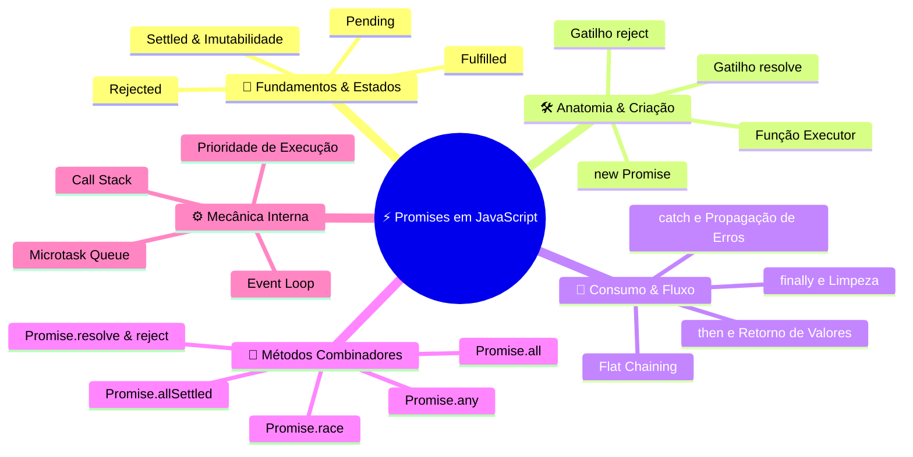
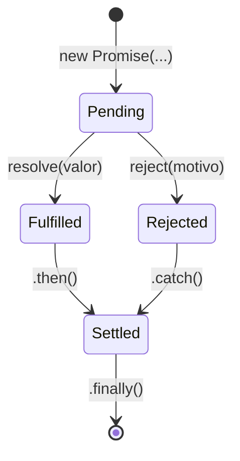
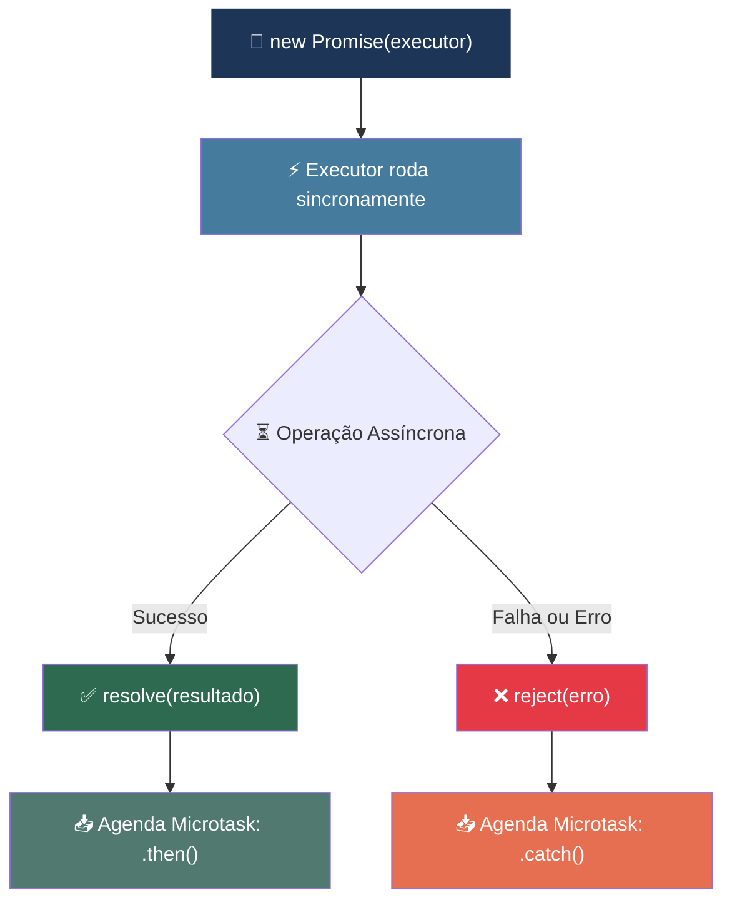
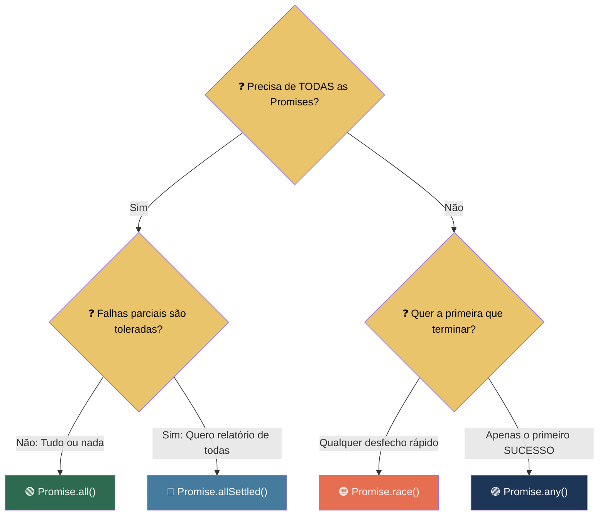
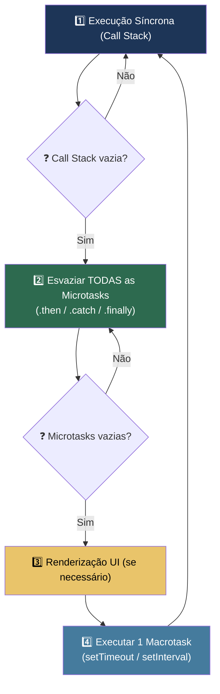
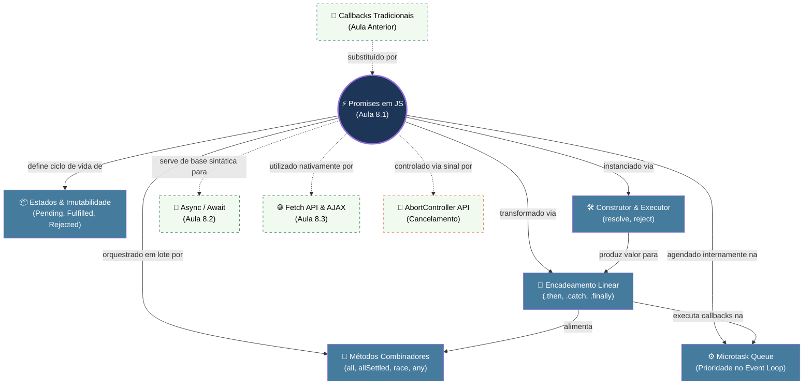
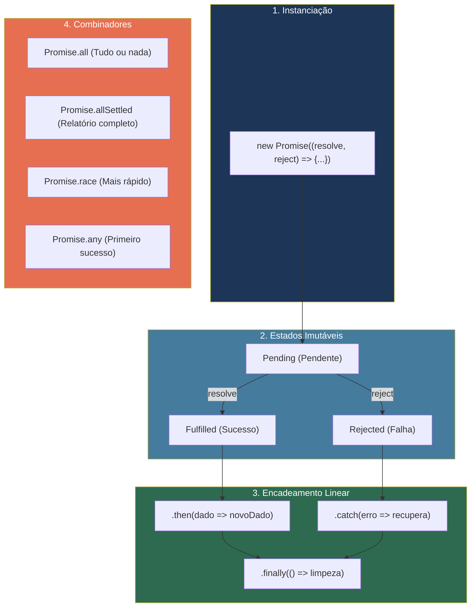

# 📘 Aula 8.1: Promises em JavaScript

> **Módulo:** Seção 8 — JS Assíncrono | **Nível:** 🟢 Fundamento & 🟡 Intermediário  
> **Tempo estimado:** ~30min de estudo focado | **Pré-requisitos:** Funções JavaScript, Callbacks, Temporizadores (`setTimeout`)

---

## 📑 Índice

1. [🎯 Objetivos de Aprendizado](#-objetivos-de-aprendizado)
2. [🗺️ Mapa da Aula](#️-mapa-da-aula)
3. [📖 Conceito 1: Ciclo de Vida e Estados da Promise](#-conceito-1-ciclo-de-vida-e-estados-da-promise)
4. [📖 Conceito 2: Criação com o Construtor `new Promise` e o Executor Síncrono](#-conceito-2-criação-com-o-construtor-new-promise-e-o-executor-síncrono)
5. [📖 Conceito 3: Consumo e Encadeamento (`.then()`, `.catch()`, `.finally()`)](#-conceito-3-consumo-e-encadeamento-then-catch-finally)
6. [📖 Conceito 4: Combinadores Concorrentes (Métodos Estáticos de `Promise`)](#-conceito-4-combinadores-concorrentes-métodos-estáticos-de-promise)
7. [📖 Conceito 5: Microtasks e a Prioridade no Event Loop](#-conceito-5-microtasks-e-a-prioridade-no-event-loop)
8. [🔗 Mapa de Conexões](#-mapa-de-conexões)
9. [📊 Resumo Visual](#-resumo-visual)
10. [🧪 Teste seu Conhecimento](#-teste-seu-conhecimento)

---

## 🎯 Objetivos de Aprendizado

Ao concluir esta aula, você será capaz de:

- **Explicar** os 3 estados fundamentais de uma Promise e o princípio de imutabilidade de resolução.
- **Implementar** rotinas assíncronas encapsuladas usando o construtor `new Promise` com `resolve` e `reject`.
- **Estruturar** pipelines assíncronos lineares usando encadeamento com `.then()`, tratamento unificado com `.catch()` e finalização com `.finally()`.
- **Selecionar** o método combinador estático correto (`all`, `allSettled`, `race`, `any`) para cenários de concorrência.
- **Analisar** a ordem de execução no Event Loop diferenciando a fila de **Microtasks** da fila de **Macrotasks**.

---

## 🗺️ Mapa da Aula



---

## 📖 Conceito 1: Ciclo de Vida e Estados da Promise

### 💡 O que é

> 💬 **Analogia:** Pense no pager eletrônico que você recebe ao pedir um lanche no balcão de um restaurante. Enquanto a cozinha prepara a comida, o aparelho está em **espera** (*Pending*). Quando o lanche fica pronto, o pager apita e você retira a comida com sucesso (*Fulfilled*). Se acabar o gás ou faltar ingrediente, o atendente avisa que não haverá entrega (*Rejected*). Em qualquer caso, o processo foi encerrado e não muda mais (*Settled*).

Uma **Promise** (Promessa) é um objeto em JavaScript que atua como um **espaço reservado (placeholder) para um valor futuro** resultante de uma operação assíncrona que ainda não foi concluída. Ela resolve o problema histórico do **Callback Hell** (aninhamento excessivo em pirâmide) ao fornecer uma interface padronizada, linear e imutável para lidar com sucessos e falhas assíncronas.

### ⚙️ Como funciona

Toda Promise transita por um ciclo de vida estrito e **unidirecional**. Ela sempre inicia no estado pendente e pode transicionar para **apenas um** dos dois estados finais. Uma vez que atinge um estado final (*settled*), seu valor e status tornam-se **imutáveis**.

| Estado | Significado Técnico | Transição Possível | Dispara manipulador |
|:---|:---|:---:|:---|
| **`pending`** | Estado inicial; operação assíncrona em andamento. | Para `fulfilled` ou `rejected` | Nenhum (aguarda) |
| **`fulfilled`** | Operação concluída com sucesso; valor resultante disponível. | Nenhuma (imutável) | `.then(onFulfilled)` |
| **`rejected`** | Operação falhou; motivo/erro da recusa disponível. | Nenhuma (imutável) | `.catch(onRejected)` |
| **`settled`** | Termo guarda-chuva para indicar que saiu de `pending`. | Nenhuma | `.finally(onFinally)` |

### 📊 Diagrama



### 💻 Na Prática

Podemos inspecionar o estado interno de uma Promise diretamente no console do navegador ou Node.js:

```javascript
// Exemplo: Inspecionando o estado de promessas
const promessaPendente = new Promise(() => {});
console.log("Pendente:", promessaPendente);
// Saída: Promise { <pending> }

const promessaResolvida = Promise.resolve("Dados carregados!");
console.log("Resolvida:", promessaResolvida);
// Saída: Promise { <fulfilled>: "Dados carregados!" }

const promessaRejeitada = Promise.reject(new Error("Falha na rede"));
console.log("Rejeitada:", promessaRejeitada);
// Saída: Promise { <rejected>: Error: Falha na rede }
// (Obs: Requer .catch para não disparar UnhandledPromiseRejection)
promessaRejeitada.catch(() => {});
```

### ⚠️ Armadilhas Comuns

- ❌ **Achar que uma Promise pode mudar de valor após resolvida:** Chamar `resolve()` duas vezes ou chamar `resolve()` e depois `reject()` não altera o estado. A primeira chamada sela o destino da Promise; as subsequentes são sumariamente ignoradas.
- ❌ **Tentar "cancelar" uma Promise nativa:** Promises em JS não possuem método `.cancel()`. Uma vez instanciadas, a operação assíncrona continuará até o fim (para cancelamento cooperativo, utiliza-se a API `AbortController`).

---

*Agora que dominamos o ciclo de vida e a imutabilidade dos estados, vamos entender como instanciar nossas próprias Promises através do seu construtor nativo.*

---

## 📖 Conceito 2: Criação com o Construtor `new Promise` e o Executor Síncrono

### 💡 O que é

> 💬 **Analogia:** É como assinar uma procuração no cartório. No exato instante em que você assina o documento na mesa (função executora síncrona), você outorga plenos poderes ao procurador para que ele execute uma tarefa e, no futuro, te entregue o resultado ou relate uma falha.

O construtor **`new Promise(executor)`** cria uma nova instância de Promise. Ele recebe obrigatoriamente uma função de retorno chamada **executor**, que recebe dois argumentos fornecidos pela engine: **`resolve`** (função para cumprir a promessa) e **`reject`** (função para recusar a promessa).

### ⚙️ Como funciona

O detalhe mais importante da arquitetura do construtor: **a função executora roda de forma síncrona e imediata** no instante em que `new Promise` é avaliado. Apenas as resoluções e os callbacks anexados via `.then()` são processados assincronamente.

| Elemento | Tipo | Papel no Mecanismo |
|:---|:---:|:---|
| **`executor`** | `Function` | Invocada **imediatamente e sincronamente** com `(resolve, reject)`. |
| **`resolve(dado)`** | `Function` | Muda o estado para `fulfilled` e repassa `dado` para o próximo `.then()`. |
| **`reject(erro)`** | `Function` | Muda o estado para `rejected` e repassa `erro` para o próximo `.catch()`. |
| **`throw new Error()`** | `Exception` | Qualquer erro lançado dentro do executor aciona implicitamente o `reject`. |

### 📊 Diagrama



### 💻 Na Prática

Vamos encapsular a função `setTimeout` em uma função utilitária profissional:

```javascript
// Exemplo: Criando uma função assíncrona de delay baseada em Promise
function temporizador(segundos) {
  return new Promise((resolve, reject) => {
    // 1. Validação defensiva (síncrona)
    if (typeof segundos !== "number" || segundos < 0) {
      reject(new TypeError("O tempo deve ser um número positivo em segundos."));
      return; // Interrompe o executor
    }

    // 2. Disparo da operação assíncrona
    setTimeout(() => {
      resolve(`Concluído com sucesso após ${segundos} segundo(s).`);
    }, segundos * 1000);
  });
}

// Consumo básico
temporizador(1)
  .then((msg) => console.log("Resultado:", msg))
  .catch((err) => console.error("Erro:", err.message));
```

### ⚠️ Armadilhas Comuns

- ❌ **Colocar processamento pesado síncrono dentro do executor:** Como o executor roda imediatamente na thread principal, loops pesados dentro dele vão congelar a interface do usuário antes mesmo da Promise ser retornada.
- ❌ **Passar strings primitivas no `reject`:** Evite `reject("falhou")`. Sempre instancie um erro formal `reject(new Error("falhou"))` para capturar a pilha de execução (*stack trace*) e viabilizar debugging.
- ❌ **Esquecer o `return` após o `reject`:** Chamar `reject(err)` não finaliza a execução das linhas seguintes dentro da função executora. Use `reject(err); return;` para evitar efeitos colaterais.

---

> [!TIP]
> 🧠 **Pare e Pense:** Por que a especificação do ECMAScript definiu que a função executora de `new Promise(executor)` deve rodar de forma **síncrona e imediata**, em vez de ser agendada para depois? O que aconteceria se você precisasse inicializar um timer, abrir uma conexão de socket ou registrar um listener imediatamente no momento da instanciação?

---

*Com a Promise criada, precisamos manipulá-la. É aqui que entra o poder do encadeamento plano e do tratamento centralizado de erros.*

---

## 📖 Conceito 3: Consumo e Encadeamento (`.then()`, `.catch()`, `.finally()`)

### 💡 O que é

> 💬 **Analogia:** Uma esteira de produção industrial em etapas. A caixa entra na esteira: a estação 1 coloca o produto (`.then`), a estação 2 cola o adesivo (`.then`), e a estação 3 embala (`.then`). Se qualquer peça quebrar no meio do caminho, um sensor desvia a caixa imediatamente para a esteira de descarte e manutenção (`.catch`). No final do expediente, a esteira é desligada e limpa, quer tenham saído caixas perfeitas ou defeituosas (`.finally`).

O consumo de Promises é realizado através de três métodos prototipais principais: **`.then()`**, **`.catch()`** e **`.finally()`**. A característica central dessa arquitetura é o **Encadeamento Plano (*Flat Chaining*)**: cada método sempre retorna **uma nova Promise**, permitindo encadear transformações sequenciais sem aninhar blocos de código.

### ⚙️ Como funciona

Quando uma função dentro de um `.then()` retorna um valor simples (ex: `return 10`), esse valor é automaticamente envelopado em uma Promise resolvida. Se ela retornar **outra Promise**, o próximo `.then()` aguarda essa nova Promise resolver antes de continuar. Se ocorrer qualquer exceção (`throw`), o fluxo pula todos os `.then()` intermediários e cai no primeiro `.catch()`.

| Método | Argumentos | Retorno | Comportamento Chave |
|:---|:---|:---:|:---|
| **`.then(onFulfilled, onRejected)`** | `(valor) => novoValor` | Nova `Promise` | Executa no sucesso. O valor retornado alimenta o próximo `.then()`. |
| **`.catch(onRejected)`** | `(erro) => recuperacao` | Nova `Promise` | Captura qualquer erro anterior. O que ele retorna recupera o fluxo para o próximo `.then()`. |
| **`.finally(onFinally)`** | `() => void` | Mesma `Promise` | Executa sempre (sucesso ou falha). **Não recebe argumentos** e preserva o valor/erro original. |

### 📊 Diagrama


### 💻 Na Prática

Comparativo: eliminando o Callback Hell através do encadeamento linear com Promises:

```javascript
// Simulação de banco de dados assíncrono
function buscarUsuario(id) {
  return new Promise((resolve, reject) => {
    setTimeout(() => {
      id === 1 ? resolve({ id: 1, nome: "Leonardo", role: "admin" }) 
               : reject(new Error("Usuário não encontrado."));
    }, 400);
  });
}

function buscarPermissoes(usuario) {
  return new Promise((resolve) => {
    setTimeout(() => {
      resolve({ ...usuario, permissoes: ["READ", "WRITE", "DELETE"] });
    }, 400);
  });
}

// Pipeline Linear Limpo (Flat Chain)
console.log("Iniciando carregamento...");

buscarUsuario(1)
  .then((usuario) => {
    console.log(`1. Usuário carregado: ${usuario.nome}`);
    return buscarPermissoes(usuario); // Retorna uma nova Promise!
  })
  .then((usuarioCompleto) => {
    console.log(`2. Permissões carregadas: ${usuarioCompleto.permissoes.join(", ")}`);
    return `Dashboard liberado para ${usuarioCompleto.nome}`;
  })
  .then((statusFinal) => {
    console.log(`3. Status: ${statusFinal}`);
  })
  .catch((erro) => {
    console.error(`❌ Erro no pipeline: ${erro.message}`);
  })
  .finally(() => {
    console.log("🔒 Finalizado: ocultando spinner de loading.");
  });
```

### ⚠️ Armadilhas Comuns

- ❌ **"Promise Hell" (Aninhamento Desnecessário):** Aninhar `.then()` dentro de `.then()`. O objetivo das Promises é manter a indentação plana no nível zero.
- ❌ **Esquecer o `return` dentro do `.then()`:** Se você executar uma transformação ou chamar outra função assíncrona sem `return`, o próximo `.then()` receberá `undefined`.
- ❌ **Achar que `.finally()` recebe o resultado:** O callback de `.finally()` não aceita parâmetros porque ele roda tanto no sucesso quanto no erro apenas para efeitos colaterais (fechar conexões, ocultar loadings).

---

*E quando precisamos disparar várias tarefas assíncronas ao mesmo tempo e coordenar seus resultados? Para isso, a classe `Promise` oferece métodos combinadores de alto nível.*

---

## 📖 Conceito 4: Combinadores Concorrentes (Métodos Estáticos de `Promise`)

### 💡 O que é

> 💬 **Analogia:** Uma equipe de 4 mensageiros enviados para missões diferentes:
> - **`Promise.all`**: O reino só avança se **todos** os 4 mensageiros voltarem com suas mensagens. Se um for capturado, o plano é cancelado na hora.
> - **`Promise.allSettled`**: O rei espera os 4 voltarem para saber exatamente quem conseguiu e quem falhou.
> - **`Promise.race`**: Uma corrida direta: a mensagem do primeiro que cruzar a fronteira (seja boa ou má notícia) é a que vale.
> - **`Promise.any`**: O rei quer a primeira mensagem de vitória que chegar. Relatórios de derrota são ignorados a menos que todos os 4 percam.

Os métodos estáticos combinadores permitem coordenar a execução de **múltiplas Promises em paralelo/concorrência**, unificando múltiplos fluxos assíncronos em uma única Promise resultante.

### ⚙️ Como funciona

| Método Estático | Critério de Resolução | Critério de Rejeição | Comportamento de Erro | Caso de Uso Típico |
|:---|:---|:---|:---:|:---|
| **`Promise.all(iterable)`** | Quando **todas** cumprirem com sucesso. | Quando a **primeira** falhar. | **Fail-Fast**: Rejeita imediatamente no 1º erro. | Operações dependentes (ex: carregar perfil + preferências + saldo). |
| **`Promise.allSettled(iterable)`** | Quando **todas** finalizarem (`settled`). | **Nunca rejeita**. Retorna array `{status, value/reason}`. | Tolera falhas parciais. | Painéis/Dashboards onde 1 widget quebrado não deve quebrar a página. |
| **`Promise.race(iterable)`** | Quando a **primeira** concluir (com sucesso). | Quando a **primeira** concluir (com rejeição). | Segue a 1ª a concluir. | Implementação de **Timeouts** de requisição. |
| **`Promise.any(iterable)`** | Quando a **primeira com sucesso** concluir. | Apenas se **todas** falharem. | Retorna `AggregateError`. | Buscar recurso no servidor espelho/CDN mais rápido. |
| **`Promise.resolve(v)`** | Imediatamente resolvida com `v`. | N/A | Útil para normalização. | Transformar valores síncronos em Promises. |
| **`Promise.reject(e)`** | N/A | Imediatamente rejeitada com `e`. | Útil para guard clauses. | Interrupção rápida de pipelines. |

### 📊 Diagrama



### 💻 Na Prática

Dois padrões arquiteturais essenciais: tolerância a falhas com `allSettled` e timeout com `race`:

```javascript
const servicoA = () => new Promise(res => setTimeout(() => res("Dados do Serviço A"), 300));
const servicoB = () => new Promise((_, rej) => setTimeout(() => rej(new Error("Serviço B indisponível")), 200));
const servicoC = () => new Promise(res => setTimeout(() => res("Dados do Serviço C"), 500));

// 1. Tolerância a falhas parciais com Promise.allSettled
Promise.allSettled([servicoA(), servicoB(), servicoC()])
  .then((resultados) => {
    resultados.forEach((res, index) => {
      if (res.status === "fulfilled") {
        console.log(`✅ Serviço ${index + 1}:`, res.value);
      } else {
        console.warn(`⚠️ Serviço ${index + 1} falhou:`, res.reason.message);
      }
    });
  });

// 2. Padrão Timeout com Promise.race
function comTimeout(promessaOriginal, limiteMs) {
  const promessaTimeout = new Promise((_, reject) => {
    setTimeout(() => reject(new Error("Tempo limite de requisição excedido!")), limiteMs);
  });
  return Promise.race([promessaOriginal, promessaTimeout]);
}

// Teste de timeout: servicoC demora 500ms, mas o limite é 250ms
comTimeout(servicoC(), 250)
  .then(dados => console.log("Resposta:", dados))
  .catch(err => console.error("Falha por Timeout:", err.message));
```

### ⚠️ Armadilhas Comuns

- ❌ **Usar `Promise.all` em formulários independentes:** Se uma requisição de 10 falhar, o `Promise.all` descarta silenciosamente o resultado das outras 9 que deram certo. Use `Promise.allSettled`.
- ❌ **Achar que `Promise.race` cancela as perdedoras:** A Promise que perdeu a corrida continua rodando em segundo plano até terminar; apenas o retorno dela é ignorado pelo combinador.

---

> [!TIP]
> 🧠 **Pare e Pense:** Se você executar `Promise.race([requisicaoServidor(), timeout(3000)])` e o timeout vencer, a requisição HTTP no servidor é abortada? O que acontece com os recursos de rede se não utilizarmos um `AbortSignal` em conjunto?

---

*Para entender perfeitamente por que Promises se comportam de forma assíncrona mesmo quando já estão resolvidas, precisamos examinar a mecânica do Event Loop e das Microtasks.*

---

## 📖 Conceito 5: Microtasks e a Prioridade no Event Loop

### 💡 O que é

> 💬 **Analogia:** Pense na fila de um banco. As pessoas na fila normal do caixa são as **Macrotasks** (como `setTimeout`). Quando o caixa atende uma pessoa, antes de chamar a próxima da fila geral, ele atende prioritariamente quem tem um comprovante especial de retorno imediato no guichê expresso — as **Microtasks** (callbacks de Promises). O caixa só volta para a fila geral quando a fila expressa estiver 100% vazia.

No ecossistema JavaScript, o **Event Loop** gerencia a ordem de execução através de filas com prioridades distintas. Os callbacks registrados por Promises (`.then()`, `.catch()`, `.finally()`) são colocados na **Fila de Microtasks** (*Microtask Queue*), que possui **prioridade máxima** sobre a fila tradicional de Macrotasks/Tasks (`setTimeout`, `setInterval`, I/O).

### ⚙️ Como funciona

O ciclo de processamento do JavaScript segue uma ordem rigorosa:
1. Executa todo o código síncrono da **Call Stack** até esvaziar.
2. Executa **todas as Microtasks** pendentes na fila até ela ficar completamente vazia.
3. Se houver renderização visual (no navegador), ela é processada.
4. Pega a **próxima Macrotask** (ex: callback do `setTimeout`) e a envia para a Call Stack.
5. Repete o ciclo.

| Categoria | Fontes Típicas | Prioridade | Esvaziamento |
|:---|:---|:---:|:---|
| **Síncrono (Call Stack)** | Funções normais, executor de `new Promise` | 🥇 1ª (Imediata) | Executa até o fim da pilha |
| **Microtasks** | `.then()`, `.catch()`, `.finally()`, `queueMicrotask()` | 🥈 2ª (Alta Prioridade) | **Esvazia a fila inteira** antes de prosseguir |
| **Macrotasks (Tasks)** | `setTimeout`, `setInterval`, `setImmediate`, eventos de I/O | 🥉 3ª (Geral) | Processa **uma por vez** por ciclo |

### 📊 Diagrama



### 💻 Na Prática

Analise a ordem exata de saída do código abaixo:

```javascript
// Exemplo clássico da mecânica do Event Loop
console.log("1. Síncrono Global");

setTimeout(() => {
  console.log("4. Macrotask (setTimeout 0ms)");
}, 0);

Promise.resolve().then(() => {
  console.log("3. Microtask (Promise.then)");
});

console.log("2. Síncrono Global Final");

// Saída no Console:
// 1. Síncrono Global
// 2. Síncrono Global Final
// 3. Microtask (Promise.then)
// 4. Macrotask (setTimeout 0ms)
```

### ⚠️ Armadilhas Comuns

- ❌ **Achar que `setTimeout(..., 0)` roda antes de uma Promise resolvida:** Mesmo com atraso 0ms, o `setTimeout` é uma Macrotask e sempre perderá a corrida para qualquer Microtask de Promise.
- ❌ **Starvation do Event Loop:** Agendar Microtasks recursivamente sem parar impede que o navegador renderize a página ou processe cliques e temporizadores, travando completamente a aba.

---

## 🔗 Mapa de Conexões

Veja como os conceitos abordados nesta aula se interconectam e preparam o terreno para os próximos tópicos avançados de JavaScript Assíncrono:



As Promises representam a **espinha dorsal** do JavaScript moderno. Todo o ecossistema assíncrono subsequente — incluindo `async/await`, chamadas HTTP com `fetch()`, manipulação de Streams e Service Workers — é construído sobre a fundação de Promises que você dominou nesta aula.

---

## 📊 Resumo Visual

### Comparação Direta dos Combinadores

| Combinador | Sucesso Quando... | Rejeição Quando... | Erro Retornado | Caso de Uso Recomendado |
|:---|:---:|:---:|:---:|:---|
| **`Promise.all`** | **Todas** cumprirem | **Primeira** falhar | O erro da 1ª | Dados interdependentes (*fail-fast* obrigatório) |
| **`Promise.allSettled`** | **Todas** terminarem | **Nunca** rejeita | Nenhum | Relatórios e painéis com tolerância a falhas parciais |
| **`Promise.race`** | **Primeira** resolver | **Primeira** rejeitar | O erro da 1ª | Timeouts e cancelamentos por tempo limite |
| **`Promise.any`** | **Primeira** resolver | **Todas** falharem | `AggregateError` | Redundância de servidores/CDNs espelhos |

---

### Síntese em Um Olhar



---

### ✅ Checklist: O que devo saber

Antes de prosseguir para a próxima aula (`async/await`), certifique-se de que você é capaz de:

- [ ] **Explicar** a diferença entre os estados `pending`, `fulfilled` e `rejected`, e por que o estado é imutável.
- [ ] **Criar** funções personalizadas encapsulando temporizadores ou eventos com `new Promise((resolve, reject) => ...)`.
- [ ] **Encadear** múltiplos `.then()` passando valores para os elos seguintes com a instrução `return`.
- [ ] **Centralizar** o tratamento de exceções assíncronas utilizando um único `.catch()` ao final do pipeline.
- [ ] **Escolher** entre `Promise.all` e `Promise.allSettled` de acordo com a tolerância a falhas parciais da aplicação.
- [ ] **Prever** a ordem de saída de logs diferenciando código síncrono, Microtasks e Macrotasks.

---

## 🧪 Teste seu Conhecimento

Tente responder mentalmente ou no editor antes de abrir as respostas! 🙈

---

### Questões Conceituais

**Questão 1:** Um desenvolvedor júnior escreveu o seguinte bloco de código dentro de um executor de Promise:

```javascript
const promessa = new Promise((resolve, reject) => {
  resolve("Primeira resolução");
  reject(new Error("Erro posterior"));
  resolve("Segunda resolução");
});

promessa
  .then((res) => console.log("THEN:", res))
  .catch((err) => console.log("CATCH:", err.message));
```

O que será impresso no console e por quê?

<details>
<summary>🔍 Ver resposta</summary>

**Resposta:** Será impresso apenas `THEN: Primeira resolução`.  
**Justificativa:** As Promises são máquinas de estado finito **imutáveis**. Assim que a função `resolve("Primeira resolução")` é invocada pela primeira vez, o estado é definitivamente transicionado para `fulfilled`. Qualquer invocação subsequente de `reject` ou `resolve` dentro do mesmo executor é sumariamente ignorada pelo motor JavaScript.

</details>

---

**Questão 2:** Analise o pipeline de transformação abaixo. Qual será o valor impresso no console ao final da execução?

```javascript
Promise.resolve(5)
  .then((num) => {
    num * 2; // Atenção aqui!
  })
  .then((resultado) => {
    console.log("Resultado final:", resultado);
  });
```

<details>
<summary>🔍 Ver resposta</summary>

**Resposta:** Será impresso `Resultado final: undefined`.  
**Justificativa:** No primeiro `.then()`, a expressão `num * 2` foi avaliada, mas não possui a palavra-chave `return`. Em JavaScript, uma função sem `return` explícito retorna `undefined`. Como o retorno de um `.then()` define o valor de entrada do próximo, o segundo `.then()` recebe `undefined`.

</details>

---

### Questões Práticas / Cenários

**Questão 3 (Cenário de Arquitetura):** Você está desenvolvendo o painel de monitoramento de uma fintech. A tela precisa exibir 4 widgets: Cotação do Dólar, Saldo da Conta, Notificações e Histórico de Transações. Se o serviço de Notificações estiver fora do ar (retornar erro 500), os outros 3 widgets ainda devem carregar normalmente na tela. Qual método de `Promise` você deve utilizar para disparar as 4 buscas simultâneas?

<details>
<summary>🔍 Ver resposta</summary>

**Resposta:** Deve-se utilizar **`Promise.allSettled()`**.  
**Justificativa:** O método `Promise.all()` aplica a política de *fail-fast*, o que faria a tela inteira falhar se o serviço de Notificações falhasse. Já o `Promise.allSettled()` aguarda a finalização de todas as requisições e retorna um array com o status (`fulfilled` ou `rejected`) de cada uma, permitindo renderizar os 3 widgets com sucesso e exibir uma mensagem de indisponibilidade apenas no widget com erro.

</details>

---

**Questão 4 (Pegadinha do Event Loop):** Qual é a ordem exata de saída impressa no console ao executar o trecho abaixo?

```javascript
console.log("A");

setTimeout(() => {
  console.log("B");
}, 0);

new Promise((resolve) => {
  console.log("C");
  resolve("D");
}).then((val) => {
  console.log(val);
});

console.log("E");
```

<details>
<summary>🔍 Ver resposta</summary>

**Resposta:** A ordem exata é: `A ➔ C ➔ E ➔ D ➔ B`.  
**Justificativa detalhada:**
1. `console.log("A")` executa sincronamente (**A**).
2. `setTimeout` agenda seu callback na fila de **Macrotasks**.
3. O executor dentro de `new Promise(...)` é **síncrono e imediato**, executando `console.log("C")` (**C**).
4. `resolve("D")` agenda o `.then()` na fila prioritária de **Microtasks**.
5. `console.log("E")` roda sincronamente (**E**).
6. A Call Stack esvaziou. O Event Loop esvazia a fila de **Microtasks**, executando o `.then()` (**D**).
7. Sem mais microtasks, o Event Loop processa a próxima **Macrotask**, executando o `setTimeout` (**B**).

</details>

---

**Questão 5 (Fluxo com Recuperação de Erro):** Analise o encadeamento a seguir e determine o que será impresso:

```javascript
Promise.resolve(100)
  .then((val) => {
    throw new Error("Falha no cálculo");
  })
  .then((val) => val + 50)
  .catch((err) => {
    console.warn("Capturado:", err.message);
    return 10; // Recuperação
  })
  .then((val) => console.log("Final:", val * 2));
```

<details>
<summary>🔍 Ver resposta</summary>

**Resposta:** Será impresso:  
`Capturado: Falha no cálculo`  
`Final: 20`  
**Justificativa:** Quando a exceção é lançada no primeiro `.then()`, o segundo `.then()` é ignorado e o fluxo pula para o manipulador `.catch()`. O `.catch()` captura a mensagem de erro e retorna o número `10`. Como o retorno de um `.catch()` gera uma Promise resolvida (a menos que ele lance outro erro), o fluxo é recuperado e o último `.then()` recebe o valor `10`, imprimindo `Final: 20`.

</details>

---

### 🏋️ Desafio de Aplicação

> **Desafio Hands-on (Tempo estimado: 20-30min): Utilitário de Retry com Timeout**  
> 
> Implemente uma função utilitária em JavaScript chamada `executarComRetryETimeout(funcaoAssincrona, maxTentativas, timeoutMs)`.
> 
> **Requisitos:**
> 1. A função deve tentar executar `funcaoAssincrona()` (uma função que retorna uma Promise).
> 2. Cada tentativa individual deve sofrer timeout se demorar mais que `timeoutMs` (usando `Promise.race`).
> 3. Se uma tentativa falhar ou estourar o timeout, a função deve tentar novamente até atingir `maxTentativas`.
> 4. Se todas as tentativas falharem, a Promise final deve ser rejeitada com o erro da última tentativa.
> 5. Se qualquer tentativa for bem-sucedida dentro do tempo limite, retorne imediatamente o valor resolvido.
> 
> *Dica: Use recursão de Promises ou encadeamento com `.catch()` para orquestrar as retentativas!*
