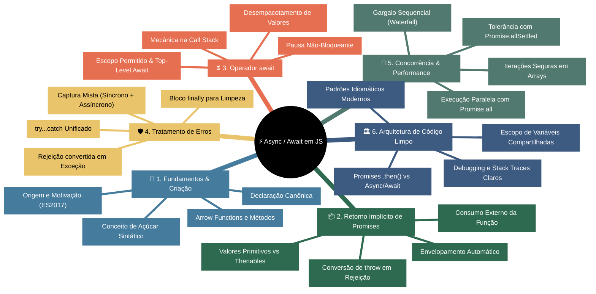
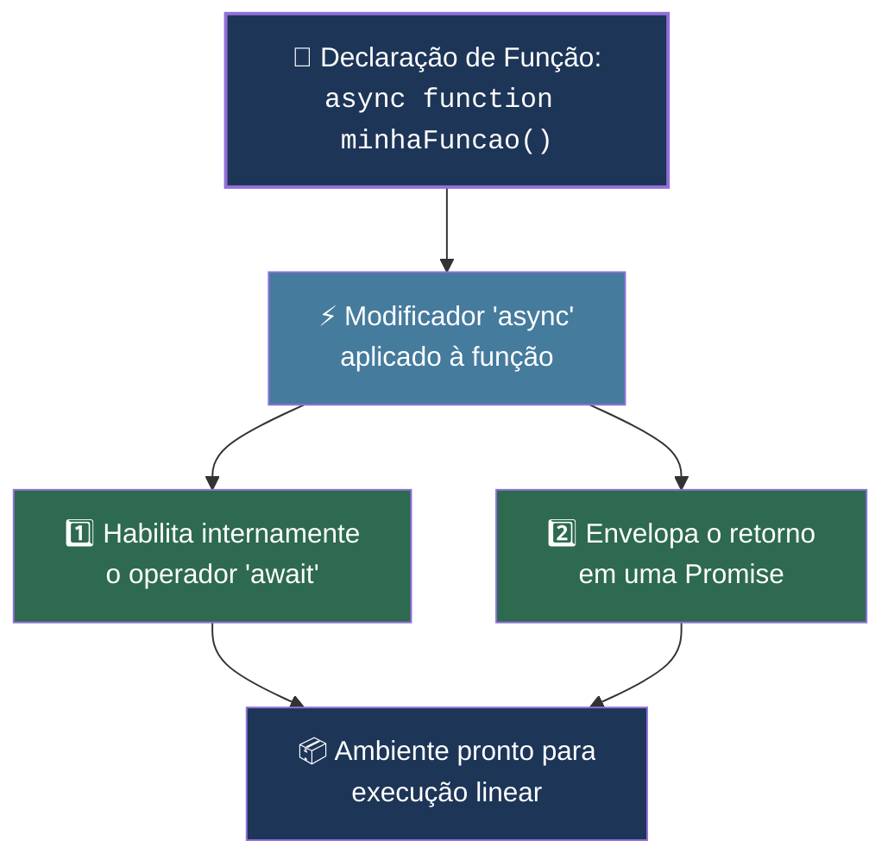
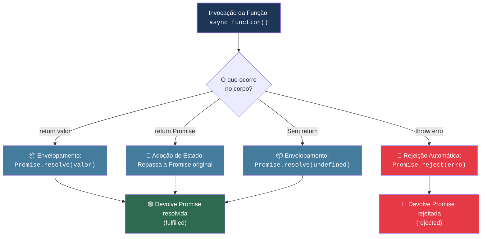
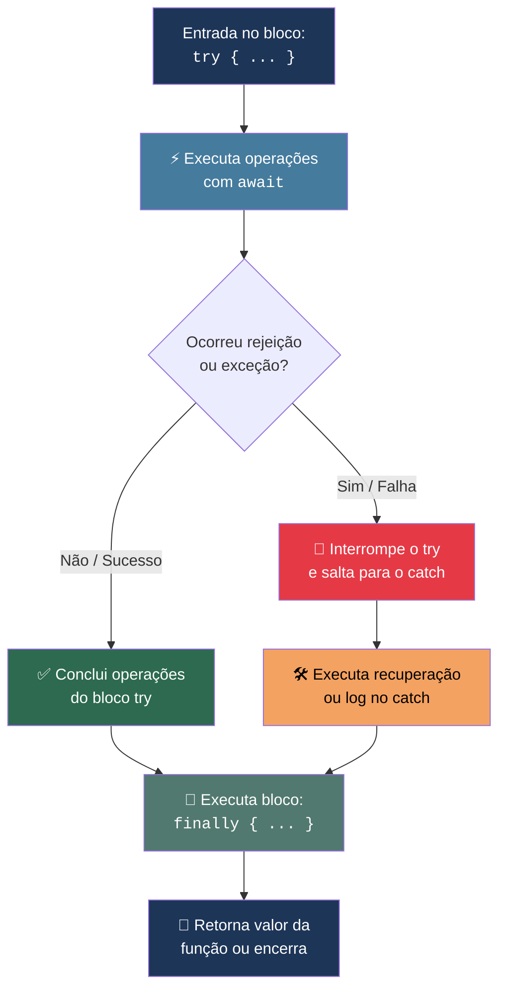
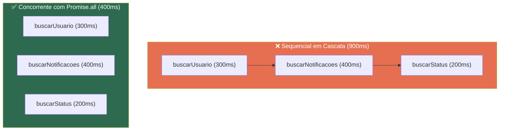
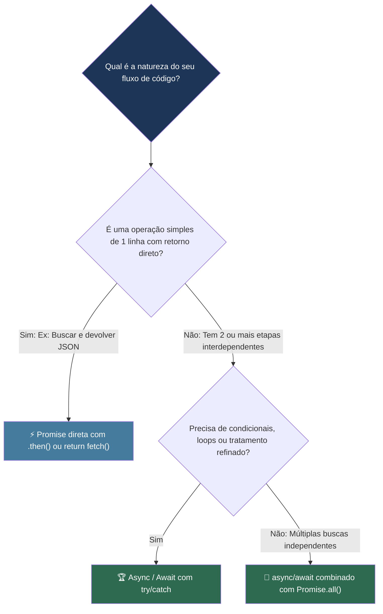
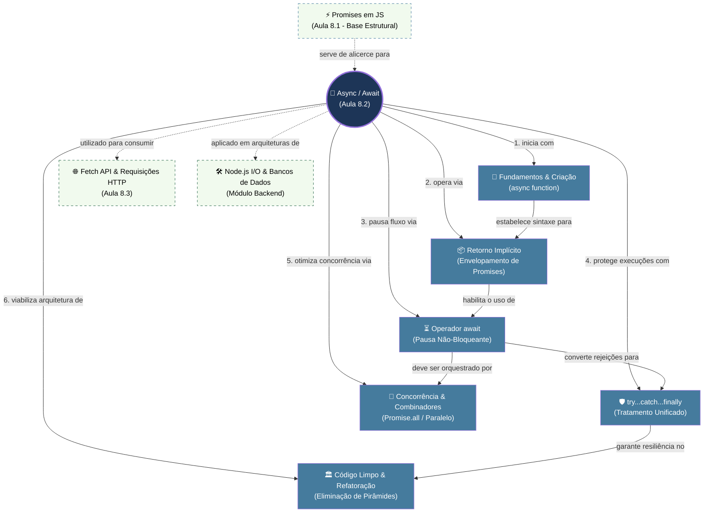
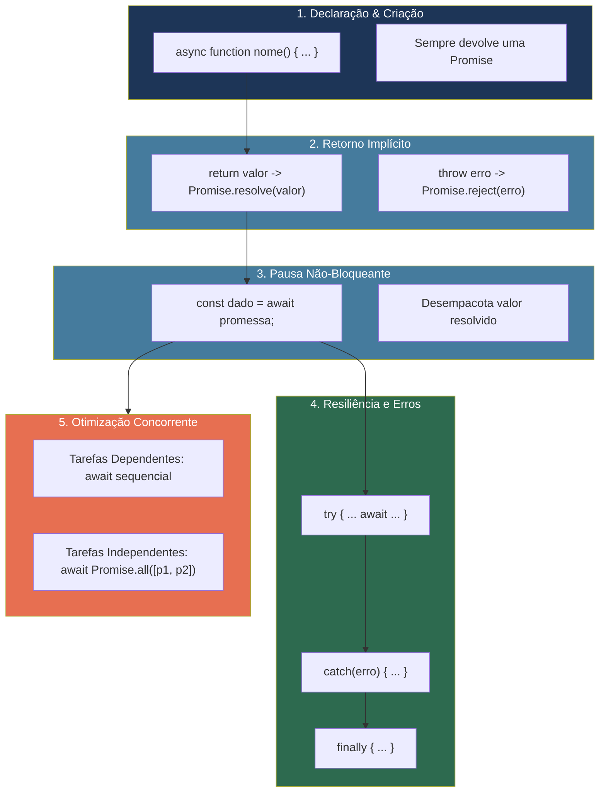

# 📘 Aula 8.2: Async / Await em JavaScript

> **Módulo:** Seção 8 — JS Assíncrono | **Nível:** 🟡 Intermediário & 🔴 Avançado  
> **Tempo estimado:** ~45min de estudo focado | **Pré-requisitos:** Funções JavaScript, Promises em JavaScript (Aula 8.1), Try/Catch Básico

---

## 📑 Índice

1. [🎯 Objetivos de Aprendizado](#-objetivos-de-aprendizado)
2. [🗺️ Mapa da Aula](#️-mapa-da-aula)
3. [📖 Conceito 1: Fundamentos e Sintaxe Básica de Criação (`async function`)](#-conceito-1-fundamentos-e-sintaxe-básica-de-criação-async-function)
4. [📖 Conceito 2: O Mecanismo de Retorno Implícito e a Máquina de Promises](#-conceito-2-o-mecanismo-de-retorno-implícito-e-a-máquina-de-promises)
5. [📖 Conceito 3: O Operador `await` e a Pausa Não-Bloqueante](#-conceito-3-o-operador-await-e-a-pausa-não-bloqueante)
6. [📖 Conceito 4: Tratamento de Erros Unificado com `try...catch...finally`](#-conceito-4-tratamento-de-erros-unificado-com-trycatchfinally)
7. [📖 Conceito 5: Concorrência e Performance (Sequencial vs Paralelo com Combinadores)](#-conceito-5-concorrência-e-performance-sequencial-vs-paralelo-com-combinadores)
8. [📖 Conceito 6: Arquitetura de Código Limpo: Comparativo `Promises` vs `Async/Await`](#-conceito-6-arquitetura-de-código-limpo-comparativo-promises-vs-asyncawait)
9. [🔗 Mapa de Conexões](#-mapa-de-conexões)
10. [📊 Resumo Visual](#-resumo-visual)
11. [🧪 Teste seu Conhecimento](#-teste-seu-conhecimento)

---

## 🎯 Objetivos de Aprendizado

Ao concluir esta aula, você será capaz de:

- **Compreender** a motivação histórica da criação de `async/await` e seu papel como açúcar sintático sobre Promises.
- **Implementar** funções assíncronas do zero em todas as variações sintáticas (declarações canônicas, arrow functions, expressões anônimas e métodos de classe/objeto).
- **Explicar** o mecanismo de encapsulamento e retorno implícito de Promises executado automaticamente pela engine do JavaScript.
- **Dominar** o operador `await` para pausar localmente o fluxo assíncrono e desempacotar valores resolvidos de forma não-bloqueante na Call Stack.
- **Construir** rotinas resilientes de tratamento de erros unificando exceções síncronas e rejeições assíncronas em blocos `try...catch...finally`.
- **Orquestrar** fluxos concorrentes de alta performance, eliminando gargalos sequenciais (*waterfalls*) com `Promise.all` e `Promise.allSettled`.
- **Refatorar** pipelines legados baseados em pirâmides de `.then()` para arquiteturas lineares, expressivas e de fácil manutenção.

---

## 🗺️ Mapa da Aula



---

## 📖 Conceito 1: Fundamentos e Sintaxe Básica de Criação (`async function`)

### 💡 O que é

> 💬 **Analogia:** Imagine um **veículo com câmbio automático moderno**. Sob o capô, o motor continua tendo engrenagens mecânicas, embreagem e transmissão de força exatamente iguais aos carros manuais (as Promises que você aprendeu na Aula 8.1). Porém, para o motorista, não é mais necessário pisar no pedal de embreagem a cada troca de marcha nem coordenar alavancas complexas (`new Promise`, `resolve`, `reject` manuais): basta colocar a alavanca na posição "Drive" (a palavra-chave **`async`**) e o carro gerencia suavemente as transições internas de marcha para você.

O recurso **`async/await`** foi introduzido oficialmente no JavaScript na especificação **ECMAScript 2017 (ES8)** com um propósito claro: **simplificar drasticamente a escrita e a leitura de código assíncrono**, reduzindo o ruído visual das cadeias de Promises sem abrir mão do seu poder.

Em termos fundamentais da engenharia de software, o `async/await` é um **Açúcar Sintático (*Syntactic Sugar*)**: ele não introduz um novo mecanismo no motor JavaScript nem cria threads paralelas; ele é uma sintaxe mais limpa construída 100% sobre as Promises nativas da linguagem.

Para criar uma função assíncrona, utilizamos a palavra-chave reservada **`async`** antes da definição da função. Isso informa ao interpretador JavaScript que aquela função operará em um contexto assíncrono especial.

### 📝 Sintaxe Básica e Anatomia

Podemos criar funções assíncronas em todas as variações de sintaxe suportadas pelo JavaScript moderno:

```javascript
// 1. Declaração Canônica Tradicional (Function Declaration)
async function buscarUsuario(id) {
  console.log(`Buscando dados do usuário #${id}...`);
  return { id, nome: "Leonardo" };
}

// 2. Expressão de Função Anônima (Function Expression)
const carregarConfiguracoes = async function() {
  return { tema: "dark", idioma: "pt-BR" };
};

// 3. Arrow Function Assíncrona
const calcularImposto = async (valor) => {
  return valor * 0.15;
};

// 4. Método Assíncrono em Objeto Literal
const servicoUsuario = {
  async autenticar(email, senha) {
    return { token: "JWT-XYZ-123", email };
  }
};

// 5. Método Assíncrono em Classe (POO)
class RelatorioService {
  async gerarRelatorioMensal(mes) {
    return `Relatório consolidado do mês ${mes}`;
  }
}
```

**Dissecando as Partes e Argumentos:**
- **Palavra-chave `async`**: Modificador obrigatório colocado **antes** da palavra `function`, dos parâmetros de uma arrow function `async () => {}` ou do nome do método em classes/objetos.
- **Identificador / Nome da Função**: Nome atribuído à função (ex: `buscarUsuario`), seguindo as regras normais de identificadores em JS.
- **Lista de Parâmetros `(id, valor, ...)`**: Aceita qualquer quantidade de argumentos (obrigatórios, opcionais, valores padrão ou operador rest `...args`).
- **Corpo da Função `{ ... }`**: Bloco de código delimitado por chaves onde as instruções são executadas. Todo o código síncrono inicial roda imediatamente até encontrar um ponto assíncrono.
- **Retorno (`return`)**: Qualquer valor retornado aqui será tratado pela engine como o valor de resolução de uma promessa.

### ⚙️ Como funciona

| Aspecto | Função Tradicional Síncrona | Função Assíncrona (`async function`) |
|:---|:---|:---|
| **Declaração** | `function soma(a, b) { return a + b; }` | `async function soma(a, b) { return a + b; }` |
| **Tipo do Retorno** | Retorna o valor primitivo/objeto diretamente (`number`). | Retorna **sempre** uma instância de `Promise` contendo o valor. |
| **Uso de `await`** | ❌ Gera erro de sintaxe (*SyntaxError*). | 🟢 Totalmente permitido no corpo da função. |
| **Tratamento de Exceções** | `throw` interrompe a thread imediatamente se não capturado. | `throw` rejeita a Promise retornada automaticamente. |
| **Execução Inicial** | Síncrona na Call Stack. | **Síncrona na Call Stack** até o primeiro `await` ou `return`. |

### 📊 Diagrama



### 💻 Na Prática

Criando e instanciando funções assíncronas nas diferentes estruturas do dia a dia:

```javascript
// Exemplo: Camada de serviços simulando operações de banco de dados
// 1. Função Canônica utilitária
async function conectarBancoDados() {
  console.log("🔌 [DATABASE] Estabelecendo conexão...");
  return "Conexão ativa (Pool: 5/5)";
}

// 2. Objeto de repositório com métodos assíncronos
const ProdutoRepository = {
  async salvar(produto) {
    console.log(`💾 Salvando produto: ${produto.nome}`);
    return { ...produto, id: Date.now(), criadoEm: new Date() };
  },

  async buscarPorId(id) {
    console.log(`🔍 Consultando registro #${id}`);
    return { id, nome: "Monitor Ultrawide 34'", preco: 2800 };
  }
};

// 3. Arrow function para operações rápidas
const formatarMoeda = async (valor) => `R$ ${valor.toFixed(2)}`;

// Invocação inicial: Note que todas retornam Promises!
conectarBancoDados().then((msg) => console.log("Status:", msg));
ProdutoRepository.buscarPorId(10).then((prod) => console.log("Produto:", prod));
```

### ⚠️ Armadilhas Comuns

- ❌ **Tentar criar método construtor assíncrono em classes:** Escrever `async constructor() { ... }` gera `SyntaxError: Class constructor may not be an async method`. Construtores de classes devem ser sempre síncronos. Para inicialização assíncrona, utilize um método estático fábrica (ex: `static async criar() { ... }`).
- ❌ **Posicionamento incorreto de `async` em Arrow Functions:** Escrever `(dados) async => { ... }` ou `const fn = (async) => { ... }` causará erro de sintaxe. A forma correta é estritamente: `const fn = async (dados) => { ... }`.
- ❌ **Achar que `async` transforma o código em multithreaded:** Funções assíncronas continuam rodando na thread principal do JavaScript; elas apenas delegam tarefas de I/O para o sistema e agendam retornos na fila de Microtasks.

---

*Agora que dominamos a criação e a sintaxe de declaração das funções assíncronas, o que acontece exatamente com o valor que colocamos dentro da cláusula `return`? Vamos dissecar o mecanismo de retorno implícito.*

---

## 📖 Conceito 2: O Mecanismo de Retorno Implícito e a Máquina de Promises

### 💡 O que é

> 💬 **Analogia:** Imagine uma **esteira de empacotamento expresso dos Correios**. Qualquer item que você coloca sobre essa esteira — seja uma simples carta, um chaveiro pequeno ou um documento pronto — é recolhido por um braço robótico que o coloca imediatamente dentro de uma **caixa padronizada com etiqueta de rastreio futura (uma Promise)** antes de despachá-lo. Se você já colocar sobre a esteira uma caixa que já estava pronta e lacrada, o robô reconhece a embalagem e apenas a repassa adiante sem reembalar.

O comportamento mais importante de uma `async function` é o seu **Retorno Implícito de Promise**: independentemente do que você retorne dentro da função, **ela sempre entregará uma Promise para o chamador externo**.

Esse mecanismo segue 3 regras automáticas executadas pela engine:
1. **Valores Primitivos ou Objetos:** Se a função retorna um valor síncrono comum (ex: `return "Sucesso"`), a engine o encapsula automaticamente com `Promise.resolve("Sucesso")`.
2. **Retorno de outra Promise:** Se a função retorna uma Promise já existente (ex: `return fetch(...)`), a engine adota o estado dessa Promise sem criar duplo empacotamento (*auto-unwrapping*).
3. **Lançamento de Erro (`throw`):** Se a função lança uma exceção (ex: `throw new Error("Falha")`), o JavaScript intercepta esse erro e o converte em uma rejeição automática `Promise.reject(erro)`.

### 📝 Sintaxe e Assinatura

```javascript
// Função com retornos implícitos variados
async function processarTransacao(valor, tipo) {
  // 1. Caso de Erro com throw: Vira Promise<rejected>
  if (valor <= 0) {
    throw new Error("O valor da transação deve ser positivo.");
  }

  // 2. Caso de Retorno Primitivo/Objeto: Vira Promise<fulfilled: { ... }>
  if (tipo === "PIX") {
    return { status: "CONCLUIDO", metodo: "PIX", valor };
  }

  // 3. Caso de Retorno de Outra Promise: Repassa o estado da Promise
  return Promise.resolve({ status: "AGENDADO", metodo: "BOLETO", valor });
}
```

**Dissecando as Partes e Argumentos:**
- **Cláusula `return valorPrimitivo`**: Converte o valor para `Promise.resolve(valorPrimitivo)` com estado `fulfilled`.
- **Cláusula `throw instanciaDeErro`**: Interrompe o corpo da função e retorna `Promise.reject(instanciaDeErro)` com estado `rejected`.
- **Ausência de `return` explícito**: Se o corpo da função terminar sem `return`, a engine executa implicitamente `Promise.resolve(undefined)`.

### ⚙️ Como funciona

| O que você escreve no corpo da função `async` | O que o motor JavaScript executa por baixo dos panos | Estado da Promise resultante |
|:---|:---|:---:|
| `return "OK"` | `Promise.resolve("OK")` | `fulfilled` |
| `return { id: 1 }` | `Promise.resolve({ id: 1 })` | `fulfilled` |
| `return new Promise(...)` | Adota a Promise retornada diretamente | `pending` / `fulfilled` / `rejected` |
| `throw new Error("Erro")` | `Promise.reject(new Error("Erro"))` | `rejected` |
| `{ /* sem return */ }` | `Promise.resolve(undefined)` | `fulfilled` |

### 📊 Diagrama



### 💻 Na Prática

Inspecionando os estados retornados e comprovando o encapsulamento:

```javascript
// Função de validação de estoque
async function validarEstoque(item, quantidade) {
  if (quantidade <= 0) {
    throw new Error("Quantidade inválida solicitada.");
  }
  return { item, quantidade, aprovado: true };
}

// 1. Invocação que resolve com sucesso
const promessaSucesso = validarEstoque("Cadeira Gamer", 2);
console.log("Objeto retornado imediatamente:", promessaSucesso);
// Saída: Promise { <pending> } ou Promise { <fulfilled>: { item: 'Cadeira Gamer', ... } }

promessaSucesso.then((dados) => {
  console.log("✅ Dados desempacotados:", dados);
});

// 2. Invocação que gera erro (throw)
const promessaErro = validarEstoque("Cadeira Gamer", -1);
promessaErro.catch((err) => {
  console.error("❌ Erro capturado via rejeição:", err.message);
});
```

### ⚠️ Armadilhas Comuns

- ❌ **Tentar ler o retorno síncrono diretamente na chamada:**
  ```javascript
  // ERRO COMUM:
  const resultado = validarEstoque("Teclado", 1);
  console.log(resultado.aprovado); // undefined! 'resultado' é a Promise, não o objeto interno.
  ```
- ❌ **Lançar strings em vez de objetos `Error`:** Fazer `throw "Erro"` cria uma Promise rejeitada com uma string simples, perdendo o rastreamento de pilha (*stack trace*). Use sempre `throw new Error("Mensagem")`.

---

> [!TIP]
> 🧠 **Pare e Pense:** Se uma função declarada com `async` sempre retorna uma `Promise`, o que acontece se você chamar uma função `async` dentro de outra função `async` sem utilizar `await`? O retorno será a Promise em si ou o valor final desempacotado?

---

*Sabendo que as funções assíncronas geram e retornam Promises automaticamente, como fazemos para "pausar" a leitura do código e esperar os dados ficarem prontos sem travar a aplicação? É hora de dominar o operador `await`.*

---

## 📖 Conceito 3: O Operador `await` e a Pausa Não-Bloqueante

### 💡 O que é

> 💬 **Analogia:** Pense no **pager eletrônico vibratório** de uma praça de alimentação. Você vai ao balcão, faz seu pedido e o atendente te entrega o pager. Você volta para sua mesa e fica aguardando o aparelho vibrar (`await`). Enquanto o seu prato é preparado na cozinha, **você** está aguardando aquele prato específico para poder comer, mas **o restaurante não congela**: as outras mesas continuam conversando, o garçom continua servindo bebidas e outros pedidos continuam sendo preparados normalmente.

O operador **`await`** é utilizado para **pausar a execução da função assíncrona** até que uma Promise seja liquidada (*settled*). Quando a Promise é resolvida com sucesso, o `await` "desempacota" (*unwraps*) o valor interno e o entrega diretamente para a expressão ou variável de atribuição. Se a Promise for rejeitada, o `await` interrompe a função e lança o erro como uma exceção.

O ponto crucial da arquitetura JavaScript é que o `await` realiza uma **pausa não-bloqueante**: ele suspende apenas o contexto daquela função assíncrona específica na Call Stack, liberando o Event Loop para processar eventos de interface, timers, cliques de usuário e outras requisições concorrentes.

### 📝 Sintaxe e Assinatura

O operador `await` é posicionado antes de qualquer expressão que resulte em uma Promise (ou valor comum):

```javascript
// Sintaxe Canônica Básica
async function fluxoCarregamentoPerfil(idUsuario) {
  console.log("1. Início da função assíncrona");

  // O await pausa esta função até a Promise buscarNoBanco resolver
  const usuario = await buscarNoBanco(idUsuario);
  console.log("2. Dados do usuário recebidos:", usuario.nome);

  // Próxima etapa aguarda a anterior concluir
  const preferencias = await buscarPreferencias(usuario.id);
  console.log("3. Preferências carregadas:", preferencias.tema);

  return { ...usuario, preferencias };
}
```

**Dissecando as Partes e Argumentos:**
- **`await`**: Operador unário. Só pode ser utilizado dentro do corpo de funções declaradas com `async` (ou no nível raiz de arquivos em módulos ES modernos com **Top-Level Await**).
- **Expressão Operando (`buscarNoBanco(...)` ou `promessa`)**: Qualquer expressão JavaScript. Se for uma Promise, o motor aguarda sua liquidação. Se for um valor síncrono comum (ex: `await 42`), o JavaScript o converte internamente para `Promise.resolve(42)` e resolve no próximo tick de Microtask.
- **Atribuição `const resultado = await ...`**: Recebe o valor resolvido que foi passado para a função `resolve(valor)` da Promise original.

### ⚙️ Como funciona

| Expressão com `await` | Resolução do Motor JS | Comportamento do Fluxo |
|:---|:---|:---|
| **`await Promise.resolve("OK")`** | Extrai a string `"OK"` | Atribui `"OK"` à variável e continua a linha seguinte. |
| **`await Promise.reject(new Error())`** | Transforma a rejeição em `throw` | Interrompe o fluxo e pula imediatamente para o bloco `catch`. |
| **`await 100` (Valor Primitivo)** | Converte para `Promise.resolve(100)` | Atribui `100` na próxima microtask sem travar o código. |
| **`await` fora de `async` (CJS clássico)** | Erro de compilação/sintaxe | Lança `SyntaxError: await is only valid in async functions`. |

### 📊 Diagrama

```mermaid
sequenceDiagram
    autonumber
    participant CS as 🧵 Call Stack (Thread Principal)
    participant AF as ⚡ async function carregar()
    participant API as 🌐 Servidor / Banco (Promise)
    participant EV as 🔄 Event Loop & Microtasks

    CS->>AF: Inicia execução da função
    AF->>API: Dispara busca: buscarNoBanco()
    AF->>CS: Encontra 'await': Suspende função 'carregar' e sai da Call Stack
    Note over CS,EV: Thread Principal LIVRE para processar cliques, timers e UI!
    API-->>EV: Promise resolve com { id: 1, nome: "Leo" }
    EV->>CS: Call Stack fica livre; agenda retomada da Microtask
    CS->>AF: Retoma 'carregar()' exatamente de onde parou com os dados desempacotados
    AF-->>CS: Executa linhas seguintes até o fim
```

### 💻 Na Prática

Simulando um fluxo de checkout de pedido passo a passo com temporizadores reais:

```javascript
// Funções auxiliares baseadas em Promises
function buscarProduto(id) {
  return new Promise((resolve) => {
    setTimeout(() => resolve({ id, nome: "Teclado Mecânico", preco: 350 }), 400);
  });
}

function processarPagamento(pedido, cartaoValido) {
  return new Promise((resolve, reject) => {
    setTimeout(() => {
      cartaoValido
        ? resolve({ status: "APROVADO", codigoTransacao: "TX-998877" })
        : reject(new Error("Cartão recusado pela operadora."));
    }, 500);
  });
}

// Consumo linear e limpo com await
async function realizarCheckout(idProduto, cartaoValido) {
  console.log("🛒 [CHECKOUT] Iniciando processo de compra...");

  console.log("🔍 Buscando dados do produto no catálogo...");
  const produto = await buscarProduto(idProduto);
  console.log(`📦 Produto encontrado: ${produto.nome} — R$ ${produto.preco}`);

  console.log("💳 Enviando cobrança para o gateway de pagamento...");
  const transacao = await processarPagamento(produto, cartaoValido);
  console.log(`✅ Pagamento processado! Código: ${transacao.codigoTransacao}`);

  return {
    sucesso: true,
    produto: produto.nome,
    comprovante: transacao.codigoTransacao
  };
}

// Invocando o fluxo
realizarCheckout(101, true).then((recibo) => {
  console.log("🎉 Compra finalizada com sucesso:", recibo);
});
```

### ⚠️ Armadilhas Comuns

- ❌ **Esquecer a palavra `await` antes de uma função assíncrona:** Se você escrever `const prod = buscarProduto(101)` sem o `await`, a variável `prod` conterá o objeto `Promise { <pending> }` em vez dos dados do produto, quebrando qualquer tentativa posterior de ler `prod.nome`.
- ❌ **Usar `await` em funções de callback tradicionais não marcadas como `async`:**
  ```javascript
  // ERRO COMUM: A arrow function interna não é async!
  function processarLista(itens) {
    itens.forEach((item) => {
      // SyntaxError: await is only valid in async functions
      // const res = await salvar(item);
    });
  }
  ```
- ❌ **Top-Level Await em ambientes não modulares:** O uso de `await` fora de qualquer função só é permitido na raiz de arquivos configurados como **ES Modules** (`"type": "module"` no `package.json` ou arquivos com extensão `.mjs`). Em arquivos CommonJS tradicionais (`.js` padrão no Node.js legado), isso gerará erro de sintaxe.

---

*Agora que sabemos como suspender e desempacotar valores com `await`, como nos protegemos contra falhas de rede, dados corrompidos ou promessas rejeitadas? Vamos aprender o tratamento de erros unificado.*

---

## 📖 Conceito 4: Tratamento de Erros Unificado com `try...catch...finally`

### 💡 O que é

> 💬 **Analogia:** Pense na **rede de segurança e no protocolo de segurança de um circo**. O trapezista executa saltos mortais no ar (`try`). Se tudo der certo, ele pousa suavemente na plataforma oposta. Se ele escorregar no meio do voo por qualquer imprevisto (`throw` ou `reject`), a rede elástica amortiza sua queda imediatamente e a equipe médica entra em ação (`catch`), impedindo que o evento termine em desastre. Ao término do número circense, as luzes do picadeiro são reorganizadas para a próxima atração (`finally`), quer o salto tenha sido perfeito ou o trapezista tenha caído na rede.

Antes de `async/await`, o desenvolvedor era forçado a lidar com dois mundos separados de erros: blocos `try/catch` para erros síncronos da linguagem (como `JSON.parse` de string inválida) e encadeamentos `.catch()` para rejeições assíncronas de Promises.

Com `async/await`, o JavaScript atinge o **tratamento unificado de exceções**: quando uma Promise aguardada com `await` é rejeitada, o motor JavaScript **converte essa rejeição em uma exceção padrão da linguagem (`throw`)**. Com isso, podemos capturar e tratar qualquer tipo de erro — síncrono ou assíncrono — utilizando a estrutura clássica e consagrada **`try...catch...finally`**.

### 📝 Sintaxe e Assinatura

```javascript
async function executarOperacaoSegura(parametro) {
  try {
    // 1. Bloco TRY: Código que pode falhar (síncrono ou assíncrono com await)
    console.log("Tentando executar operação...");
    
    // Validação síncrona
    if (!parametro) {
      throw new Error("Parâmetro obrigatório ausente."); // Erro Síncrono
    }

    // Chamada assíncrona aguardada
    const dados = await servicoRemoto(parametro); // Se rejeitar, PULA direto para o catch
    const processado = JSON.parse(dados.payloadBruto); // Erro síncrono se JSON for inválido

    return processado;

  } catch (erro) {
    // 2. Bloco CATCH: Captura QUALQUER falha ocorrida dentro do bloco try
    console.error("🚨 Falha interceptada:", erro.name, erro.message);
    
    // Estratégia de recuperação (Fallback) ou relançamento
    return { status: "CONTINGENCIA", dados: [] };

  } finally {
    // 3. Bloco FINALLY: Executa SEMPRE (após sucesso no try ou após captura no catch)
    console.log("🧹 Limpeza concluída: Fechando conexões e ocultando spinner de loading.");
  }
}
```

**Dissecando as Partes e Argumentos:**
- **Bloco `try { ... }`**: Escopo protegido onde são executadas as chamadas com `await` e transformações de dados. Qualquer exceção lançada (`throw`) ou Promise rejeitada (`reject`) interrompe a execução das linhas seguintes do `try`.
- **Bloco `catch (erro) { ... }`**: Recebe o parâmetro `erro` (uma instância de `Error` contendo `.name`, `.message` e `.stack`). Aqui são definidas as rotinas de tratamento, log de monitoramento, notificação ao usuário ou devolução de dados padrão (*fallback*).
- **Bloco `finally { ... }`**: Bloco opcional executado incondicionalmente ao final do ciclo. Essencial para liberar recursos alocados (fechar handles de banco de dados, parar loaders de interface, cancelar timers).

### ⚙️ Como funciona

| Tipo de Ocorrência no `try` | O que acontece no motor JS | Para onde o fluxo é desviado? |
|:---|:---|:---|
| **`await Promise.resolve(x)`** | Desempacota `x` com sucesso | Continua na linha seguinte do `try`. |
| **`await Promise.reject(err)`** | O `await` transforma a rejeição em exceção | Interrompe o `try` e salta para o `catch(err)`. |
| **Erro Síncrono (`JSON.parse("{inv")`)** | Lança `SyntaxError` | Interrompe o `try` e salta para o `catch(err)`. |
| **Variável não definida (`x.y.z`)** | Lança `TypeError` | Interrompe o `try` e salta para o `catch(err)`. |
| **Fim do `try` ou fim do `catch`** | Execução atinge o término | Executa o bloco `finally` e devolve o controle. |

### 📊 Diagrama



### 💻 Na Prática

Implementação resiliente de consumo de API com fallback de segurança e limpeza de estado:

```javascript
// Simulação de serviço instável
function consultarCotacaoDolar() {
  return new Promise((resolve, reject) => {
    const instabilidadeRede = true; // Simula falha na rede externa
    setTimeout(() => {
      instabilidadeRede
        ? reject(new Error("API do Banco Central temporariamente indisponível (503)."))
        : resolve({ moeda: "USD", valorBRL: 5.65, atualizacao: new Date() });
    }, 300);
  });
}

// Consumo seguro com try/catch/finally
async function obterValorCambioComFallback() {
  let carregando = true;
  console.log(`[STATUS] Carregamento iniciado: ${carregando}`);

  try {
    console.log("🌐 Solicitando cotação em tempo real...");
    const cotacao = await consultarCotacaoDolar();
    console.log(`💵 Cotação obtida com sucesso: R$ ${cotacao.valorBRL}`);
    return cotacao.valorBRL;

  } catch (erro) {
    console.warn(`⚠️ [AVISO DE CONTINGÊNCIA] Falha na consulta: ${erro.message}`);
    const valorCacheFallback = 5.60;
    console.log(`🔄 Utilizando taxa de contingência em cache: R$ ${valorCacheFallback}`);
    return valorCacheFallback;

  } finally {
    carregando = false;
    console.log(`[STATUS] Carregamento finalizado: ${carregando} (Spinner de UI ocultado)`);
  }
}

// Testando a execução
obterValorCambioComFallback().then((taxaFinal) => {
  console.log(`📊 Taxa aplicada no cálculo final: R$ ${taxaFinal}`);
});
```

### ⚠️ Armadilhas Comuns

- ❌ **Catch Vazio (Engolir Erros Silenciosamente):** Escrever `try { ... } catch (e) {}` sem registrar nenhum log ou alerta. Isso oculta falhas críticas de infraestrutura e torna a depuração de sistemas em produção praticamente impossível.
- ❌ **Achar que `try/catch` síncrono captura funções assíncronas sem `await`:**
  ```javascript
  // ANTI-PATTERN GRAVE:
  try {
    consultarCotacaoDolar(); // Faltou o 'await'! A Promise rejeita depois que o try já acabou.
  } catch (err) {
    // ESTE BLOCO NUNCA SERÁ EXECUTADO! Resulta em UnhandledPromiseRejection.
    console.error(err);
  }
  ```
- ❌ **Esquecer de relançar (*rethrow*) erros quando a função não deve se recuperar:** Se uma função interna captura um erro e não o relança (`throw erro`), quem a chamou pensará que a operação concluiu com sucesso com valor `undefined`.

---

> [!TIP]
> 🧠 **Pare e Pense:** Quando você tem uma cadeia de funções assíncronas aninhadas (`fnA` chama `fnB`, que chama `fnC`), se `fnC` lançar um erro com `throw` e nenhuma delas tiver `try/catch`, o que acontece com a pilha de chamadas? A rejeição borbulha automaticamente pelas funções como se fosse uma exceção síncrona?

---

*Tratar erros de forma individual garante segurança, mas o que acontece quando precisamos disparar 3, 5 ou 10 operações assíncronas ao mesmo tempo? Como evitar lentidão extrema no sistema? Vamos explorar a concorrência e performance.*

---

## 📖 Conceito 5: Concorrência e Performance (Sequencial vs Paralelo com Combinadores)

### 💡 O que é

> 💬 **Analogia:** Imagine um **garçom atendendo um pedido de café da manhã** composto por um café expresso, uma torrada e um suco de laranja natural.
> - **Abordagem Sequencial (*Waterfall*):** O garçom pede a torrada e fica parado ao lado do fogão esperando 3 minutos. Quando a torrada fica pronta, ele pede o café e espera 2 minutos. Quando o café sai, ele espreme a laranja e espera mais 2 minutos. **Tempo Total:** 7 minutos de espera desnecessária.
> - **Abordagem Paralela Concorrente (`Promise.all`):** O garçom grita os 3 pedidos simultaneamente para os 3 assistentes da cozinha. A torrada, o café e o suco são preparados **ao mesmo tempo**. **Tempo Total:** 3 minutos (apenas o tempo do item mais demorado).

Um dos erros de performance mais frequentes cometidos por desenvolvedores que utilizam `async/await` é criar acidentalmente um **gargalo em cascata (*Waterfall Effect*)**. Isso ocorre quando encadeamos múltiplos `await` em linha reta para tarefas que **não dependem uma da outra**.

Para obter o máximo de desempenho, integramos o `async/await` aos combinadores estáticos que aprendemos na aula anterior: **`Promise.all`** e **`Promise.allSettled`**.

### 📝 Sintaxe e Assinatura

```javascript
// ===================================================
// CENÁRIO A: Gargalo Sequencial (LENTO - EVITE para tarefas independentes)
// ===================================================
async function carregarDashboardLento(idUsuario) {
  // Leva 300ms + 400ms + 200ms = 900ms no total!
  const usuario = await buscarUsuario(idUsuario);      // Espera 300ms
  const notificacoes = await buscarNotificacoes();     // Espera 400ms
  const statusSistema = await buscarStatusServidor();  // Espera 200ms
  
  return { usuario, notificacoes, statusSistema };
}

// ===================================================
// CENÁRIO B: Execução Concorrente com Promise.all (RÁPIDO)
// ===================================================
async function carregarDashboardRapido(idUsuario) {
  // Dispara TODAS simultaneamente. Leva apenas 400ms no total (o tempo da mais demorada)!
  const [usuario, notificacoes, statusSistema] = await Promise.all([
    buscarUsuario(idUsuario),
    buscarNotificacoes(),
    buscarStatusServidor()
  ]);

  return { usuario, notificacoes, statusSistema };
}
```

**Dissecando as Partes e Argumentos:**
- **`Promise.all([...promessas])`**: Recebe um array contendo as chamadas assíncronas **já invocadas** (as promessas iniciam a execução no exato instante da chamada, antes mesmo de passarem pelo `await`).
- **`await Promise.all(...)`**: Pausa a função assíncrona até que **todas** as Promises do array terminem com sucesso (ou falhe imediatamente no primeiro erro — *Fail-Fast*).
- **Desestruturação `const [a, b, c] = await ...`**: Descompacta os resultados diretamente em variáveis nomeadas na exata ordem em que foram passadas no array.

### ⚙️ Como funciona

| Estratégia | Como as Promises são disparadas? | Tempo Total de Resposta | Quando Utilizar |
|:---|:---|:---:|:---|
| **Sequencial (`await` em cascata)** | Uma por vez (a próxima só começa quando a anterior termina). | Soma dos tempos ($T_1 + T_2 + T_3$) | Quando a etapa 2 **precisa** obrigatoriamente do dado retornado pela etapa 1. |
| **Concorrente com `Promise.all`** | Todas ao mesmo tempo na rede/IO. | Apenas a mais lenta ($\max(T_1, T_2, T_3)$) | Tarefas independentes onde o sucesso de **todas** é mandatório. |
| **Concorrente com `Promise.allSettled`** | Todas ao mesmo tempo na rede/IO. | Apenas a mais lenta ($\max(T_1, T_2, T_3)$) | Painéis e telas onde falhas parciais são toleradas. |

### 📊 Diagrama



### 💻 Na Prática

#### Exemplo: Processando uma lista de IDs de forma rápida vs lenta

```javascript
const simularApi = (id, ms) => new Promise(res => setTimeout(() => res(`Dado #${id}`), ms));

const listaIds = [1, 2, 3, 4, 5];

// 1. FORMA ERRADA EM ARRAYS: for...of com await interno (Sequencial Lento: 5 * 200ms = 1000ms)
async function processarLento(ids) {
  console.time("Tempo Sequencial");
  const resultados = [];
  for (const id of ids) {
    const res = await simularApi(id, 200); // Bloqueia cada iteração
    resultados.push(res);
  }
  console.timeEnd("Tempo Sequencial");
  return resultados;
}

// 2. FORMA ELEGANTE E RÁPIDA: Array.map + Promise.all (Paralelo Rápido: apenas 200ms no total)
async function processarRapido(ids) {
  console.time("Tempo Concorrente");
  // Mapeia cada ID para uma Promise em andamento e aguarda todas juntas
  const promessas = ids.map(id => simularApi(id, 200));
  const resultados = await Promise.all(promessas);
  console.timeEnd("Tempo Concorrente");
  return resultados;
}

// Executando a comparação
async function executarTestes() {
  await processarLento(listaIds);   // ~1000ms
  await processarRapido(listaIds);  // ~200ms (5x mais rápido!)
}

executarTestes();
```

### ⚠️ Armadilhas Comuns

- ❌ **Usar `await` dentro de `Array.prototype.map` sem o `Promise.all` por fora:**
  ```javascript
  // ERRO SUTIL:
  const dados = ids.map(async (id) => {
    return await buscar(id);
  });
  // 'dados' NÃO é um array de valores, é um Array de PROMISES: [Promise, Promise, Promise]
  // CORREÇÃO: const dados = await Promise.all(ids.map(id => buscar(id)));
  ```
- ❌ **Usar `forEach` assíncrono achando que ele aguarda as resoluções:** O método `.forEach()` não foi projetado para Promises; ele dispara as iterações e retorna imediatamente sem esperar o término dos `await` internos.
- ❌ **Colocar em `Promise.all` operações que possuem dependência direta:** Se você precisa do `idUsuario` retornado na primeira chamada para poder buscar os `pedidos` na segunda chamada, elas **devem** ser executadas sequencialmente com `await`.

---

*Com a mecânica, tratamento de erros e concorrência compreendidos, como sintetizamos tudo em uma arquitetura de software profissional e limpa? Vamos ao comparativo direto.*

---

## 📖 Conceito 6: Arquitetura de Código Limpo: Comparativo `Promises` vs `Async/Await`

### 💡 O que é

> 💬 **Analogia:** Pense na **evolução dos mapas de navegação para motoristas**.
> - Nos anos 90, usávamos **mapas rodoviários de papel dobráveis** cheios de bifurcações e setas rabiscadas na margem: *"se a rodovia estiver bloqueada, vire na pág. 12, senão continue na pág. 14"* (Cadeias de `.then()` e callbacks).
> - Hoje, usamos o **GPS no painel do carro (`async/await`)**: ele nos dá instruções lineares passo a passo na voz e na tela: *"Em 200 metros, vire à direita. Siga em frente por 2km."* O trajeto e a física das estradas continuam idênticos, mas a clareza cognitiva para o motorista dirigir sem bater o carro é infinitamente superior.

Na ciência da computação, `async/await` é classificado como um **Açúcar Sintático (*Syntactic Sugar*)** refinado sobre a especificação de Promises (ES2015). Ele não cria um novo modelo de concorrência nem adiciona novas capacidades ao motor JavaScript: seu objetivo primordial é **melhorar a ergonomia de leitura, manutenção e depuração do código**.

Ele permite que fluxos assíncronos complexos sejam lidos de cima para baixo como se fossem síncronos, preservando a semântica de escopo de variáveis locais e simplificando rastreamentos de pilha (*stack traces*) em caso de bugs.

### 📝 Comparação Estrutural de Código

Veja a refatoração completa de um serviço de autenticação e carregamento de permissões:

```javascript
// ========================================================
// ABORDAGEM 1: Promises Tradicionais com .then() e .catch()
// ========================================================
function loginUsuarioPromises(email, senha) {
  return autenticarApi(email, senha)
    .then((usuario) => {
      // Problema do Escopo: 'usuario' só é visível dentro deste callback!
      return buscarPermissoes(usuario.id)
        .then((permissoes) => {
          return registrarLogAcesso(usuario.id)
            .then(() => {
              return { usuario, permissoes }; // Aninhamento necessário para juntar os dados
            });
        });
    })
    .catch((erro) => {
      console.error("Erro na autenticação:", erro.message);
      throw erro;
    });
}

// ========================================================
// ABORDAGEM 2: Refatoração Elegante com Async / Await
// ========================================================
async function loginUsuarioAsync(email, senha) {
  try {
    // 1. Escopo plano: todas as variáveis ficam acessíveis no mesmo bloco
    const usuario = await autenticarApi(email, senha);
    const permissoes = await buscarPermissoes(usuario.id);
    await registrarLogAcesso(usuario.id);

    return { usuario, permissoes }; // Retorno limpo e direto!

  } catch (erro) {
    console.error("Erro na autenticação:", erro.message);
    throw erro;
  }
}
```

### ⚙️ Como funciona

Comparativo arquitetural detalhado entre os dois paradigmas:

| Dimensão de Análise | Promises Tradicionais (`.then / .catch`) | Async / Await (`try / catch / await`) |
|:---|:---|:---|
| **Estrutura Visual** | Cadeias funcionais com callbacks e quebras de indentação. | Linear, sequencial, lido naturalmente de cima para baixo. |
| **Escopo de Variáveis** | Variáveis de etapas anteriores exigem aninhamento ou variáveis externas com `let`. | Todas as variáveis residem naturalmente no mesmo escopo de bloco local. |
| **Condicionais Complexas** | `if/else` assíncrono exige quebrar cadeias em funções separadas. | `if`, `else`, `switch`, `while` funcionam de forma nativa e intuitiva com `await`. |
| **Tratamento de Exceções** | Exige `.catch()` separado para assíncrono e `try/catch` para síncrono. | `try...catch` unificado captura falhas de rede, runtime e sintaxe no mesmo lugar. |
| **Depuração (Debugging)** | Breakpoints em callbacks anônimos e *stack traces* fragmentados. | Pausa precisa linha a linha no DevTools/VS Code com *stack trace* claro. |

### 📊 Diagrama



### 💻 Na Prática

Exemplo de lógica de negócios real com condições, loops e validações complexas que seriam extremamente difíceis de ler com `.then()`:

```javascript
// Exemplo: Processamento de faturas em lote com regras condicionais
async function processarFaturasPendentes(clientes) {
  const relatorioFinal = { processados: 0, valorTotal: 0, falhas: [] };

  for (const cliente of clientes) {
    try {
      if (!cliente.ativo) {
        console.log(`⏩ Ignorando cliente inativo: ${cliente.nome}`);
        continue; // Controle de fluxo natural com continue
      }

      const fatura = await buscarFaturaAberta(cliente.id);
      
      if (fatura.valor > 0) {
        await debitaContaAutomatica(cliente.id, fatura.valor);
        relatorioFinal.processados++;
        relatorioFinal.valorTotal += fatura.valor;
        console.log(`💰 Fatura de R$ ${fatura.valor} quitada para ${cliente.nome}`);
      }

    } catch (erro) {
      console.error(`❌ Falha ao processar ${cliente.nome}: ${erro.message}`);
      relatorioFinal.falhas.push({ cliente: cliente.nome, motivo: erro.message });
    }
  }

  return relatorioFinal;
}
```

### ⚠️ Armadilhas Comuns

- ❌ **"Async/Await Hell" (Envelopamento Excessivo):** Marcar todas as funções do sistema como `async` sem necessidade, mesmo funções puramente síncronas que apenas somam dois números. Use `async` apenas quando a função realmente realizar operações assíncronas ou precisar retornar uma Promise.
- ❌ **Perda do Retorno da Promise (Floating Promise):** Invocar uma função `async` que executa efeitos colaterais sem colocar `await` nem capturar seu retorno, permitindo que falhas ocorram em segundo plano sem que a aplicação perceba.

---

## 🔗 Mapa de Conexões

Veja como os conceitos abordados nesta aula se integram pedagogicamente e constroem a base para o consumo avançado de APIs web:



O `async/await` representa a forma moderna e idiomática de trabalhar com assincronismo em JavaScript. Compreender que ele opera sobre a mesma infraestrutura de Promises garante que você saiba transitar com segurança entre concorrência paralela e execução sequencial limpa.

---

## 📊 Resumo Visual

### Comparação Direta de Padrões Assíncronos

| Característica | Callbacks Tradicionais | Promises (`.then / .catch`) | Async / Await (`try / catch / await`) |
|:---|:---:|:---:|:---:|
| **Padronização** | 🔴 Inconsistente (Callback Hell) | 🟡 Boa (Flat Chaining) | 🟢 Excelente (Estrutura Síncrona Linear) |
| **Tratamento de Erros** | 🔴 Manual em cada callback `(err, data)` | 🟡 Centralizado via `.catch()` | 🟢 Unificado nativo com `try...catch...finally` |
| **Concorrência** | 🔴 Extremamente complexa | 🟢 Nativa com `Promise.all` | 🟢 Perfeita com `await Promise.all()` |
| **Curva de Depuração** | 🔴 Muito difícil | 🟡 Moderada | 🟢 Fácil (Linha a linha com DevTools) |
| **Escopo de Variáveis** | 🔴 Aninhamento profundo | 🟡 Requer repasse de parâmetros | 🟢 Escopo local compartilhado no mesmo bloco |

---

### Síntese em Um Olhar



---

### ✅ Checklist: O que devo saber

Antes de avançar para a próxima aula de Fetch API e consumo de serviços web, certifique-se de que você consegue:

- [ ] **Declarar** funções assíncronas utilizando a palavra-chave `async` em todas as suas variações sintáticas.
- [ ] **Explicar** o mecanismo de retorno implícito e como o motor converte `return` e `throw` em resoluções e rejeições de Promise.
- [ ] **Utilizar** o operador `await` para pausar localmente funções assíncronas e extrair valores de promises de forma não-bloqueante.
- [ ] **Construir** estruturas resilientes de tratamento de erros com blocos unificados `try...catch...finally`.
- [ ] **Evitar** gargalos sequenciais (*waterfalls*) combinando `async/await` com `Promise.all` para requisições concorrentes.
- [ ] **Identificar** e corrigir erros de uso de `await` dentro de callbacks síncronos de arrays como `.forEach()`.
- [ ] **Refatorar** códigos baseados em cadeias de `.then()` para a sintaxe limpa de `async/await`.

---

## 🧪 Teste seu Conhecimento

Tente responder mentalmente ou no editor antes de abrir as respostas! 🙈

---

### Questões Conceituais

**Questão 1:** Analise a função assíncrona abaixo. Qual será o tipo e o valor impresso no console ao executá-la?

```javascript
async function obterNumero() {
  return 42;
}

const resultado = obterNumero();
console.log(resultado);
```

<details>
<summary>🔍 Ver resposta</summary>

**Resposta:** Será impresso um objeto do tipo `Promise` no estado realizado (*fulfilled*): `Promise { 42 }` (ou `Promise { <fulfilled>: 42 }`).  
**Justificativa:** Toda função declarada com o modificador `async` sempre retorna uma `Promise`. Quando você retorna um valor primitivo como o número `42`, o JavaScript executa automaticamente um encapsulamento síncrono equivalente a `Promise.resolve(42)`. Para obter o valor primitivo `42`, seria necessário usar `await obterNumero()` ou `obterNumero().then(val => console.log(val))`.

</details>

---

**Questão 2:** O código abaixo foi escrito em um arquivo JavaScript comum (CommonJS legado no Node.js):

```javascript
function buscarDados() {
  return Promise.resolve(["A", "B", "C"]);
}

const dados = await buscarDados();
console.log(dados);
```

O que acontecerá ao tentar executar esse arquivo e por quê?

<details>
<summary>🔍 Ver resposta</summary>

**Resposta:** Ocorrerá um erro de sintaxe em tempo de compilação/parse: `SyntaxError: await is only valid in async functions and the top level bodies of modules`.  
**Justificativa:** O operador `await` só pode ser utilizado dentro de funções expressamente marcadas com a palavra-chave `async` ou no nível superior (*Top-Level Await*) de arquivos configurados como **ECMAScript Modules (ESM)**. Em arquivos tradicionais sem suporte a módulos ESM, o uso de `await` fora de uma função assíncrona é inválido. Para corrigir, deve-se encapsular o código em uma função assíncrona auto-executável (`(async () => { ... })()`) ou migrar o arquivo para módulo ESM (`"type": "module"`).

</details>

---

### Questões Práticas / Cenários

**Questão 3 (Cenário de E-commerce / Refatoração):** Você recebeu o seguinte código legado com aninhamento excessivo de `.then()`:

```javascript
function finalizarCompra(idUsuario, idCarrinho) {
  return obterUsuario(idUsuario)
    .then((usuario) => {
      return obterCarrinho(idCarrinho)
        .then((carrinho) => {
          return cobrarCartao(usuario.cartaoId, carrinho.total)
            .then((comprovante) => {
              return { usuario: usuario.nome, total: carrinho.total, transacao: comprovante.id };
            });
        });
    })
    .catch((err) => {
      console.error("Falha no checkout:", err.message);
      throw err;
    });
}
```

Como você refatoraria essa função utilizando `async/await` de forma limpa, linear e tratando erros com `try/catch`?

<details>
<summary>🔍 Ver resposta</summary>

**Resposta:**
```javascript
async function finalizarCompra(idUsuario, idCarrinho) {
  try {
    // 1. As duas primeiras buscas são independentes entre si, podendo rodar em paralelo!
    const [usuario, carrinho] = await Promise.all([
      obterUsuario(idUsuario),
      obterCarrinho(idCarrinho)
    ]);

    // 2. A cobrança depende dos dados obtidos nas etapas anteriores
    const comprovante = await cobrarCartao(usuario.cartaoId, carrinho.total);

    // 3. Retorno plano e direto com todas as variáveis no mesmo escopo
    return {
      usuario: usuario.nome,
      total: carrinho.total,
      transacao: comprovante.id
    };
  } catch (err) {
    console.error("Falha no checkout:", err.message);
    throw err;
  }
}
```
**Justificativa:** A refatoração com `async/await` elimina completamente o aninhamento horizontal (*Pyramid of Doom*). Além disso, como `obterUsuario` e `obterCarrinho` não dependem um do outro, podemos otimizar o tempo de resposta executando-os concorrentemente com `Promise.all` antes de efetuar a cobrança.

</details>

---

**Questão 4 (Pegadinha Clássica de Performance e Execução):** Um desenvolvedor júnior precisava salvar uma lista de 10 clientes no banco de dados e escreveu o seguinte método:

```javascript
async function salvarTodos(clientes) {
  console.log("Iniciando gravação...");
  
  clientes.forEach(async (cliente) => {
    await bancoDeDados.salvar(cliente);
    console.log(`Cliente ${cliente.nome} gravado!`);
  });

  console.log("Gravação de todos concluída com sucesso!");
}
```

Ao executar o código, o console exibiu:
1. `Iniciando gravação...`
2. `Gravação de todos concluída com sucesso!`
3. E somente depois os logs de `Cliente X gravado!` começaram a pipocar no terminal.

Por que a mensagem *"Gravação de todos concluída com sucesso!"* foi impressa **antes** dos clientes serem salvos, e como corrigir para que o método aguarde todos os clientes terminarem?

<details>
<summary>🔍 Ver resposta</summary>

**Resposta:** O método `Array.prototype.forEach` é estritamente síncrono e não aguarda promessas retornadas pelo seu callback. Ele dispara as iterações imediatamente e segue em frente sem esperar a finalização dos `await` internos.  
**Justificativa e Correção:** O callback passado para o `forEach` é uma função `async` que retorna uma Promise que é completamente ignorada pelo `forEach`. Para aguardar a gravação de todos com máxima performance concorrente, deve-se usar `Array.prototype.map` combinado com `Promise.all`:

```javascript
async function salvarTodos(clientes) {
  console.log("Iniciando gravação...");

  // Dispara todas as gravações e aguarda o término de todas juntas
  await Promise.all(clientes.map(cliente => bancoDeDados.salvar(cliente)));

  console.log("Gravação de todos concluída com sucesso!");
}
```
Se a gravação precisasse obrigatoriamente ser sequencial (um por vez), o correto seria usar o loop `for...of`:
```javascript
for (const cliente of clientes) {
  await bancoDeDados.salvar(cliente);
}
```

</details>

---

**Questão 5 (Cenário de Diagnóstico de Erros):** Analise o código abaixo. O que será impresso no console ao executar `testarCaptura()`?

```javascript
function operacaoCritica() {
  return new Promise((_, reject) => {
    setTimeout(() => reject(new Error("Erro de Conexão com o Gateway")), 100);
  });
}

async function testarCaptura() {
  try {
    operacaoCritica(); // ATENÇÃO AQUI!
    console.log("Linha após chamada crítica.");
  } catch (err) {
    console.log("CATCH EXECUTADO:", err.message);
  }
}

testarCaptura();
```

<details>
<summary>🔍 Ver resposta</summary>

**Resposta:** Será impresso:  
`Linha após chamada crítica.`  
E, após 100ms, o ambiente emitirá um alerta de erro não tratado: `UnhandledPromiseRejection: Erro de Conexão com o Gateway` (o bloco `catch` **NÃO** será executado).

**Justificativa:** Como a chamada `operacaoCritica()` foi realizada **sem** o operador `await`, a função `testarCaptura()` não pausa sua execução. O bloco `try` é encerrado de forma síncrona com sucesso antes dos 100ms se passarem. Quando a Promise finalmente rejeita 100ms depois, ela não está mais sob o escopo do bloco `try/catch`, gerando uma rejeição órfã (*Unhandled Rejection*). Para capturar o erro no `catch`, a linha deve ser obrigatoriamente escrita como `await operacaoCritica();`.

</details>

---

### 🏋️ Desafio de Aplicação

> **Desafio Hands-on (Tempo estimado: 20-30min): Sistema de Emissão de Passagens Aéreas**
>
> Você foi encarregado de implementar o serviço assíncrono de compra e emissão de passagens para uma companhia aérea. A emissão exige consultar a disponibilidade do voo, reservar o assento, processar o pagamento e emitir o bilhete eletrônico.
>
> **Requisitos:**
> 1. Crie funções que simulam com `setTimeout` os seguintes serviços:
>    - `verificarVoo(codigoVoo)`: Retorna dados do voo (preço e assentos disponíveis) em 300ms. Lança erro se o código do voo for inválido.
>    - `verificarPerfilPassageiro(idPassageiro)`: Retorna os dados do passageiro e saldo de milhas em 200ms.
>    - `debitarPagamento(idPassageiro, valor)`: Processa o pagamento em 400ms.
>    - `emitirBilhete(passageiro, voo, transacao)`: Gera o e-ticket em 200ms.
> 2. Crie uma função assíncrona principal `comprarPassagemAerea(idPassageiro, codigoVoo)` que:
>    - Execute a consulta de voo e o perfil do passageiro de forma **concorrente** com `Promise.all` para não perder tempo.
>    - Verifique se há assentos disponíveis; se não houver, lance um erro explicativo.
>    - Execute o débito do pagamento com `await`.
>    - Emita o bilhete com `await` e retorne o comprovante completo consolidado.
>    - Envolva todo o fluxo em um bloco `try...catch...finally` robusto, exibindo logs em cada etapa e garantindo que um log de auditoria no `finally` registre o encerramento do processo.
> 3. Realize testes simulando uma compra bem-sucedida e uma compra com erro (ex: voo inválido ou sem assentos).
>
> *Dica: Lembre-se de verificar se as consultas de dados do passageiro e do voo dependem uma da outra antes de decidir entre `await` sequencial ou `Promise.all`.*
