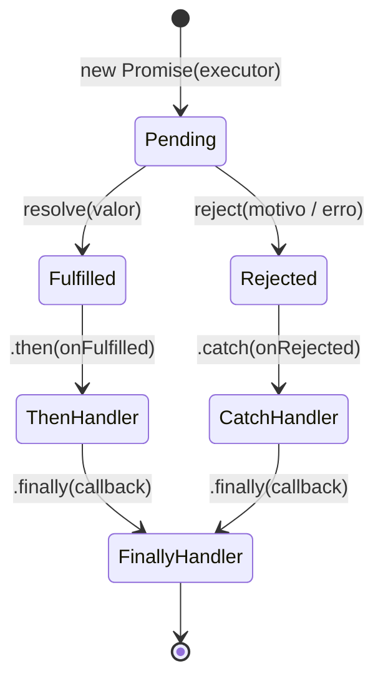

# Aula: Promises em JavaScript — Do Caos dos Callbacks ao Fluxo Assíncrono Elegante

---

## 1. Abertura e Analogia Prática

### Qual dor o conceito resolve?
No início do JavaScript, qualquer operação demorada (como carregar dados de um servidor, ler arquivos ou aguardar um temporizador) dependia exclusivamente de **funções de callback**. 

Quando precisávamos encadear múltiplas ações sequenciais (por exemplo: *buscar usuário* ➔ *buscar pedidos do usuário* ➔ *calcular desconto* ➔ *gerar fatura*), acabávamos com um código em formato de pirâmide, profundamente aninhado e propenso a erros, conhecido popularmente como **Callback Hell** (ou *Pyramid of Doom*). Além disso, o tratamento de erros precisava ser duplicado manualmente em cada etapa.

As **Promises** (Promessas) foram padronizadas no ECMAScript 2015 (ES6) para devolver a legibilidade, linearidade e o controle do fluxo assíncrono ao desenvolvedor.

---

### A Analogia da Lanchonete 🍔
Imagine que você vai a uma lanchonete e faz o pedido de um hambúrguer artesanal:

1. O atendente **não** te entrega o lanche na hora (porque ele demora para ficar pronto).
2. Em vez disso, ele te entrega um **pager/voucher eletrônico**. Esse pager é a **Promise**.
3. Enquanto o lanche é preparado na cozinha, a sua promessa está no estado **Pendente** (*Pending*). Você é livre para sentar à mesa, conversar ou mexer no celular sem travar sua vida.
4. Quando o lanche fica pronto, o pager apita e vibra: a promessa foi **Cumprida** (*Fulfilled* / *Resolved*). Você vai ao balcão e recebe seu lanche.
5. Se por acaso acabou o gás ou faltou ingrediente, o atendente te chama para avisar que o lanche não sairá: a promessa foi **Rejeitada** (*Rejected*). Você recebe o motivo da recusa e decide o que fazer.

> **Curiosidade Histórica:** O termo "Promise" (e seu conceito irmão "Future") nasceu na ciência da computação teórica em 1976 com Daniel P. Friedman e David Wise. No ecossistema JavaScript, antes de ser incorporado à especificação oficial do ES6 em 2015, o padrão foi amplamente amadurecido pela comunidade através de bibliotecas famosas como *Q*, *when.js* e *Bluebird* (especificação Promises/A+).

---

## 2. Visualização dos Estados e Ciclo de Vida

Uma Promise sempre transita por um ciclo de vida estrito e unidirecional. Uma vez que atinge um estado final (*settled*), ela se torna **imutável** — não pode mais mudar de valor nem de estado.

### Diagrama de Estados de uma Promise


*Legenda:*
* **`Pending` (Pendente):** Estado inicial, operação em andamento.
* **`Fulfilled` (Realizada):** Sucesso! O valor prometido está disponível via `.then()`.
* **`Rejected` (Rejeitada):** Falha! O motivo do erro está disponível via `.catch()`.
* **`Settled` (Concluída):** Termo genérico para indicar que ela não está mais pendente (ou deu certo ou deu errado).

---

## 3. Sintaxe, Argumentos e Anatomia

### Anatomia da Criação de uma Promise

```javascript
const minhaPromessa = new Promise((resolve, reject) => {
  // Código assíncrono ou síncrono aqui
  const operacaoBemSucedida = true;

  if (operacaoBemSucedida) {
    resolve("Dados retornados com sucesso!"); // Cumpre a promessa
  } else {
    reject(new Error("Falha no processamento.")); // Rejeita a promessa
  }
});
```

#### Desmontando a Sintaxe:
1. **`new Promise(executor)`:** O construtor recebe uma função chamada **executor**.
2. **Função `executor`:** É executada **imediatamente e sincronamente** no momento da instanciação.
3. **Parâmetro `resolve`:** Função fornecida pela engine JS. Quando invocada (`resolve(dado)`), transiciona o estado da Promise de `Pending` para `Fulfilled`.
4. **Parâmetro `reject`:** Função fornecida pela engine JS. Quando invocada (`reject(erro)`), transiciona o estado da Promise de `Pending` para `Rejected`.

---

### Consumindo Promises: `.then()`, `.catch()` e `.finally()`

```javascript
minhaPromessa
  .then((resultado) => {
    console.log("Sucesso:", resultado);
    return resultado.toUpperCase(); // O retorno vira uma nova Promise resolvida!
  })
  .then((resultadoModificado) => {
    console.log("Próximo passo:", resultadoModificado);
  })
  .catch((erro) => {
    console.error("Tratamento centralizado de erro:", erro.message);
  })
  .finally(() => {
    console.log("Limpeza de recursos (executa sempre).");
  });
```

---

### Métodos Estáticos da Classe `Promise`

Quando trabalhamos com múltiplas promessas simultâneas, a classe `Promise` oferece métodos combinadores de altíssimo nível:

| Método Estático | O que faz | Comportamento em caso de erro | Caso de uso ideal |
| :--- | :--- | :--- | :--- |
| **`Promise.all(iterable)`** | Aguarda **todas** cumprirem com sucesso. Retorna array com todos os resultados. | **Fail-Fast**: Rejeita imediatamente se **qualquer** uma falhar. | Quando todas as operações dependem umas das outras. |
| **`Promise.allSettled(iterable)`** | Aguarda **todas** finalizarem, independentemente de darem certo ou errado. | **Nunca falha**: Retorna array com `{ status, value/reason }` de cada uma. | Dashboards ou relatórios onde falhas parciais são toleradas. |
| **`Promise.race(iterable)`** | Retorna o resultado da **primeira** que concluir (seja sucesso ou falha). | Se a primeira a terminar for uma rejeição, a race rejeita. | Implementar timeouts (ex: abortar se demorar mais que 5s). |
| **`Promise.any(iterable)`** | Retorna o valor da **primeira que for cumprida com sucesso**. | Só rejeita se **todas** falharem (retorna um `AggregateError`). | Buscar dados do servidor espelho/CDN mais rápido. |
| **`Promise.resolve(val)`** | Cria uma Promise já resolvida com o valor fornecido. | N/A | Normalizar valores síncronos em pipelines assíncronos. |
| **`Promise.reject(err)`** | Cria uma Promise já rejeitada com o motivo/erro. | N/A | Forçar interrupção rápida de fluxos. |

---

### Regras de Ouro e Armadilhas Comuns (Pitfalls)

* ⚠️ **Armadilha do "Promise Hell" (Aninhamento Desnecessário):** Não aninhe `.then()` dentro de outro `.then()`. O poder da Promise está no **encadeamento plano** (*flat chaining*).
* ⚠️ **Esquecer do `return` no `.then()`:** Ao encadear passos, sempre retorne o valor ou a próxima Promise. Se esquecer o `return`, o próximo `.then()` receberá `undefined`.
* ⚠️ **Rejeições não tratadas (*Unhandled Promise Rejection*):** Sempre adicione um `.catch()` ao final da cadeia para evitar travamentos silenciosos ou avisos graves no Node.js/navegador.
* ✅ **Passe instâncias de `Error` no `reject`:** Prefira `reject(new Error("motivo"))` em vez de `reject("motivo")`, garantindo rastreamento de pilha (*stack trace*).
* 💡 **O método `.finally()` não recebe parâmetros:** Ele serve exclusivamente para limpeza (como fechar conexões ou esconder um spinner de carregamento na tela).

---

## 4. Exemplos de Código em Duas Camadas

### Camada 1: Exemplo Isolado e Minimalista

```javascript
// Função auxiliar que encapsula o setTimeout em uma Promise
function esperar(segundos) {
  return new Promise((resolve, reject) => {
    // Validação de entrada defensiva
    if (typeof segundos !== "number" || segundos < 0) {
      reject(new Error("O tempo deve ser um número positivo."));
      return;
    }

    setTimeout(() => {
      resolve(`Aguardou ${segundos} segundo(s) com sucesso.`);
    }, segundos * 1000);
  });
}

// Execução e consumo
console.log("Iniciando contagem...");

esperar(2)
  .then((mensagem) => {
    console.log("1º Passo:", mensagem);
    return esperar(1); // Retorna outra Promise para continuar a cadeia
  })
  .then((mensagem2) => {
    console.log("2º Passo:", mensagem2);
  })
  .catch((erro) => {
    console.error("Ops! Ocorreu um erro:", erro.message);
  })
  .finally(() => {
    console.log("Fim do processo de espera.");
  });
```

---

### Camada 2: Exemplo Contextualizado (Antes vs Depois)

Vamos simular a autenticação e carregamento de permissões de um usuário.

#### ❌ Antes: Callback Hell (Código complexo e frágil)
```javascript
function autenticarUsuarioCallback(email, senha, sucesso, erro) {
  setTimeout(() => {
    if (senha === "123456") {
      sucesso({ id: 101, email: email });
    } else {
      erro("Credenciais inválidas");
    }
  }, 1000);
}

function buscarPermissoesCallback(userId, sucesso, erro) {
  setTimeout(() => {
    sucesso(["ADMIN", "FINANCEIRO"]);
  }, 1000);
}

// Consumo com aninhamento em pirâmide
autenticarUsuarioCallback("leonardo@teste.com", "123456", (user) => {
  console.log("Usuário autenticado:", user.email);
  
  buscarPermissoesCallback(user.id, (permissoes) => {
    console.log("Permissões carregadas:", permissoes);
    // Mais aninhamentos viriam aqui...
  }, (errPermissao) => {
    console.error("Erro ao buscar permissões:", errPermissao);
  });
}, (errAuth) => {
  console.error("Erro de autenticação:", errAuth);
});
```

#### ✅ Depois: Promises Encadeadas (Linear, legível e robusto)
```javascript
// 1. Funções retornando Promises
function autenticarUsuario(email, senha) {
  return new Promise((resolve, reject) => {
    setTimeout(() => {
      if (senha === "123456") {
        resolve({ id: 101, email: email });
      } else {
        reject(new Error("Credenciais inválidas."));
      }
    }, 1000);
  });
}

function buscarPermissoes(usuario) {
  return new Promise((resolve) => {
    setTimeout(() => {
      resolve({ ...usuario, permissoes: ["ADMIN", "FINANCEIRO"] });
    }, 1000);
  });
}

function renderizarDashboard(usuarioCompleto) {
  console.log(`✅ Bem-vindo ${usuarioCompleto.email}! Permissões: ${usuarioCompleto.permissoes.join(", ")}`);
}

// 2. Consumo Linear e Limpo
autenticarUsuario("leonardo@teste.com", "123456")
  .then((usuario) => buscarPermissoes(usuario))
  .then((usuarioComPermissoes) => renderizarDashboard(usuarioComPermissoes))
  .catch((erro) => console.error("❌ Falha no fluxo:", erro.message))
  .finally(() => console.log("🔒 Fluxo de login finalizado."));
```

---

## 5. Engajamento, Debugging e Desafios

### 📌 Resumo Executivo
* **Uma Promise representa um valor futuro** que pode estar resolvido (`fulfilled`), rejeitado (`rejected`) ou pendente (`pending`).
* **Encadeamento Linear:** Cada `.then()` processa o passo anterior e, ao retornar um valor ou nova Promise, repassa o resultado para o próximo `.then()`.
* **Tratamento Centralizado:** Um único `.catch()` no final da cadeia captura qualquer exceção ou rejeição ocorrida em qualquer um dos elos anteriores.

---

### 🔍 Visão de Debugging
Ao imprimir uma Promise diretamente no console com `console.log(minhaPromessa)` antes dela terminar, você verá sua estrutura interna no DevTools:
```text
Promise {<pending>}
[[Prototype]]: Promise
[[PromiseState]]: "fulfilled"
[[PromiseResult]]: { id: 101, email: "leonardo@teste.com" }
```
* `[[PromiseState]]`: Indica o estado atual (`"pending"`, `"fulfilled"` ou `"rejected"`).
* `[[PromiseResult]]`: O dado retornado no `resolve()` ou o erro enviado no `reject()`.

---

### 🔗 Próximas Conexões
Dominar Promises é o alicerce fundamental para:
1. **`async / await`:** Sintaxe moderna que permite escrever código assíncrono com aparência de código síncrono sobre Promises.
2. **`fetch()` API:** O padrão moderno do JavaScript para realizar requisições HTTP REST/GraphQL no navegador e Node.js.

---

### 🚀 Desafios Práticos

* 🟢 **Básico:** Crie uma função `verificarMaioridade(idade)` que retorna uma Promise. Se a idade for maior ou igual a 18, resolva com `"Acesso permitido"`. Se for menor, rejeite com `new Error("Acesso negado: menor de idade")`.
* 🟡 **Intermediário:** Crie uma cadeia de 3 Promises: a primeira gera um número aleatório de 1 a 10; a segunda multiplica esse número por 2; a terceira verifica se o número resultante é maior que 10 (se for, resolve `"Número alto"`, senão rejeita `"Número baixo"`).
* 🔴 **Avançado:** Implemente uma função `buscarComTimeout(promessaOriginal, tempoLimiteMs)`. Usando `Promise.race`, ela deve retornar o resultado da promessa original se ela terminar a tempo, ou rejeitar com `new Error("Tempo limite excedido!")` caso o temporizador vença a corrida.

---

## 🎯 Questões de Fixação

Tente responder antes de ver a resposta!

---

**Questão 1:** Um desenvolvedor júnior escreveu uma função que instancia uma Promise e colocou tanto `resolve("OK")` quanto `reject("Erro")` dentro do bloco executor, sem nenhuma condicional `if/else`:

```javascript
const p = new Promise((resolve, reject) => {
  resolve("Primeira resposta");
  reject(new Error("Segunda resposta"));
});

p.then(res => console.log("THEN:", res))
 .catch(err => console.log("CATCH:", err.message));
```

O que será exibido no console?

- A) Será exibido `"CATCH: Segunda resposta"`, pois o `reject` sobrescreve o `resolve`.
- B) Ocorrerá um erro de sintaxe em tempo de execução (*Uncaught SyntaxError*).
- C) Será exibido `"THEN: Primeira resposta"`, pois o estado de uma Promise é imutável após ser definida pela primeira vez.
- D) Ambos serão exibidos: `"THEN: Primeira resposta"` e em seguida `"CATCH: Segunda resposta"`.

<details>
<summary>🔍 Ver resposta</summary>

**C) Será exibido `"THEN: Primeira resposta"`** — As Promises são máquinas de estado finito unidirecionais e **imutáveis**. Assim que a função `resolve()` ou `reject()` é chamada pela primeira vez, o estado é fixado (neste caso, `fulfilled`). Qualquer chamada subsequente para `resolve` ou `reject` no mesmo executor é sumariamente ignorada.

</details>

---

**Questão 2:** Analise o código abaixo onde um programador encadeou múltiplos métodos `.then()` para transformar um texto, mas esqueceu um detalhe crucial:

```javascript
Promise.resolve("javascript")
  .then((linguagem) => {
    linguagem.toUpperCase();
  })
  .then((resultado) => {
    console.log("Resultado final:", resultado);
  });
```

O que será impresso no console?

- A) `Resultado final: JAVASCRIPT`
- B) `Resultado final: undefined`
- C) `Resultado final: javascript`
- D) Um erro de tipo `TypeError: Cannot read properties of undefined`

<details>
<summary>🔍 Ver resposta</summary>

**B) `Resultado final: undefined`** — No primeiro `.then()`, a expressão `linguagem.toUpperCase()` foi executada, mas **não houve a instrução `return`**. Como qualquer função em JavaScript sem `return` explícito retorna `undefined`, o segundo `.then()` recebe `undefined` como seu argumento `resultado`.

</details>

---

**Questão 3:** A equipe de infraestrutura precisa verificar o status de 4 microsserviços críticos para montar um painel. Eles querem disparar as 4 checagens em paralelo e exibir na tela o status de **cada um deles**, mesmo que 1 ou 2 microsserviços estejam fora do ar (com erro de conexão). Qual método estático da classe `Promise` é o mais indicado?

- A) `Promise.all()`
- B) `Promise.race()`
- C) `Promise.any()`
- D) `Promise.allSettled()`

<details>
<summary>🔍 Ver resposta</summary>

**D) `Promise.allSettled()`** — O método `Promise.allSettled()` aguarda a conclusão de todas as promessas, retornando um array de objetos contendo o status (`fulfilled` ou `rejected`) e o respectivo valor ou erro de cada uma. O `Promise.all()` seria inadequado aqui porque aplicaria *fail-fast* e rejeitaria todo o lote assim que o primeiro serviço falhasse.

</details>

---

**Questão 4 (Pegadinha do Event Loop):** Observe cuidadosamente a ordem das instruções no trecho a seguir:

```javascript
console.log("A");

const promessa = new Promise((resolve) => {
  console.log("B");
  resolve("C");
});

promessa.then((val) => console.log(val));

console.log("D");
```

Qual será a ordem exata de saída no console?

- A) `A ➔ B ➔ C ➔ D`
- B) `A ➔ D ➔ B ➔ C`
- C) `A ➔ B ➔ D ➔ C`
- D) `B ➔ A ➔ D ➔ C`

<details>
<summary>🔍 Ver resposta</summary>

**C) `A ➔ B ➔ D ➔ C`** — A função executora dentro de `new Promise(...)` roda de forma **síncrona e imediata** (`"A"`, depois `"B"`). O `resolve("C")` agenda o callback do `.then()` na fila de **Microtasks** do Event Loop. O código síncrono principal continua e executa `"D"`. Apenas após a pilha síncrona esvaziar, o Event Loop processa as microtasks, exibindo `"C"`.

</details>

---

**Questão 5:** Considere uma cadeia com 3 etapas assíncronas onde a segunda etapa falha propositalmente:

```javascript
Promise.resolve(10)
  .then((num) => num * 2)
  .then((num) => {
    throw new Error("Erro no cálculo!");
  })
  .then((num) => num + 5)
  .catch((err) => "Recuperado do erro")
  .then((res) => console.log("Final:", res));
```

O que será impresso no console?

- A) `Final: Recuperado do erro`
- B) O fluxo trava na segunda etapa e nada é exibido.
- C) `Final: 25`
- D) Um erro não tratado (*UnhandledPromiseRejection*).

<details>
<summary>🔍 Ver resposta</summary>

**A) `Final: Recuperado do erro`** — Quando o erro é lançado no segundo `.then()`, o fluxo pula imediatamente os `.then()` intermediários até encontrar o primeiro manipulador `.catch()`. O `.catch()` captura a falha e retorna a string `"Recuperado do erro"`. O retorno de um `.catch()` é uma nova Promise cumprida, permitindo que o último `.then()` seja executado normalmente recebendo esse valor.

</details>

---

## ⚡ Resumo Rápido para Revisão

Memorize estas associações:

| Se você precisar... | Pense em... |
| :--- | :--- |
| Criar uma nova rotina assíncrona baseada em promessa | **`new Promise((resolve, reject) => ...)`** |
| Processar o valor de sucesso de uma Promise | **`.then((valor) => ...)`** |
| Capturar e tratar qualquer erro de uma cadeia assíncrona | **`.catch((erro) => ...)`** |
| Executar código de limpeza independente de dar certo ou errado | **`.finally(() => ...)`** |
| Rodar várias requisições juntas e só continuar se **todas** derem certo | **`Promise.all([p1, p2, ...])`** |
| Rodar várias requisições e saber o resultado de **todas**, mesmo com falhas | **`Promise.allSettled([p1, p2, ...])`** |
| Descobrir qual promessa termina **mais rápido** (sucesso ou falha) | **`Promise.race([p1, p2, ...])`** |
| Obter o primeiro resultado com **sucesso** de uma lista de tentativas | **`Promise.any([p1, p2, ...])`** |
| Transformar um valor síncrono estático em uma Promise resolvida | **`Promise.resolve(valor)`** |

---

### 🔑 Fatos-Chave que Você PRECISA Saber

| Fato / Comportamento | O que significa na prática |
| :---: | :--- |
| **Estados possíveis: 3** | `Pending` (pendente), `Fulfilled` (sucesso), `Rejected` (falha). |
| **Imutabilidade de Estado** | Uma vez que a Promise transiciona para `Fulfilled` ou `Rejected`, o estado **nunca mais muda**. |
| **Executor é Síncrono** | A função dentro de `new Promise(...)` executa imediatamente; apenas `.then()/.catch()` vão para a fila assíncrona (*Microtasks*). |
| **`.then()` sem `return` gera `undefined`** | No encadeamento, você **deve** retornar o valor para que o próximo `.then()` possa consumi-lo. |
| **`.catch()` recupera o fluxo** | O retorno de um bloco `.catch()` gera uma Promise resolvida, permitindo que os `.then()` subsequentes continuem rodando. |
| **`Promise.all` é Fail-Fast** | Se você tiver 100 Promises e a 1ª falhar, o `Promise.all` rejeita na mesma hora sem esperar as outras 99. |
